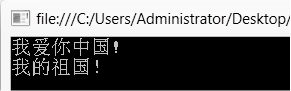

### 8.1.3　StringBuilder

String类是引用类型，每次改变String类对象的值，即修改字符串变量对应的字符串，都需要在内存中为新字符串重新分配空间。在某些特定情况，例如，循环中可能需要反复修改一个字符串变量的值，内存开销会比较大。StringBuilder类则没有这一问题，StringBuilder类的对象可以调用ToString( )方法将StringBuilder类的内容作为String类字符串输出，调用Append( )和AppendLine( )方法添加内容。例如，

```c
StringBuilder str1 = new StringBuilder( );
str1.Append("我爱你");
str1.AppendLine("中国!");
str1.Append("我的祖国！");
Console.WriteLine(str1.ToString());
```

输出结果如下图所示。


