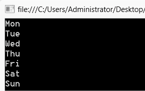

### 8.2.1　一维数组

可以把数组理解为一个表格，一维数组就是一个一行多列的表格，数组中的数据称为数组的元素，对应表格中的一格。定义一维数组的语法格式如下。

```c
数据类型[ ] 数组名；
```

例如，

```c
int[ ] a;　　　　　//定义一维整型数组a
```

定义过数组之后并不能直接使用，需要先对数组进行初始化，初始化就是指出数组中元素的个数，为数组分配内存空间，也可以同时为数组元素赋初值。一维数组初始化的语法格式如下。

```c
数组名 = new 数据类型[数组元素个数]{数组元素列表}；
```

或者：

```c
数组名 = new 数据类型[数组元素个数]；
```

例如，

```c
a = new int[5]{1，2，3，4，5};             //数组初始化的同时为数组元素赋初值 
或 a =new int[5]；                         //初始化数组a为整型，5个元素
```

数组的初始化也可以在定义的同时完成。例如，

```c
int[ ] a= new int[3]{1，2，3}；
```

以上语句可以简化为：

```c
int[ ] a= {1，2，3}；                      //只有定义的同时初始化才可以使用此简化方式
```

数组初始化时如果没有给出数组元素的初值列表，则系统会将数组元素初始化为默认值，数组数据类型不同，数组元素默认值也不同，int型的默认值为0，bool型的默认值为false。

> 
> **提示**
> 数组初始化时如果给出数组元素的初值列表，则可以省略数组元素个数，如a= new int[]{1，2，3}；

由于数组包含多个数组元素，为了区分数组的不同元素，使用“数组名[下标]”的方式访问数组元素，可以将数组元素作为一般变量使用。C#中为数组提供了一个属性Length，表示数组的长度，也就是数组中的元素个数，类型为整型。数组元素下标从0开始到Length-1。数组的使用通常配合循环结构，例如，

```c
string[] week = { "Mon", "Tue", "Wed", "Thu", "Fri", "Sat", "Sun" };
for(int i=0;i<week.Length;i++)
Console.WriteLine (week[i]);
```

输出结果如下图所示。


