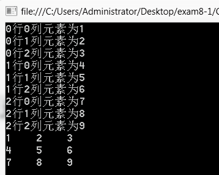

### 8.2.2　二维数组

一维数组可以看成一行多列的表格，二维数组则可以看做多行多列的表格。定义二维数组时需要在方括号中间加上“，”，定义二维数组的语法格式如下。

```c
数据类型[ ， ] 数组名；
```

例如，

```c
int[ ， ] b;  //定义二维整型数组b
```

与一维数组类似，二维数组也需要初始化。二维数组初始化时不需要给出数组元素个数，而是需要给出数组的行数和列数，数组元素个数=行数×列数。二维数组初始化的语法格式如下。

```c
数组名 = new 数据类型[行数，列数]{数组元素列表}；
```

或者：

```c
数组名 = new 数据类型[行数，列数]；
```

例如，

```c
b=new int[2,3] ;
或b=new int[2,3]{{1,2,3},{4,5,6}};
```

数组b为2行3列，共2×3=6个元素，数组元素列表需写成行列形式，使用两层花括号。

二维数组也可以在定义的同时完成初始化。例如，

```c
int b = new int[2,3]{{1,2,3},{4,5,6}};
```

二维数组b可以看做一个2行3列的表格，如下所示，行数2，行号从0到行数-1；列数3，列号从0到列数-1。要访问二维数组元素，需要使用“数组名[行号，列号]”的方式，例如，b[0，1]为数组b中0行1列的元素，值为2。


**【范例8-1】 使用二维数组输出数组元素。**

（1）启动Visual Studio 2013，新建一个控制台应用程序，项目名称为“ArrayElement”。

（2）在Program.cs中的Main方法中添加如下代码。

```c
01  int[,] b = { { 1, 2, 3 }, { 4, 5, 6 }, { 7, 8, 9 } };
02  for (int i = 0; i <3; i++)
03          for (int j = 0; j <3; j++)
04                  Console.WriteLine("{0}行{1}列元素为{2}",i,j,b[i,j]);
05  for (int i = 0; i < 3; i++)
06  {
07          for (int j = 0; j < 3; j++)
08          {
09                  Console.Write("{0,-5}", b[i, j]); //输出数组元素，每个元素占5格，靠左对齐
10          }
11          Console.WriteLine();
12  }
13  Console.ReadKey();
```

程序输出结果如下图所示。


**【范例分析】**

二维数组的操作通常使用二重for循环实现，外层for循环控制行号变化，内层for循环控制列号变化，循环体实现对数组元素的操作。要将数组按行列表格形式输出，则需要在外层for循环的循环体最后加上换行。

