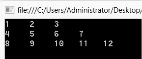

### 8.2.3　多维数组和交错数组

在一维、二维数组之上，还可以有更高维数的数组。C#为数组提供了Rank属性，该属性存储的是数组的维数。

多维数组的定义与二维数组类似，以三维数组为例，可以把三维数组看做一本记录本，每页都是一个表格，那么，可以使用页号、行号、列号来定位三维数组的一个元素。定义三维数组的语法格式为：

```c
数据类型[ ，， ] 数组名；
```

类似的，三维数组元素的引用使用“数组名[页号，行号，列号]”的方式，三维数组的操作通常使用三重嵌套的for循环完成。

C#中还提供一类特殊的数组——交错数组。交错数组可以看成是数组的数组，交错数组的每个元素又是一个数组。定义三维数组的语法格式为：

```c
数据类型[ ][ ] 数组名；
```

例如，

```c
int[ ][ ] c； //定义int型交错数组c
```

交错数组使用前也需要初始化。例如，

```c
c=new int[3][ ]；//交错数组c包含3个元素c[0]、c[1]、c[2]，每个元素又是一个数组
```

除了初始化交错数组本身，还需要把交错数组的每个元素作为数组进行初始化

交错数组也可以在定义的同时完成全部初始化。例如，

```c
int[ ][ ] c= new int[3][]
{
    new int[ ] { 1, 2, 3 },
    new int[ ] { 4, 5, 6, 7 },
    new int[ ] { 8, 9, 10, 11,12}
};
```

**【范例8-2】 使用交错数组。**

（1）启动Visual Studio 2013，新建一个控制台应用程序，项目名称为“JaggedArray”。

（2）在Program.cs中的Main方法中添加如下代码。

```c
01  int[ ][ ] c;
02  c = new int[3][ ];
03  c[0] = new int[ ] { 1, 2, 3 };
04  c[1] = new int[ ] { 4, 5, 6, 7 };
05  c[2] = new int[ ] { 8, 9, 10, 11,12};
06  for (int i = 0; i < c.Length; i++)
07  {
08          for (int j = 0; j < c[i].Length; j++)
09          Console.Write("{0,-5}", c[i][j]);
10          Console.WriteLine();
11  }
12  Console.ReadKey();
```

程序输出结果如下图所示。


