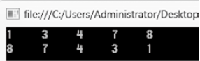
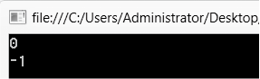
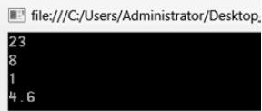
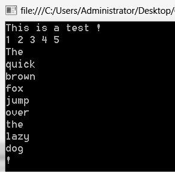
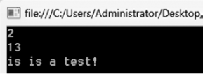

### 8.2.4　数组基本操作

C#中提供了许多实现数组操作的方法。

#### 1．数组排序和反转

Array类的静态方法Sort( )可以实现数组的排序，无返回值。语法格式如下。

```c
Array.Sort(数组名)；
```

Array类的静态方法Reverse( )可以实现数组的反转，无返回值。语法格式如下。

```c
Array.Sort(数组名)；
```

例如，

```c
int[] a= {3,8,1,7,4};
Array.Sort(a);
for (int i = 0; i < a.Length; i++)
Console.Write("{0,-5}", a[i]);
Console.WriteLine();
Array.Reverse(a);
for (int i = 0; i < a.Length; i++)
Console.Write("{0,-5}", a[i]);
Console.WriteLine();
```

输出结果如下图所示。


#### 2．查找数组元素

Array类的静态方法IndexOf( )可以判断数组是否包含与给定值相等的元素，是则返回对应数组元素的下标，否则返回-1。语法格式如下。

```c
Array.Contains(数组名，要查找的值)；
```

例如，

```c
int[] a= {3,8,1,7,4};
Console.WriteLine(Array.IndexOf(a,3));
Console.WriteLine(Array.IndexOf(a, 13));
Console.ReadKey();
```

输出结果如下图所示。


#### 3．数组元素求和、最大值、最小值、平均值

C#提供了方法Sum( )、Max( )、Min( )、Average( )对数组元素进行统计。语法格式如下。

```c
数组名.Sum( )；
```

例如，

```c
int[] a= {3,8,1,7,4};
Console.WriteLine(a.Sum( ));
Console.WriteLine(a.Max( ));
Console.WriteLine(a.Min( ));
Console.WriteLine(a.Average( ));
Console.ReadKey();
```

输出结果如下图所示。


#### 4．数组字符串相互转化

String类的静态方法Join( )可以将数组中所有元素连接起来，生成一个字符串，返回值为该字符串。语法格式如下。

```c
String.Join(分隔符，数组名)；
```

注意Join( )方法分隔符类型为字符串。

方法Split( )可以根据分隔符将字符串切分为多个部分，每个部分作为一个数组元素生成一个字符串数组，返回值为该字符串数组。语法格式如下。

```c
字符串变量.Split(分隔符)；
```

注意Split( )方法中的分隔符类型为字符型。

```c
string[] a = {"This","is","a","test","!"};
Console.WriteLine(string.Join("",a));
int[] a2 = { 1, 2, 3, 4, 5 };
Console.WriteLine(string.Join(" ",a2));
string str = "The quick brown fox jump over the lazy dog !";
string[ ] b = str.Split(' ');
for (int i = 0; i < b.Length; i++)
Console.WriteLine(b[i]);
Console.ReadKey();
```

输出结果如下图所示。


#### 5．在字符串中查找、删除字符数组元素

String类方法IndexOfAny( )用于在字符串中查找给定字符数组中的所有元素，返回字符数组元素在字符串中首次出现的位置值，查找失败则返回-1。语法格式如下。

```c
字符串变量.IndexOfAny (字符数组名)；
```

String类方法LastIndexOfAny( )用于在字符串中查找给定字符数组中的所有元素，返回字符数组元素在字符串中最后出现的位置值，查找失败则返回-1。语法格式如下。

```c
字符串变量.LastIndexOfAny (字符数组名)；
```

String类方法Trim( )可以在字符串的首部和尾部去除给定字符数组中的所有元素，返回操作后的字符串。

例如，

```c
char[] a = { 'a', 't', 'i' };
string str = "This is a test!";
Console.WriteLine(str.IndexOfAny(a));   //数组a作为IndexOfAny方法的参数使用
Console.WriteLine(str.LastIndexOfAny(a));
char [] b={'T','h','t'};
Console.WriteLine(str.Trim(b));
Console.ReadKey();
```

输出结果如下图所示。


