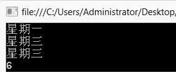

### 8.3　枚举


**本节视频教学录像：5分钟**

枚举类型用于声明一组命名常数。定义枚举类型的语法格式如下。

```c
enum 枚举类型名{枚举成员列表}
```

例如，

```c
enum week {星期一,星期二,星期三,星期四,星期五,星期六,星期天};
```

枚举类型week包含七个常数，默认第一个常数为0，对应“星期一”，每个名称对应的常数都比前边一个加1，最后一个常数为6，对应“星期天” 。相当于为常数起了个名字，把七个常数组合在一起构成枚举类型week。

也可以指定枚举类型中名称和常数之间的对应关系。例如，

```c
enum week {星期一=1,星期二,星期三,星期四,星期五,星期六,星期天};
```

给出第一个名称星期一对应的常数为1，后边的名称对应的常数值分别是2、3、4、5、6、7。

**【范例8-3】 使用枚举类型。**

（1）启动Visual Studio 2013，新建一个控制台应用程序，项目名称为“EnumExam”。

（2）在Program.cs中的Main方法中添加如下代码。

```c
01  namespace  enumExam
02  {
03          //枚举类型定义在类定义之外
04          enum week { 星期一, 星期二, 星期三, 星期四, 星期五, 星期六, 星期天 }; 
05          class Program
06          {
07                  static void Main(string[] args)
08                  {
09                  //定义枚举类型变量x，选择枚举类型Week中的一个名称为变量x赋值
10                  week x = week.星期一; 
11                  //定义枚举类型变量y，将整数2强制转换为week类型的值赋值给变量y 
12                  week y =(week)2;     
13                  Console.WriteLine(x.ToString());   
14                  Console.WriteLine(y.ToString());
15                  Console.WriteLine((week)2);           //输出枚举类型week中常量2对应的名称
16                  Console.WriteLine((int)week.星期天);  //输出枚举类型week中名称"星期天"
                                                           对应的常量
17                  Console.ReadKey();
18                  }
19          }
20  }
```

输出结果如下图所示。


**【范例分析】**

枚举类型的最大作用是可以自定义一个类型，将许多相关的名称作为一个集合保存和使用，每个名称对应一个整型常量，相对于直接使用数值，使用枚举类型可以使代码更加清晰易懂，便于记忆。枚举类型的变量只能选择几个常量中的一个，方便控制变量取值范围，保证程序的执行过程安全可靠。常量值和枚举值之间转换方便，使用枚举类型使代码更容易编写和维护。

