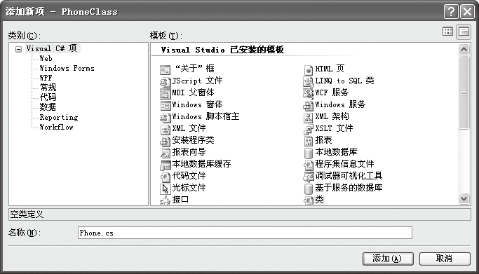
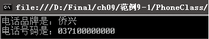
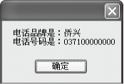

### 9.2.2　类的定义

类的定义使用class关键字，其语法如下。

```c
[访问修饰符]  class  类名
{
    //类的主体
}
```

其中，访问修饰符可以是public、protected、internal、private和protected internal等。class是声明类的关键字，类名是自己定义的类的名称，大括号中声明的是类的成员。其中“访问修饰符”可以省略。

对类的访问控制权限需要用访问修饰符来定义，在C#中访问修饰符有以下5种。

（1）public：对类的访问不受限制，就像公共图书馆一样，谁都可以进去看书。

（2）protected：对类的访问仅限于包含类或从包含类派生的类，就像单位的图书馆，只有该单位或其子公司的人才能进去。

（3）private：访问仅限于包含类，如私人图书馆一样不对外开放。

（4）internal：访问仅限于当前项目，如允许派到本单位协助工作的人也能访问的单位的图书馆，除了本单位的人能访问外，外单位派到本单位协助工作的人也能访问。

（5）protected internal：同时拥有protected的访问权限和internal的访问权限。

> 
> **注意**
> 类名一般采用帕斯卡命名法，即首字母大写，通常命名类采用完整的英文单词，如Person类、Student类。

**【范例9-1】 下面定义“电话类”，在此类中定义两个成员来表示电话的品牌和电话号码。**

（1）启动Visual Studio 2013，新建一个控制台应用程序，项目名称为“PhoneClass”。选择【项目】
【添加类】菜单命令，在弹出的【添加新项——PhoneClass】对话框中输入类的【名称】“Phone.cs”。


（2）单击【确定】按钮，直接打开“Phone.cs”的代码窗口，系统会自动生成下面的Phone类的框架。

```c
01  using System;                        //使程序能直接使用System基本类包中的资源
02  using System.Collections.Generic;    //使程序能直接使用泛型集合的接口和类
03  using System.Linq;                   //使程序能直接使用语言集成查询的类和接口
04  using System.Text;                   //使程序能直接使用字符编码类
05  
06  namespace PhoneClass                 //名称空间名称，可以自定义，如Example41
07  {        
08   class Phone                         //自动生成的类名
09   {        
             //类的成员在这对大括号中定义
10  }
11  }
```

（3）在Phone类中第9行后面的大括号里定义类的成员，代码如下（代码9-2-1.txt）。

```c
01  public string brand;                //定义公有的成员表示电话的品牌
02  public string phoneNumber;          //定义公有的成员表示电话号码
```

（4）选择【生成】
【生成解决方案】菜单命令，如果没有编译错误，说明类创建成功。然后在Program.cs中的Main方法中添加如下代码进行测试（代码9-2-2.txt）。

```c
01  Phone objPhone=new Phone();                             //创建对象objPhone
02  objPhone.brand  = "侨兴";                                //对对象的成员brand赋值  
03  objPhone.phoneNumber = "037100000000";                   //对对象成员phoneNumber赋值
04  Console.WriteLine("电话品牌是："+objPhone.brand );        //输出对象的成员brand的值 
05  Console.WriteLine("电话号码是：" + objPhone.phoneNumber); //输出phoneNumber的值
06  Console.Read();                        //暂停程序的运行，按任意键继续
```

**【运行结果】**

选择【调试】
【启用调试】菜单命令或单击按钮，即可在控制台中输出如下图所示的结果。


**【范例分析】**

在这个程序中，代码比较简单。我们选择创建控制台应用程序项目，然后向项目中添加一个新类来生成类的框架，接着编写代码来创建类。为了能实际运行，在Program.cs中创建了Phone的对象objPhone，并对objPhone对象的成员赋值，然后利用控制台输出结果。

**【拓展训练】**

利用Windows应用程序来定义【范例9-1】中的Phone类，创建一个对象并运行，通过此例进一步练习在Windows应用程序中如何创建类。

（1）在Visual Studio 2013中新建一个Windows应用程序，项目名称为“PhoneClassExt”。选择【项目】
【添加类】菜单命令，在弹出的对话框中输入类的【名称】“Phone.cs”。

（2）与【范例9-1】中的步骤（2）、（3）相同（拓展代码9-2-1.txt）。

（3）在窗体Form1中双击，进入代码窗口并产生Form1_Load事件处理程序框架，然后在Form1_Load事件处理程序中输入以下代码测试Phone类（拓展代码9-2-3.txt）。

```c
01  private void Form1_Load(object sender, EventArgs e)     //窗体加载事件处理程序
02  {
03          Phone objPhone=new Phone();             //创建对象objPhone
04          objPhone.brand  = "侨兴";               //对对象的成员brand赋值
05          objPhone.phoneNumber = "037100000000";  //对对象成员phoneNumber赋值
06          MessageBox.Show("电话品牌是："+objPhone.brand + "\n" +"电话号码是："+  objPhone.
            phoneNumber );                         //输出objPhone对象的成员值
07  }
```

运行后的输出结果如下图所示。


其中MessageBox.Show方法能将字符串信息显示在一个消息框中。

