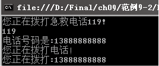
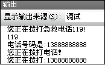

### 9.2.3　类的成员

组成类的元素称为类的成员，类的成员主要包括描述状态的数据成员和描述操作的函数成员。比如在9.2.2小节的Phone类中，brand和phoneNumber就是Phone类的数据成员，而电话还有接电话和打电话等功能，这些功能则属于函数成员（函数成员中的方法）。函数成员提供了操作类中数据的某些功能，包括属性、方法、索引器、事件、运算符、构造函数和析构函数等。

#### 1．数据成员

类的数据成员包括字段、常量和事件。字段就是在类中定义的变量，用来存储描述类的特征的值，如电话的颜色、品牌和号码等。常量是类的常量成员。

> 
> **提示**
> 常量成员名称的第一个字母一般大写，也经常使用全部大写、多个字母之间用下画线连接的常量名。

成员变量的定义语法为：

```c
[访问修饰符] 数据类型  成员变量名
```

其中，在声明成员变量时使用不同的访问修饰符来定义它们的访问级别，可以是public、private、protected和internal等 ，其含义和类的访问修饰符类似，只是对类中成员的访问权限的限制。

如在9.2.2小节介绍的Phone类的基础上，添加一个常量声明。

```c
const string PhoneType = "GSM";        //声明常量
```

#### 2．属性成员

属性是字段的一种自然扩展，是一个与类或对象相关联的命名。与字段不同的是，属性不表示存储位置，属性拥有访问器，访问器定义了读取或者写入属性值时必须执行的代码。通过属性的get{}访问器和set{}访问器来实现对类中私有字段的读/写操作。为了类的封装性，一般是把描述类的特征的字段定义为private，把属性设为public来操作私有的字段。定义属性成员的格式如下。

```c
[访问修饰符] 数据类型  属性名
{
get{}        //get访问器
set{}        //set访问器
}
```

其中属性的访问修饰符是用来指定方法的访问级别的，主要的访问修饰符和数据成员的访问修饰符一样。属性方法的命名通常使用帕斯卡命名法，即首字母大写。

例如，将【范例9-1】中Phone类的phoneNumber字段定义为private，可以定义一个属性成员PhoneNumber来对私有的phoneNumber进行存/取。代码如下。

```c
01  private string phoneNumber;           //定义一个私有字段成员用于表示电话号码
02  public string PhoneNumber             //定义属性成员，用于设置和获取_phoneNumber的值
03  {
04          get { return phoneNumber; }   //get访问器，读取phoneNumber的值
05          set { phoneNumber = value; }  //set访问器，设置phoneNumber的值
06  }
```

定义好属性，就可以通过对象的属性来存/取私有字段的值了。例如，

```c
01  Phone objPhone = new Phone();           //创建对象
02  objPhone.PhoneNumber = "13888888888";   //通过set访问器为私有字段phoneNumber赋值
03  Console.WriteLine("电话号码是:" + objPhone.PhoneNumber);  //通过get访问器得到私有字段phoneNumber的值
```

#### 3．方法成员

方法是用来描述对象的行为的，对类的数据成员的操作都封装在类的方法中。方法的主要功能是操作数据，没有方法的程序是没有意义的，就像电话如果不具有接打功能，是没有什么作用的一样。

方法的声明格式如下。

```c
 [访问修饰符] 返回值数据类型 方法名（参数列表）
{
      //方法体
}
```

（1）方法的访问修饰符是用来指定方法的访问级别的，主要的访问修饰符和属性的访问修饰符一样。

（2）方法的返回值类型可以是任意一种C#的数据类型，如果没有返回值，就用关键字“void”表示。

（3）方法的命名和属性一样，建议用名称和动词的组合表示。

（4）方法可以有参数，也可以没有参数，多个参数之间用“，”分隔，没有参数也不能省略“（）”。

（5）方法体通常是方法完成功能要执行的代码。

下面给Phone类中添加一个打电话的方法Dial，以实现电话的拨打功能。

```c
01  public void Dial(string number)                        //定义方法
02  {
03          Console.WriteLine("您正在拨打:"+number);        //表示方法实现的操作
04  }
```

#### 4．静态成员

静态成员和类是相关联的，不依赖于特定的对象，可以作为类中“共”有的成员。如果类的某个成员声明时使用了static关键字，该成员就变成了静态成员。在类中可以定义为静态的成员有字段、方法、属性、运算符、事件和构造函数等，但不能是索引器、析构函数。静态成员可以直接使用，不必创建对象，可通过“类名.静态成员”方式使用静态成员。静态成员为类的所有对象所共享，非静态成员也叫做实例成员，实例成员属于具体的对象。如任何一部电话都可以拨打急救电话，拨打急救电话功能就可以定义为静态的。代码如下。

```c
01  public static void EmergencyCall（）;          //静态方法EmergencyCall
02  {
03          Console.WriteLine("您正在拨打119!");
04  }
```

**【范例9-2】 定义一个属性，方法为多种成员的“电话”类，熟悉类的创建。**

（1）在Visual Studio 2013中新建C#控制台程序，项目名为“PhoneClass”，然后在项目中添加一个Phone类文件，在Phone.cs中输入如下代码来定义类（代码9-2-4.txt）。

```c
01  public const string PhoneType = "GSM";        //声明常量，隐式静态
02  public static string emergency_Call = "119";  //静态字段
03  private string phoneNumber;                   //定义私有字段成员表示电话号码
04  public string PhoneNumber                     //定义属性，设置和获取phoneNumber的值
05  {
06          get { return phoneNumber; }          //得到phoneNumber的值
07          set { phoneNumber = value; }         //设置phoneNumber的值
08  }
09  public void Dial()                           //无参数方法成员，表示电话具有拨打功能
10  {
11          Console.WriteLine("您正在拨打电话！");
12  }
13  public void Dial(string number)              //有参数方法成员，表示拨打一个具体的电话号码
14  {
15          Console.WriteLine("您正在拨打:" + number);
16  }
17  public static void EmergencyCall()           //静态方法EmergencyCall
18  {
19          Console.WriteLine("您正在拨打急救电话119!");
20  }
```

> 
> **提示**
> 类中常量隐式是静态。

（2）在Program.cs的Main方法中输入以下代码以测试类的成员（拓展代码9-2-5.txt）。

```c
01  Phone.EmergencyCall();                    //静态方法通过类名直接调用 
02  Console.WriteLine(Phone.emergency_Call);  //静态字段通过类名直接调用
03  Phone objPhone = new Phone();             //创建对象
04  objPhone.PhoneNumber = "13888888888";     //通过set访问器为私有字段phoneNumber赋值
05  Console.WriteLine("电话号码是:" + objPhone.PhoneNumber);
//通过get访问器得到私有字段phoneNumber的值 
06  objPhone.Dial();                          //无参数实例方法
07  objPhone.Dial("13888888888");             //有参数实例方法
```

**【运行结果】**

单击工具栏中的
按钮，即可在控制台中输出如下图所示的结果。


**【范例分析】**

在这个实例中定义了常量PhoneType、静态字段emergency_Call和静态方法EmergencyCall，对这些静态成员的使用方法是“类名.静态成员名”，不需要实例化；类中还定义了如下实例成员：phoneNumber、有参数的Dial方法和无参数的Dial方法，使用的时候先要创建对象，以“对象名.实例成员名”的方式调用。

**【拓展训练】**

把【范例9-2】改成Windows 应用程序形式。

新建一个Windows应用程序，项目名为“PhoneClassExt”，添加一个Phone类，代码不变，把【范例9-2】中Program.cs中Main方法里面的代码放在Windows窗体应用程序的Form1_load方法中。运行后，在【输出】窗口中显示的运行结果如下图所示。


在Windows窗体应用程序中Console.WriteLine方法用于在【输出】窗口输出信息。如果看不见【输出】窗口，可以选择【视图】【输出】菜单命令显示，或按快捷键调出【输出】窗口。

