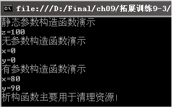

### 9.3.4　构造函数和析构函数

对象和客观世界中的事物一样，从创建到消亡都有一个生命周期，对象的创建和销毁是通过类的构造函数和析构函数来完成的。

#### 1．构造函数

构造函数是类的特殊方法成员，其名称和类名相同，主要用来完成对象的初始化。

C#通过new创建对象的过程实际上就是调用类的构造函数的过程，创建对象时调用构造函数对对象进行初始化。每个类都有构造函数，如果没有定义，系统也会提供一个默认的构造函数，默认的构造函数一般不进行什么操作。在访问一个类的时候，系统最先执行构造函数中的语句。

#### 2．析构函数

析构函数是对象销毁前释放所占用系统资源的类的成员。析构函数的名字是在类名前面加一个符号“~”。析构函数不接受任何参数，也不返回任何值，例如，

```c
01  public class MyClass     //声明类MyClass
02  {
03          ~MyClass()       //析构函数名
04          { //析构函数  }   //析构函数的内容
05  }
```

> 
> **提示**
> 一个类只能有一个析构函数，析构函数不能手动调用，是系统自动调用的。

**【范例9-3】 定义一个包含构造函数和析构函数的Point类，表示平面上的点坐标。**

（1）在Visual Studio 2013中新建C#控制台程序，项目名为“PointClass”。

（2）在Program.cs中的class Program类的前面或者后面添加Point类代码，注意Program类和Point类是并列的，不能嵌套。代码如下（代码9-3-1.txt）。

```c
01  class Point
02  {
03          public int X { get; set; }           //定义属性X，得到和设置点的横坐标
04          public int Y { get; set; }           //定义属性Y，得到和设置点的纵坐标 
05          public Point()                       //无参数构造函数用于初始化
06          {
07                  X = 0; Y =2;                 //初始化
08          }
09          public Point(int val_x,int   val_y)  //有参数构造函数
10          {
11                  X = val_x; Y = val_y;        //用指定的参数初始化X和Y
12          }
13          ~Point()                            //析构函数
14          {
15          Console.WriteLine("析构函数主要用于清理资源！");
16          Console.ReadKey();                 //为了看见析构函数的运行，可以添加此行代码
17          }
18  }
```

（3）在Program.cs的Main方法中输入以下代码以测试类的成员（代码9-3-2.txt）。

```c
01  Point objPoint1 = new Point();              //创建对象objPoint1，用无参构造函数进行初始化
02  Console.WriteLine("无参数构造函数演示");
03  Console.WriteLine("x="+objPoint1.X  );      //输出objPoint1的横坐标
04  Console.WriteLine("y="+objPoint1.Y);        //输出objPoint1的纵坐标
05  Point objPoint2 = new Point(80,90);         //创建对象objPoint2，用有参构造函数进行初始化
06  Console.WriteLine("有参数构造函数演示");
07  Console.WriteLine("x=" + objPoint2.X);      //输出objPoint2横坐标
08  Console.WriteLine("y=" + objPoint2.Y);      //输出objPoint2纵坐标
09  Console.ReadKey();                          //暂停程序运行，按任意键继续
```

**【运行结果】**

单击工具栏中的
按钮，即可在控制台中输出如下图所示的结果。


**【范例分析】**

在这个实例中，我们把类Point和控制台应用程序自动生成的Program类放在同一个命名空间中。在步骤（2）中，第5~8行在Point类中定义了一个无参数的构造函数，第9~12行定义了一个有两个参数的构造函数Point（int val_x,int val_y），第13~17行定义了一个析构函数。

**【拓展训练】**

在【范例9-3】中添加静态构造函数（拓展代码9-3-3.txt）。

【范例9-3】声明的构造函数是非静态的实例构造函数。构造函数也有静态的，静态构造函数用于初始化类中的静态字段成员。在Point类中添加静态构造函数的代码如下。

```c
01  public static int z;  //添加一个静态字段z
02  static Point()        //定义静态构造函数
03  {
04          z =100;       //对静态字段初始化
05  }
```

在【范例9-3】的Program.cs的Main方法中添加如下代码测试静态构造函数。

```c
01  Console.WriteLine("静态参数构造函数演示");
02  Console.WriteLine("z=" + Point.z);        //通过类名直接访问静态成员
```

运行结果如下图所示。


