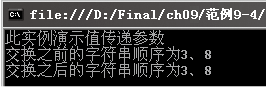
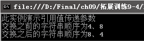
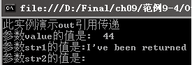

### 9.3.5　参数传递

C#的许多方法成员是有参数的，定义方法时声明的参数是形式参数（或叫虚拟参数），调用方法时要给形式参数传值，传递的值是实在参数。C#有“值传递”和“引用传递”两种传递参数类型。值传递是C#默认的传递方式，使用值传递方式时，向形式参数传递的是实在参数的副本，方法内发生的对形式参数的更改对实在参数本身没有任何影响，就像文件的复印件一样，无论如何修改复印件，原件没有任何改变。如果希望所调用的方法能更改实在参数的值，则必须使用 ref 或 out 关键字声明通过引用传递方式传递参数，引用传递是把实在参数的地址传给形式参数，形式参数和实在参数指向同一个存储单元，对形式参数的改变就是对实在参数的改变。out传递与ref类似，二者的区别是，ref要求参数在传递之前必须初始化，out则不要求初始化。

**【范例9-4】 交换两个变量的值，演示值传递和ref引用传递。**

（1）在Visual Studio 2013中新建C#控制台程序，项目名称为“ParametersDemo”，然后在 Program.cs中添加Swap方法交换两个变量的值（代码9-4-1.txt）。

```c
01  private void Swap( int num1, int num2)  //交换数据的方法
02  {
03          int temp;                       //定义用于交换变量值的中间变量
04          temp = num1;                    //将num1的值赋给中间变量temp
05          num1 = num2;                    //将num2的值赋给num1
06          num2 = temp;                    //将中间变量temp中存储的num1的原来值赋给num2
07  }
```

（2）在 Program.cs的Main方法中添加以下代码（代码9-4-2.txt），测试运行结果。

```c
01  int num1 = 3;                             //定义变量num1
02  int num2 = 8;                             //定义变量num2
03  Console.WriteLine("此实例演示值传递参数" );
04  Console.WriteLine("交换之前的字符串顺序为{0}、{1}", num1, num2);
05  Program objProgram = new Program()        //创建对象以调用Swap方法来交换数据
06  objProgram.Swap(num1, num2);              //调用交换方法
07  Console.WriteLine("交换之后的字符串顺序为{0}、{1}", num1, num2);        //输出结果
08  Console.ReadLine();                       //暂停程序的运行，按任意键继续
```

**【代码详解】**

在步骤（1）中定义了Swap方法来实现两个变量的交换。在步骤（2）的第1~2行，在Main方法中定义了两个变量num1和num2；第5行创建了对象 objProgram，采用默认的值传递调用Swap方法；第6行调用Swap方法交换num1和num2的值。

**【运行结果】**

选择【调试】
【启用调试】菜单命令或单击按钮，输出结果如下图所示。


**【范例分析】**

运行结果显示并没有真正交换num1和num2两个变量的值，因为选择的是值传递的方法来传递参数。虽然在Swap方法中交换了参数的值，但不影响原来实在参数num1和num2的值。要想交换实在参数num1和num2的值，改为引用方式进行参数传递即可。

**【拓展训练】**

将【范例9 -4】改为引用传递方式实现数据的交换（拓展代码9-4-3.txt）。

（1）将Swap方法的定义改为如下方式。

```c
private void Swap( int num1, int num2)     //定义改用ref方式传递参数来交换数据
```

（2）在Main方法中改为如下形式调用Swap方法。

```c
objProgram.Swap(ref num1, ref num2);       //调用时也要用ref
```

运行结果显示真正地交换了两个变量的值，如下图所示。


> 
> **注意**
> 在使用ref方式传递参数时，定义和调用时都要使用ref关键字。

out 关键字与 ref 关键字类似，也是声明引用传递参数的，但ref 要求变量必须在传递之前对实在参数初始化。尽管作为 out 参数传递的变量不需要在传递之前初始化，但需要调用方法在方法返回之前对out传递的参数赋值。当希望方法返回多个值时，可以使用out方式，使用 out 参数的方法可以将变量用做返回类型，还可以将一个或多个对象作为 out 参数返回给调用方法。下面的例子使用 out 在一个方法调用中返回3个值。请注意，第3个参数所赋的值为null，这样能允许方法有选择地返回值。

```c
01  class OutReturnExample              //定义类用于演示使用out返回多个值
02  {
03          static void Method(out int i, out string s1, out string s2)
04          {                           //定义静态方法使用out进行参数的传递
05          i = 44;                     //参数i赋值为44
06          s1 = "I've been returned";  //参数s1赋值为"I've been returned"
07          s2 = null;                  //参数s2赋值为null
08  }
09  static void Main()                  //程序入口点方法
10  {
11          int value;                  //定义int变量value
12          string str1, str2;          //定义两个字符串变量
13          Console.WriteLine ("此实例演示out引用传递"); 
14          Method(out value, out str1, out str2);  //调用Method方法得到3个返回值赋给3个实参
15          Console.WriteLine("参数value的值是:  "+value);  //参数value的值是44
16          Console.WriteLine("参数str1的值是:" + str1);    //参数str1的值是"I've been returned"
17          Console.WriteLine("参数str2的值是:" + str2);    //参数str2的值是null
18          Console.ReadKey();
19  }
20  }
```

代码在“拓展训练9-4”文件夹中的“OutParameter”项目中，运行结果如下图所示。


