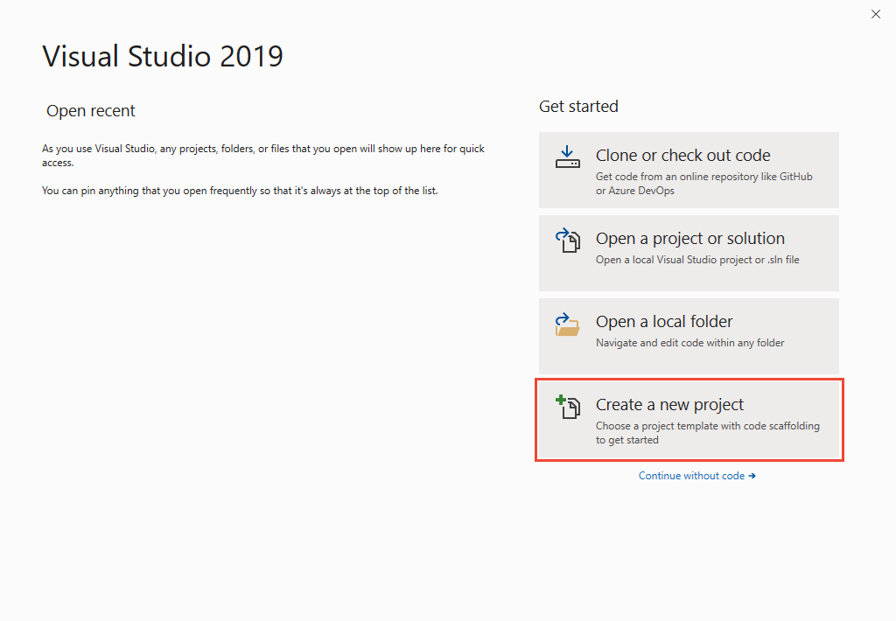
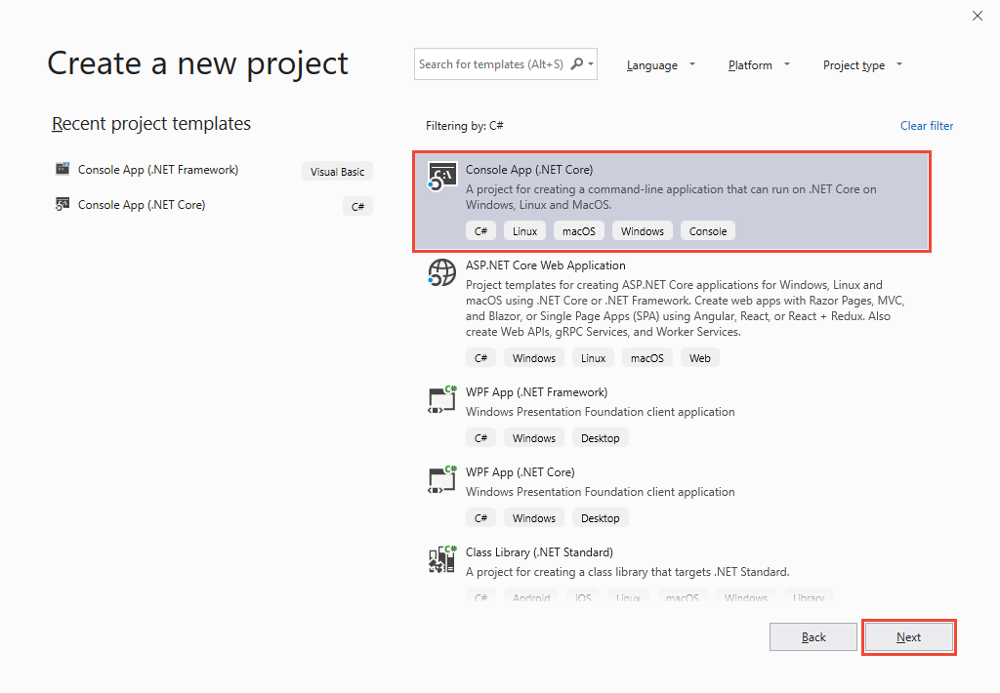

[toc]

### 1. Hello World -- 你的第一个程序

#### 1.1 创建一个新的应用程序

启动 Visual Studio。你将在 Windows 上看到以下图像：



在图像右下角选择 "创建新项目" 。Visual Studio 会显示 "新建项目" 对话框：



在 "新建项目" 对话框中，选择 "控制台应用(.NET Core)"，然后按 "下一步"。请为项目命名（例如 "HelloWorld"），然后按 "创建"。

Visual Studio 将打开你的项目。一个基本的 "Hello World!" 已初见雏形示例。按 <kbd>Ctrl</kbd> + <kbd>F5</kbd> 运行项目。Visual Studio 生成项目，将源代码转换为可执行文件。然后，它会启动一个运行新应用程序的命令窗口。你应在窗口中看到以下文本：

```console
Hello World!

C:\Workspace\TempSpace\HelloWorld\bin\Debug\netcoreapp3.1\HelloWorld.exe (进程 5028)已退出，代码为 0。
要在调试停止时自动关闭控制台，请启用“工具”->“选项”->“调试”->“调试停止时自动关闭控制台”。
按任意键关闭此窗口. . .
```

### 1. C# 程序的元素

字符 `//` 将该行的其余内容转换为一条注释。

```c#
// A Hello World! program in C#.
```

还可以通过将文本块置于 `/*` 和 `*/` 字符之间，禁止对其的注释。这在下面的示例中显示。

```c#
/* A "Hello World!" program in C#.
This program displays the string "Hello World!" on the screen. */
```

C# 控制台应用程序必须包含 `Main` 方法，控件在其中开始和结束。`Main` 方法是驻留在类或结构中的静态方法。可以通过以下方式之一来声明 `Main` 方法：

+ 它可返回 `void`。这表示程序不会返回值。

  ```c#
  static void Main() 
  {
      // ...
  }
  ```

+ 还可以返回一个整数。整数是应用程序的 "退出代码"。

  ```c#
  static int Main()
  {
      //...
      return 0;
  }
  ```

  

+ 无论使用哪种返回类型，它都可以带有参数。

  ```c#
  static void Main(string[] args)
  {
      //...
  }
  ```

  或

  ```c#
  static int Main(string[] args)
  {
      //...
      return 0;
  }
  ```

### 3. 输入和输出

C# 程序通常使用由 .NET 的运行时库提供的输入/输出服务。语句 `System.Console.WriteLine("Hello World!");` 使用 WriteLine 方法。该方法将在标准输出流中显示其字符串参数，后接新行。如果程序开头包含 `using System;` 指令，则可以直接使用 System 类和方法，而不必进行完全限定。例如，可以调用 `Console.WriteLine`，而非 `System.Console.WriteLine`：

```c#
using System;
Console.WriteLine("Hello World!");
```

有关输入/输出方法的详细信息，请参阅 [System.IO](https://docs.microsoft.com/zh-cn/dotnet/api/system.io)。  

### 4. C# 程序的通用结构

C# 程序可由一个或多个文件组成。每个文件均可包含零个或多个命名空间。一个命名空间包含类、结构、接口、枚举、委托等类型以及其他命名空间。下面是包含所有这些元素的 C# 程序主干：

```c#
// A skeleton of a C# program
using System;
namespace YourNamespace
{
    class YourClass
    {
        
    }
    
    struct YourStruct
    {
        
    }
    
    interface IYourInterface
    {
        
    }
    
    delegate int YourDelegate();
    
    enum YourEnum
    {
        
    }
    
    namespace YourNestedNamespace
    {
        struct YourStruct
        {
            
        }
    }
    
    class YourMainClass
    {
        
        static void Main(string[] args)
        {
            // Your program starts here...
        }
    }
}
```

### 5. 标识符名称

有效标识符必须遵循以下规则：

+ 标识符必须以字母或 `_` 开头。
+ 标识符可以包含 Unicode 字母字符、十进制数字字符、Unicode 连接字符、Unicode 组合字符或 Unicode 格式字符。有关 Unicode 类别的详细信息，请参阅 [Unicode 类别数据库](https://www.unicode.org/reports/tr44/)。可以在标识符上使用 `@` 前缀来声明与 C# 关键字匹配的标识符。`@` 不是标识符名称的一部分。例如，`@if` 声明名为 `if` 的标识符。

有关有效标识符的完整定义，请参阅 [C# 语言规范中的标识符主题](https://docs.microsoft.com/zh-cn/dotnet/csharp/language-reference/language-specification/lexical-structure)。

#### 5.1 命名约定

按照约定，C# 程序对类型名称、命名空间和所有公共成员使用 `PascalCase`。此外，以下约定也很常见：

+ 接口名称以大写字母 `I` 开头。
+ 属性类型以单词 `Attribute` 结尾。
+ 枚举类型对非标记使用单数名词，对标记使用复数名词。
+ 标识符不应包含两个连续的 `_` 字符。这些名称保留给编译器生成的标识符。

### 6. C# 编码约定

#### 6.1 命名约定

+ 在不包括 `using 指令` 的短语示例中，使用命名空间限定。如果你知道命名空间默认导入项目中，则不必完全限定来之该命名空间的名称。如果对于单行来说过长，则可以在点（.）后中断限定名称，如下面的示例所示。

  ```c#
  var currentPerformanceCounterCategory = new System.Diagnostics.PerformanceCounterCategory();
  ```

+ 你不必更改通过使用 Visual Studio  设计器工具创建的对象的名称以使它们适合其他准则。

#### 6.2 布局约定

Microsoft 示例和样本符合以下约定：

+ 使用默认的代码编辑器设置（智能缩进、4 字符缩进、制表符保存为空格）。

+ 每行只写一条语句。

+ 每行只写一个声明。

+ 如果连续行未自动缩进，请将它们缩进一个制表符（四个空格）。

+ 在方法定义与属性定义之间添加至少一个空白行。

+ 使用括号突出表达式中的字句，如下面的代码所示。

  ```c#
  if ((val1 > val2) && (val1 > val3))
  {
      // Take appropriate action.
  }
  ```

#### 6.3 注释约定

+ 将注释放在单独的行上，而非代码行的末尾。

+ 以大写字母开始注释文本。

+ 以句点结束注释文本。

+ 在注释分隔符（//）与注释文本之间插入一个空格，如下面的示例所示。

  ```c#
  // The following declaration creates a query. It does not run
  // the query.
  ```

+ 不要在注释周围创建格式化的星号块。

### 7. 语言准则

#### 7.1 String 数据类型

+ 使用 `字符串内插` 来连接短字符串，如下面的代码所示。

  ```c#
  string displayName = $"{nameList[n].LastName}, {nameList[n].FirstName}";
  ```

+ 若要在循环中追加字符串，尤其是在使用大量文本时，请使用 `StringBuilder` 对象。

  ```C#
  var phrase = "lalalalalalalalalalalalalalalalalalalalla";
  var manyPhrases = new StringBuilder();
  for (var i = 0; i < 10000; i++) 
  {
      manyPhrases.Append(phrase);
  }
  // Console.WriteLine("tra" + manyPhrases);
  ```

#### 7.2 隐式类型的局部变量

+ 当变量类型明显来自赋值的右侧时，或者当精度类型不重要时，请对本地变量进行 `隐式类型化`。

  ```c#
  // When the type of a variable is clear from the context, use var
  // in the declaration.
  var var1 = "This is clearly a string.";
  var var2 = 27;
  var var3 = Convert.ToInt32(Console.ReadLine());
  ```

+ 当类型并非明显来自赋值的右侧时，请勿使用 `var`。

  ```C#
  // When the type of a variable is not clear from the context, use an
  // explicit type.
  int var4 = ExampleClass.ResultSoFar();
  ```

+ 请勿依靠变量名称来指定变量的类型。它可能不正确。

  ```c#
  // Naming the following variable inputInt is misleading.
  // It is a string.
  var inputInt = Console.ReadLine();
  Console.WriteLine(inputInt);
  ```

+ 避免使用 `var` 来代替 `dynamic`。

+ 使用隐式类型化来确定 for 循环中循环变量的类型。

  下面的示例在 `for` 语句中使用隐式类型化。

  ```c#
  var phrase = "lalalalalalalalalalalalalalalalalalalalla";
  var manyPhrases = new StringBuilder();
  for (var i = 0; i < 10000; i++) 
  {
      manyPhrases.Append(phrase);
  }
  // Console.WriteLine("tra" + manyPhrases);
  ```

+ 不要使用隐式类型化来确定 foreach 循环变量的类型。

  下面的示例在 `foreach` 语句中使用显示类型化。

  ```c#
  foreach (char ch in laugh)
  {
      if (ch == 'h')
          Console.Write("H");
      else
          Console.Write(ch);
  }
  Console.WriteLine();
  ```

  > NOTE
  >
  > 注意不要意外更改可迭代集合的元素类型。例如，在 `foreach` 语句中从 `System.Linq.IQueryable` 切换到 `System.Collections.IEnumerable` 很容易，这会更改查询的执行。

#### 7.3 无符号数据类型

通常，使用 `int` 而非无符号类型。`int` 的使用在整个 C# 中都很常见，并且当你使用 `int` 时，更容易与其他库交互。

#### 7.4 阵列

当在声明行上初始化数组时，请使用简洁的语法。

```c#
// Preferred syntax. Note that you cannot use var here instead of string[].
string[] vowels1 = { "a", "e", "i", "o", "u" };

// If you use explicit instantiation, you can use var.
var vowels2 = new string[] { "a", "e", "i", "o", "u" };

// If you specify an array size, you must initialize the elements one at a time.
var vowels3 = new string[5];
vowels3[0] = "a";
vowels3[1] = "e";
// And so on.
```

#### 7.5 委托

使用简洁的语法来创建委托类型的实例。

```c#
// First, in class Program, define the delegate type and a method that
// has a matching signature.

// Define the type.
public delegate void Del(string message);

// Define a method that has a matching signature.
public static void DelMethod(string str)
{
    Console.WriteLine("DelMethod argument: {0}", str);
}
```

```C#
// In the Main method, create an instance of Del.

// Preferred: Create an instance of Del by using condensed syntax.
Del exampleDel2 = DelMethod;

// The following declaration uses the full syntax.
Del exampleDel1 = new Del(DelMethod);
```

#### 7.6 异常处理中的 try-catch 和 using 语句

+ 对大多数异常处理使用 `try-catch` 语句。

  ```C#
  static string GetValueFromArray(string[] array, int index)
  {
      try 
      {
          return array[index];
      }
      catch (System.IndexOutOfRangeException ex)
      {
          Console.WriteLine("Index is out of range: {0}", index);
          throw;
      }
  }
  ```

+ 通过使用 C# `using 语句` 简化你的代码。如果具有 `try-finally` 语句（该语句中 `finally` 块的唯一代码是对 `Dispose` 方法的调用），请使用 `using` 语句代替。

  ```c#
  // This try-finally statement only calls Dispose in the finally block.
  Font font1 = new Font("Arial", 10.0f);
  try 
  {
      byte charset = font1.GdiCharSet;
  }
  finally 
  {
      if (font1 != null)
      {
          ((IDisposable)font1).Dispose();
      }
  }
  
  // You can do the same thing with a using statement.
  using(Font font2 = new Font("Arial", 10.0f))
  {
      byte charset = font2.GdiCharSet;
  }
  ```

#### 7.7 && 和 || 运算符

若要通过跳过不必要的比较来避免异常并提高性能，请在执行比较时使用 && （而不是 &），使用 ||（而不是 |），如下面的示例所示。

```c#
Console.Write("Enter a dividend: ");
var dividend = Convert.ToInt32(Console.ReadLine());

Console.Write("Enter a divisor: ");
var divisor = Convert.ToInt32(Console.ReadLine());

// If the divisor is 0, the second clause in the following condition
// causes a run-time error. The && operator short circuits when the
// first expression is false. That is, it does not evaluate the
// second expression. The & operator evaluates both, and causes
// a run-time error when divisor is 0.
if ((divisor != 0) && (dividend / divisor > 0))
{
    Console.WriteLine("Quotient: {0}", dividend / divisor);
}
else
{
    Console.WriteLine("Attempted division by 0 ends up here.");
}
```

#### 7.8 New 运算符

+ 隐式类型化时，请使用对象实例化的简洁形式，如下面的声明所示：

  ```C#
  var instance1 = new ExampleClass();
  ```

  上一行等同于下面的声明。

  ```c#
  ExampleClass instance2 = new ExampleClass();
  ```

+ 使用对象初始值设定项来简化对象创建。

  ```c#
  // Object initializer.
  var instance3 = new ExampleClass { Name = "Desktop", ID = 37414,
                                   Location = "Redmond", Age = 2.3 };
  
  // Default constructor and assignment statement
  var instance4 = new ExampleClass();
  instance4.Name = "Desktop";
  instance4.ID = 37414;
  instance4.Location = "Redmond";
  instance4.Age = 2.3;
  ```

#### 7.9 事件处理

如果你正定义一个稍后不需要删除的事件处理程序，请使用 lambda 表达式。

```c#
public Form2() 
{
    // You can use a lambda expression to define an event handler.
    this.Click += (s, e) =>
    {
        MessageBox.Show(((MouseEventArgs)e).Location.ToString());
    };
}

// Using a lambda expression shortens the following traditional definition.
public Form1()
{
    this.Click += new EventHandler(Form1_Click);
}

void Form1_Click(object sender, EventArgs e) 
{
    MessageBox.Show(((MouseEventArgs)e).Location.ToString());
}
```

#### 7.10 静态成员

通过使用类名称调用 **静态** 成员：ClassName.StaticMember。这种做法通过明确静态访问使代码更易于阅读。请勿使用派生类的名称限定基类中定义的静态成员。编译该代码时，代码可读性具有误导性，如果想派生类添加具有相同名称的静态成员，代码可能会被破坏。

#### 7.11 LINQ 查询

+ 对查询变量使用有意义的名称。下面的示例为位于西雅图的客户使用 `seattleCustomers`。

  ```C#
  var seattleCustomers = from customer in customers
      				   where customer.City == "Seattle"
      				   select customer.Name;
  ```

+ 使用别名确保匿名类型的属性名称都使用 Pascal 大小写格式正确大写。

  ```c#
  var localDistributors =
      from customer in customers
      join distributor in distributors on customer.City equals distributor.City
      select new { Customer = customer, Distributor = distributor };
  ```

+ 如果结果中的属性名称模棱两可，请对属性重命名。例如，如果你的查询返回客户名称和分销商 ID，而不是在结果中将它们保留为 `Name` 和 `ID`，请对它们进行重命名以明确 `Name` 是客户的名称， `ID` 是分销商的 ID。

  ```c#
  var localDistributors =
      from customer in customers
      join distributor in distributors on customer.City equals distributor.City
      select new { CustomerName = customer.Name, DistributorID = distributor.ID };
  ```

+ 在查询变量和范围变量的声明中使用隐式类型化。

  ```c#
  var seattleCustomers = from customer in customers
      				   where customer.City == "Seattle"
      				   select customer.Name;
  ```

+ 对齐 from 字句下的查询子句，如果上面的示例所示。

+ 在其他查询子句之前使用 where 子句，以确保后面的查询子句作用于经过减少和筛选的数据集。

  ```c#
  var seattleCustomers2 = from customer in customers
      					where customer.City = "Seattle"
      					orderby customer.Name
      					select customer;
  ```

+ 使用多行 `from` 子句代替 `join` 子句以访问内部集合。例如， `Student` 对象的集合可能包含测验分数的集合。当执行以下查询时，它返回高于 90 的分数，并返回得到该分数的学生的姓名。

  ```c#
  // Use a compound from to access the inner sequence within each element.
  var scoreQuery = from student in students
      			 from score in students.Scores
      			 where score > 90
      			 select new { Last = student.LastName, score };
  ```

  