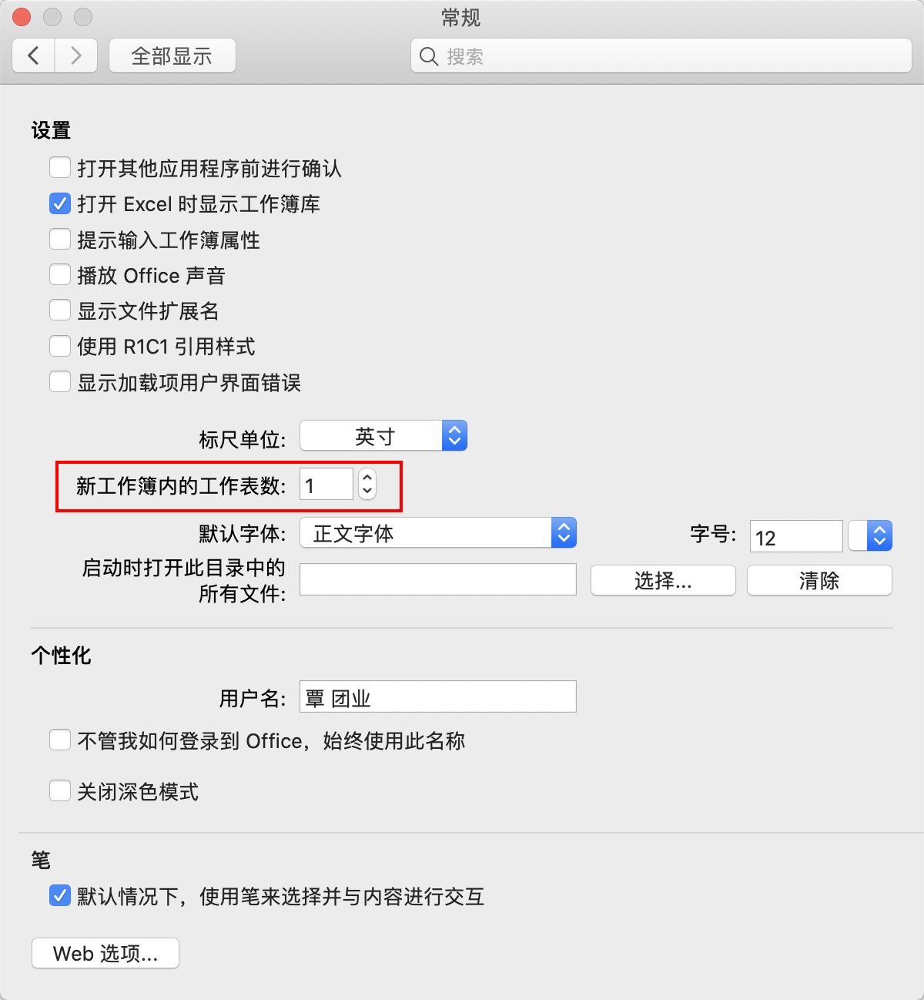
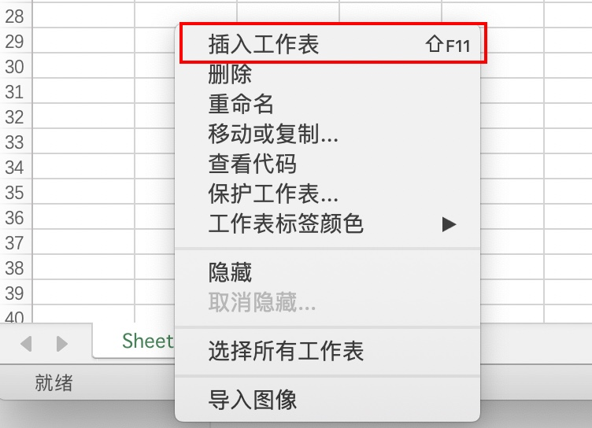

**1. 随着工作簿一同创建**

用户可以通过设置来改变新建工作簿时所包含的工作表数目。在功能区上依次单击【Office 按钮】-> 【Excel 选项】，打开【Excel 选项】对话框，选择【常用】选项卡。

在【包含的工作表数】 微调框内，用户可以设置新工作簿默认包含的工作表数目，数值范围为 1 ~ 255。

**2. 从现有的工作簿中创建**

在 Excel 功能区的【开始】选项卡中单击【插入】下拉按钮，在扩展菜单中单击【插入工作表】命令。

在当前工作表标签上单击鼠标右键，在弹出的快捷菜单上选择【插入】，在弹出的【插入】对话框中选中【工作表】，再单击【确定】按钮。

在键盘上按 <Shift + F11> 组合键，则会在当前工作表前插入新工作表。

如果用户需要批量增加多张工作表，可以在第一次插入工作表操作完成后按 <F4> 键重复操作，也可以在同时选中多张工作表的情况下使用功能区按钮，或使用工作表标签的右键菜单命令插入工作表。

> 创建新工作表的操作无法通过【撤销】按钮进行撤销。

