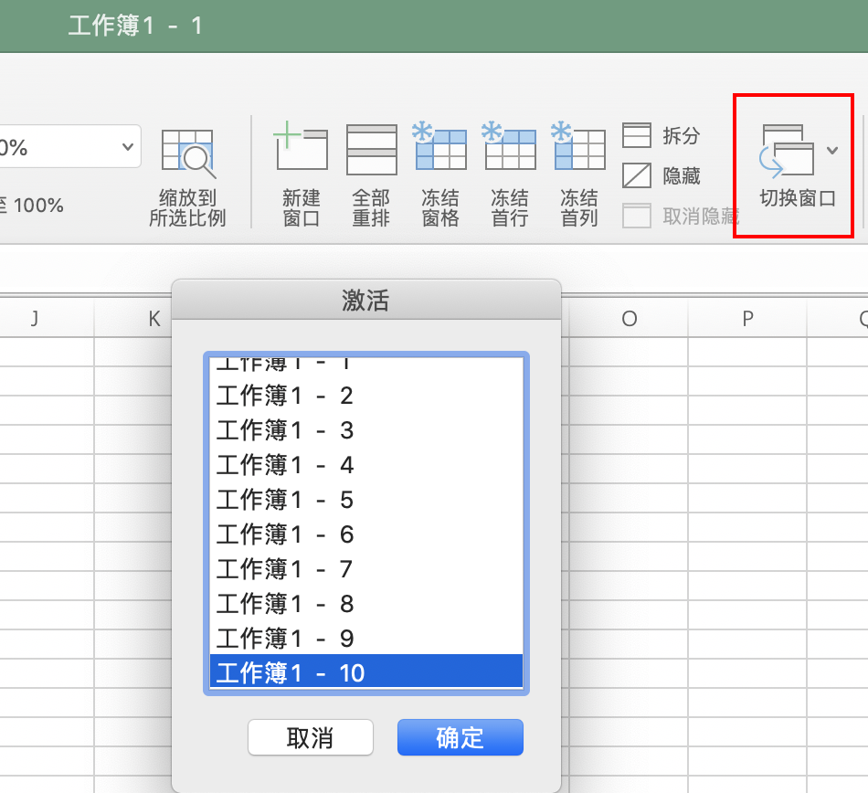
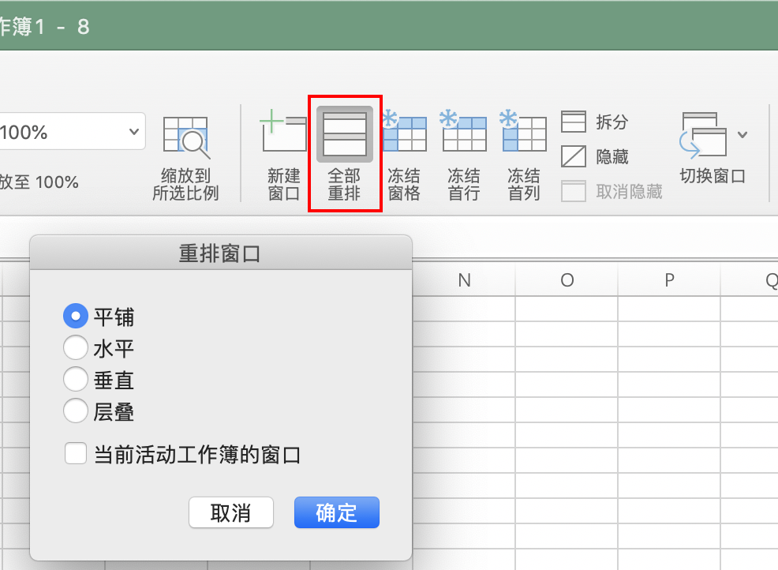
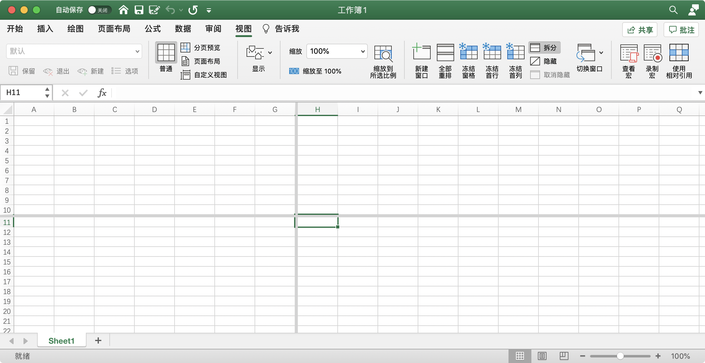
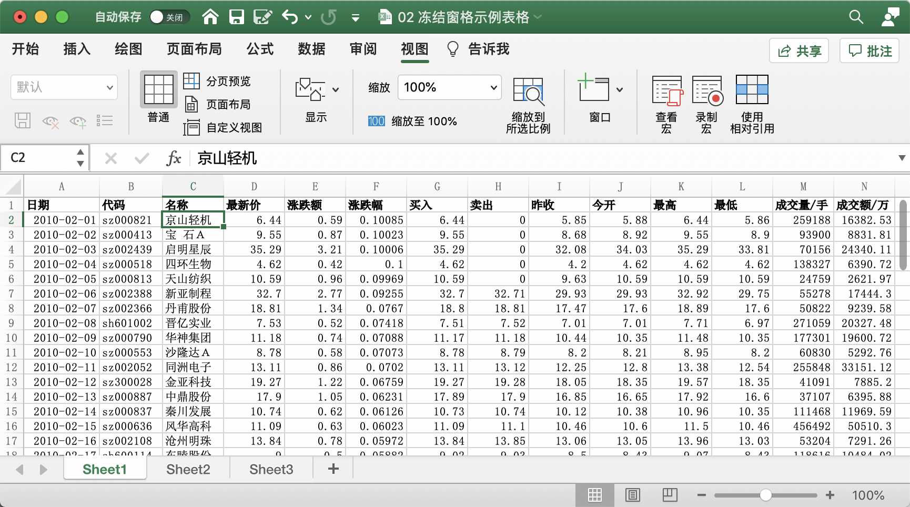
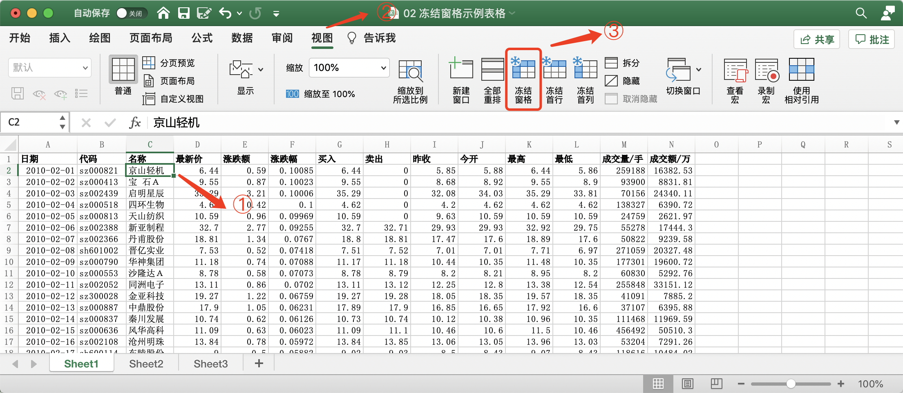
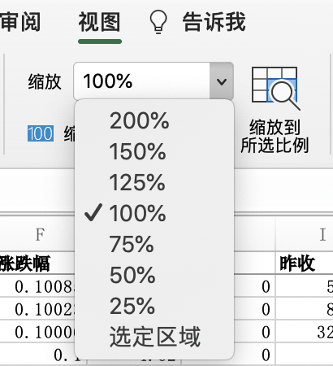
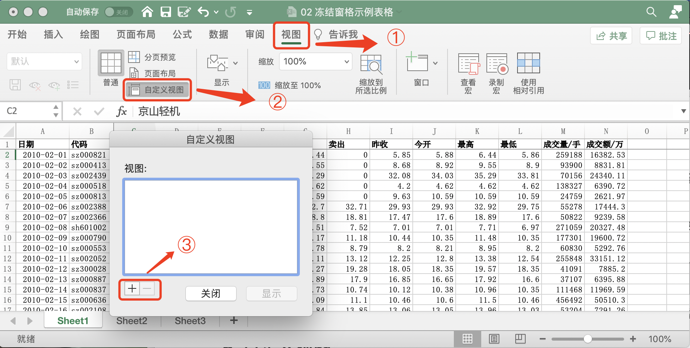
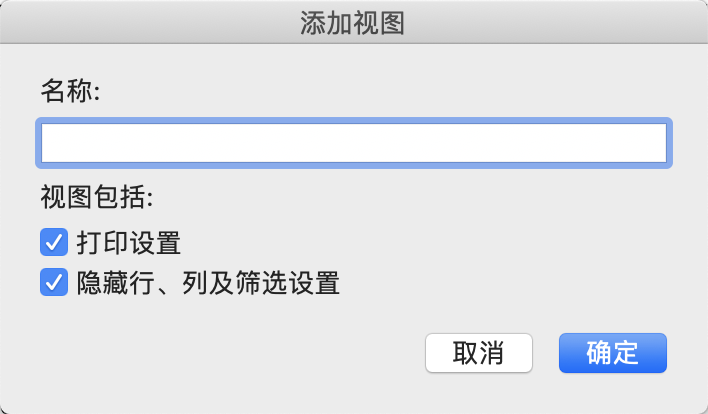

[toc]

### 1. 工作簿的多窗口显示

#### 1.1 创建新窗口

在 Excel 功能区上依次单击 【视图】->【新建窗口】按钮，如图 3-48 所示，即可为当前工作簿创建出新的窗口。

原有的工作簿窗口和新建的工作簿窗口都会相应地更改标题栏上的名称。如图 3-49 所示。

#### 1.2 窗口切换

用户可以通过菜单操作，将其他工作簿窗口选定为当前工作簿窗口，操作方法如下。

在 Excel 功能区中单击【视图】选项卡上的【切换窗口】下拉按钮，其扩展列表中会显示当前所有的工作簿窗口名称。单击相应名称项，即可将其切换为当前工作簿窗口，如图 3-50 所示。

如果当前打开的工作簿窗口较多（9个以上），【切换窗口】下拉列表无法显示所有窗口名称，则列表底部会显示【其他窗口】选项。单击此选项，会弹出【激活】对话框，其中的列表框内将显示全部工作簿窗口。在列表框中选定工作簿窗口，然后单击【确定】按钮，即可切换至目标工作簿，如图 3-51 所示。

除了通过菜单的操作方式以外，在 Excel 工作窗口中按 <Ctrl + F6> 或者 <Ctrl + Tab> 组合键，可以切换到上一个工作簿窗口。

另外，用户还可以通过单击 Windows 系统任务栏上的窗口来进行工作簿窗口的切换，或者在键盘上按 <Alt + Tab> 组合键，进行程序窗口的切换。

#### 1.3 重排窗口

（1）手动排列窗口。

> 提示：在浮动窗口的标题栏上双击鼠标左键，可以将浮动窗口重新变为最大化窗口，在标题栏左端的 Excel 图标上双击鼠标左键，可以关闭此工作簿窗口。当窗口显示为浮动状态时，关闭 Excel 程序，则下次启动 Excel 程序时依然以浮动窗口形式显示工作簿。

在浮动窗口的标题栏上按住鼠标左键，可以拖动浮动窗口改变放置的位置。当鼠标位于窗口边界并出现黑色双箭头图标时，可以按住鼠标左键拖动，以改变窗口的大小形状，如同操作其他普通的 Windows 应用程序窗口。

（2）【重排窗口】命令

在 Excel 功能区上单击【视图】选项卡中的【全部重排】按钮，在弹出的【重排窗口】对话框中选择一种排列方式，如图 3-54 所示。

如果在【重排窗口】对话框中勾选【当前活动工作簿的窗口】复选框，则工作窗口中只会同时显示当前工作簿的所有窗口。当然，如果当前工作簿只有唯一一个窗口，也可以勾选此复选框来单独显示此工作簿窗口。

> 提示：在浮动窗口标题栏上单击鼠标右键，在弹出的快捷菜单中选择【重排窗口】命令，也可以实现窗口重排操作。

### 2. 并排比较

“并排比较” 是一种特殊的重排窗口方式选定需要对比的某个工作簿窗口，单击 Excel 功能区上【视图】选项卡中的【并排查看】按钮。如果存在多个工作簿，则弹出【并排比较】对话框。在其中选择需要进行对比的目标工作簿，然后单击【确定】按钮，即可将两个工作簿窗口并排显示在 Excel 工作窗口之中。

通过【视图】选项卡上的【同步滚动】切换按钮，用户可以选择打开或者关闭此自动同步窗口滚动的功能。

要关闭并排比较的工作模式，可以在【视图】选项卡上单击【并排查看】切换按钮。单击工作表窗口的【最大化】按钮，并不会取消 ”并排查看”。

### 3. 拆分窗口

#### 3.1 使用菜单命令拆分

当鼠标定位于 Excel 工作区域内时，在 Excel 功能区上单击【视图】选项卡上的【拆分】切换按钮，就可以沿着当前激活单元格的左边框和上边框的方向，将当前表格区域拆分为 4 个窗格。

将光标定位到拆分条上，按住鼠标左键即可移动拆分条，改变窗格的布局。

要取消整个窗口的拆分状态，可以在 Excel 功能区上单击【视图】选项卡上的【拆分】切换按钮，进行状态切换。

#### 3.2 直接拆分

将鼠标光标移动到垂直滚动条的上端或水平滚动条的右端，然后按住鼠标左键，向下或者向左拖动，即可将对窗口进行水平拆分或者垂直拆分。（Mac OS 无效）

### 4. 冻结窗格

**示例 3.1 通过冻结窗格实现区域固定显示**

操作目的：在下图所示表格中固定显示列标题（第 1 行）及日期、代码两列区域（A、B 列）。

操作方法：需要固定显示的行列为 A、B 列及第 1 行，因此选中 C2 单元格为当前活动单元格。在 Excel 功能区上单击【视图】选项卡上的【冻结窗格】按钮。

> 在设置了冻结窗格的工作表中，按 <Ctrl + Home> 组合键可快速定位到两条冻结线交叉的位置，即最初执行冻结窗格命令是的定位位置所在。

用户还可以选择【冻结首行】或【冻结首列】命令，快速冻结表格首行或冻结首列。

> 如果需要变换冻结位置，用户需要先取消冻结，然后再执行一次冻结窗格操作，但 ”冻结首行“ 或者 ”冻结首列“ 不受此限制。

要取消工作表的冻结窗格状态，可在 Excel 功能区上再次单击 【视图】选项卡上的【取消冻结窗格】按钮。

> 冻结窗格与拆分窗口功能无法在同一工作表上同时使用。

### 5. 窗口缩放

在功能区上单击【视图】选项卡上的【缩放】下拉按钮，弹出【显示比例】对话框。

如果选择【缩放到所选比例】，则 Excel 会对当前选定的表格区域进行缩放，以使得当前窗口恰好完整显示所选定的区域（前提是不超过 10% ~ 400% 的缩放允许范围）。

Excel 状态栏上也有【显示比例】滑动按钮，用户可以直接移动滑动条来调节缩放比例。也可以单击滑动条左侧的【缩放级别】按钮，打开【显示比例】对话框进行选择设置。

> 如果用户使用的鼠标带滚轮，可以在按住 <kbd>Ctrl</kbd> 键的同时滚动滚轮，也可以方便地调整显示比例。

### 6. 自定义视图

在对工作表进行各种视图显示调整后，用户如果想要保存这些设置内容，并在以后的工作中能够随时使用这些设置后的视图显示，可以通过 “视图管理器” 来实现。

在 Excel 功能区上单击【视图】选项卡上的【自定义视图】按钮，弹出【视图管理器】对话框。要将当前的视图显示保存为一个自定义视图，可在对话框上单击【添加】按钮，在弹出的【添加视图】对话框的【名称】框中填入为创建的视图定义的名称，然后单击【确定】按钮，即可完成创建工作。

视图管理器所能保存的视图设置包括窗口的大小、位置、拆分窗口、冻结窗格、显示比例、打印设置、创建视图时的选定单元格、行列的隐藏、筛选，以及【选项】对话框的诸多设置。需要调用自定义视图的显示时，用户可以再次在 Excel 功能区上单击【视图】选项卡上的【自定义视图】按钮，在弹出的【视图管理器】对话框的类别框中选择相应的视图名称，然后单击【显示】按钮。

> “视图管理器” 操作与 ”列表“ 操作不可以同时进行。如果当前工作簿的任何工作表中存在 ”列表“，则 ”视图管理器“ 命令会变成灰色不可用。