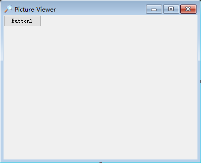
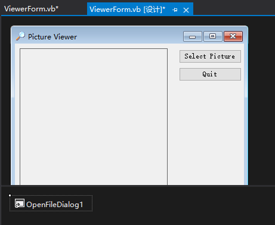

**1. 在窗体中添加可见控件**

首先将一个 Button 控件添加到窗体中。为此，双击 "工具箱" 中的 Button 控件。Visual Basic 将创建一个新按钮，并将其放在窗体的左上角。

按照下表修改 Button 属性：

| 属性     | 值               |
| -------- | ---------------- |
| Name     | btnSelectPicture |
| Location | 275,10           |
| Size     | 105,23           |
| Text     | Select Picture   |

虽然可通过双击 "工具箱" 中的 Button 控件，再添加一个按钮，但这次将通过复制已创建的按钮来添加一个按钮到窗体中。

为此，右击 "Select Picture" 按钮并从弹出的菜单中选择 "复制" 命令。接下来，在窗体的任意处右击并从窗体的快捷菜单中选择 "粘贴" （也可以使用键盘 <kbd>Ctrl</kbd>+<kbd>C</kbd> 组合键进行复制，用 <kbd>Ctrl</kbd>+<kbd>V</kbd> 组合键进行粘贴）命令。新按钮出现在窗体中央，且默认被选中。按照下表修改该按钮的属性：

| 属性     | 值      |
| -------- | ------- |
| Name     | btnQuit |
| Location | 275, 40 |
| Text     | Quit    |

双击 "工具箱" 中的 PictureBox，将一个 PictureBox 控件添加到窗体中，然后按如下设置它的属性。

| 属性        | 值             |
| ----------- | -------------- |
| Name        | picShowPicture |
| BorderStyle | FixedSingle    |
| Location    | 8,8            |
| Size        | 248, 272       |

**2. 在窗体中添加不可见的控件**

> 注意：除 OpenFileDialog 控件外，还有其他控件也提供文件操作功能。例如，SaveFileDialog 控件让用户能够指定文件名和路径以保存文件。

现在在 "工具箱" 中找到 OpenFileDialog 控件，然后双击它。注意，该控件并不放在窗体中，而是出现在窗体下方的特定位置。

选中 OpenFileDialog，按照下表修改其属下：

| 属性     | 值                                          |
| -------- | ------------------------------------------- |
| Name     | ofdSelectPicture                            |
| FileName | <使其为空>                                  |
| Filter   | Windows Bitmaps\|\*.BMP\|JPEG Files\|\*.JPG |
| Title    | Select Picture                              |

Filter 属性用于限制（过滤）要在 "打开文件" 对话框中显示的文件类型。过滤器的格式为：描述|过滤器。

