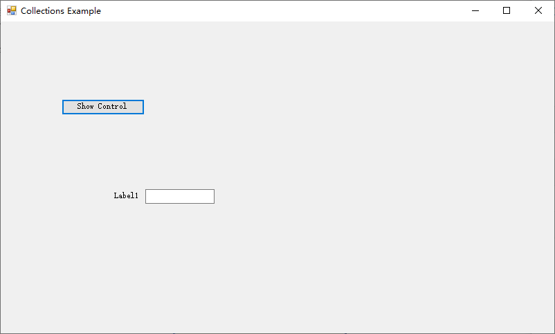

为了更好地理解集合，下面创建一个小型 Visual Basic 项目，它遍历窗体的 Controls 集合，并显示窗体中每个控件的 Name 属性。按照下面的步骤来创建这个示例项目。

1. 创建一个新的 Windows 窗体应用程序项目，将其命名为 Collections Example。
2. 使用 "解决方案资源管理器" 将窗体的文件名改为 CollectionsExampleForm.vb （右击 "解决方案资源管理器" 中的 Form1.vb，再选择 "重命名"），并将窗体的 Text 属性设置为 Collections Example。
3. 双击工具箱中的 Button 工具添加一个新按钮到窗体中。按如下设置该按钮的属性。

| 属性     | 值                 |
| -------- | ------------------ |
| Name     | btnShowNames       |
| Location | 88,112             |
| Size     | 120,23             |
| Text     | Show Control Names |

4. 将一个文本框和标签控件添加到窗体中。添加控件到窗体中时，确保每个空间的名称是唯一的。
5. 将控件添加到窗体中后，双击 Show Control Name 按钮，为它的 Click 事件添加代码。输入下列代码：

```vb
Dim intIndex As Integer
For intIndex = 0 To Me.Controls.Count - 1
MessageBox.Show("Control #" & intIndex & " has the name " & _
    Me.Controls(intIndex).Name)
Next intIndex
```

> 注意，每个窗体都有一个 Controls 集合，该集合可能不包含任何控件。即使窗体中没有任何控件，窗体也有 Controls 集合。

