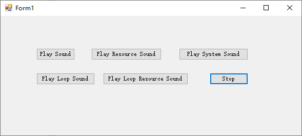

[toc]

> > 摘自：[播放声音](https://docs.microsoft.com/zh-cn/dotnet/visual-basic/developing-apps/programming/computer-resources/playing-sounds)

### 播放声音

`My.Computer.Audio.Play` 方法允许应用程序一次仅播放一种背景声音；应用程序播放新背景声音时，会停止播放上一种背景声音。你也可以播放一种声音并等待其播放完毕。

下例中使用 `My.Computer.Audio.Play` 方法播放声音。指定 `AudioPlayMode.WaitToComplete` 时，`My.Computer.Audio.Play` 将等待声音播放完毕，然后再调用代码继续。

```vb
Sub PlayBackgroundSoundFile()
    My.Computer.Audio.Play("C:\Waterfall.wav",
        AudioPlayMode.WaitToComplete)
End Sub
```

下例中使用 `My.Computer.Audio.Play` 方法播放声音。使用此示例时，应确保应用程序资源包含名为 Waterfall 的 .wav 声音文件。

```vb
Sub PlayBackgroundSoundResource()
    My.Computer.Audio.Play(My.Resources.Waterfall,
        AudioPlayMode.WaitToComplete)
End Sub
```

> 提示：为项目添加资源文件的方法，请参考《[为项目添加资源文件](../../../Commons/为项目添加资源文件.md)》文章。

### 播放循环声音

在下例中，指定 `PlayMode.BackgroundLoop` 时，`My.Computer.Audio.Play` 方法将播放指定的背景声音。使用此示例时，应确保文件名可指代计算机中的 .wav 声音文件。

```vb
Sub PlayLoopingBackgroundSoundFile()
    My.Computer.Audio.Play("C:\Waterfall.wav",
        AudioPlayMode.BackgroundLoop)
End Sub
```

在下例中，指定 `PlayMode.BackgroundLoop` 时，`My.Computer.Audio.Play` 方法将播放指定的背景声音。使用此示例时，应确保应用程序资源包含名为 Waterfall 的 .wav 声音文件。

```vb
Sub PlayLoopingBackgroundSoundResource()
    My.Computer.Audio.Play(My.Resources.Waterfall,
          AudioPlayMode.BackgroundLoop)
End Sub
```

### 停止播放背景声音

使用 `My.Computer.Audio.Stop` 方法可停止应用程序当前播放的背景声音或循环声音。

下面的示例将停止播放背景声音。

```vb
Sub StopBackgroundSound()
    My.Computer.Audio.Stop()
End Sub
```

### 播放系统声音

使用 `My.Computer.Audio.PlaySystemSound` 方法可播放指定的系统声音。例如：

```vb
Sub PlaySystemSound()
    My.Computer.Audio.PlaySystemSound(
        System.Media.SystemSounds.Asterisk)
End Sub
```

> 注意：如果使用 `AudioPlayMode.WaitToComplete` 设置播放模式将会导致 UI 阻塞（应用无法响应事件，一直到音乐播放完成）。

下面是测试应用界面：



下面是相关代码：

```vb
Imports System.Media

Public Class Form1

    Private Sub PlayBacgroundSoundFile()
        My.Computer.Audio.Play("C:\Waterfall.wav", AudioPlayMode.WaitToComplete)
    End Sub

    Private Sub PlayBackgroundSoundResource()
        My.Computer.Audio.Play(My.Resources.Waterfall, AudioPlayMode.WaitToComplete)
    End Sub

    Private Sub PlayLoopingBackgroundSoundFile()
        My.Computer.Audio.Play("C:\Waterfall.wav", AudioPlayMode.BackgroundLoop)
    End Sub

    Private Sub PlayLoopingBackgroundSoundResource()
        My.Computer.Audio.Play(My.Resources.Waterfall, AudioPlayMode.BackgroundLoop)
    End Sub

    Private Sub StopBackgroundSound()
        My.Computer.Audio.Stop()
    End Sub

    Private Sub PlaySystemSound()
        My.Computer.Audio.PlaySystemSound(SystemSounds.Asterisk)
    End Sub

    Private Sub btnPlaySound_Click(sender As Object, e As EventArgs) Handles btnPlaySound.Click
        PlayBacgroundSoundFile()
    End Sub

    Private Sub btnPlayResourceSound_Click(sender As Object, e As EventArgs) Handles btnPlayResourceSound.Click
        PlayBackgroundSoundResource()
    End Sub

    Private Sub btnPlaySystemSound_Click(sender As Object, e As EventArgs) Handles btnPlaySystemSound.Click
        PlaySystemSound()
    End Sub

    Private Sub btnStop_Click(sender As Object, e As EventArgs) Handles btnStop.Click
        My.Computer.Audio.Stop()
    End Sub

    Private Sub btnLoopSound_Click(sender As Object, e As EventArgs) Handles btnLoopSound.Click
        PlayLoopingBackgroundSoundFile()
    End Sub

    Private Sub btnPlayLoopResourceSound_Click(sender As Object, e As EventArgs) Handles btnPlayLoopResourceSound.Click
        PlayLoopingBackgroundSoundResource()
    End Sub
End Class
```

