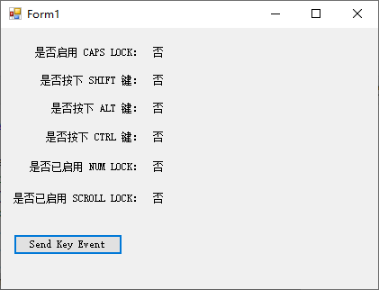

下表列出了与 `My.Computer.Keyboard` 对象相关联的任务，并提供了演示如何执行每个任务的主题链接。

| 到                         | 请参阅                                                       |
| :------------------------- | :----------------------------------------------------------- |
| 确定是否已启用 CAPS LOCK   | [CapsLock](https://docs.microsoft.com/zh-cn/dotnet/api/microsoft.visualbasic.devices.keyboard.capslock) |
| 确定是否按下 SHIFT 键      | [ShiftKeyDown](https://docs.microsoft.com/zh-cn/dotnet/api/microsoft.visualbasic.devices.keyboard.shiftkeydown) |
| 确定是否按下 ALT 键        | [AltKeyDown](https://docs.microsoft.com/zh-cn/dotnet/api/microsoft.visualbasic.devices.keyboard.altkeydown) |
| 确定是否按下 CTRL 键       | [CtrlKeyDown](https://docs.microsoft.com/zh-cn/dotnet/api/microsoft.visualbasic.devices.keyboard.ctrlkeydown) |
| 确定是否已启用 NUM LOCK    | [NumLock](https://docs.microsoft.com/zh-cn/dotnet/api/microsoft.visualbasic.devices.keyboard.numlock) |
| 确定是否已启用 SCROLL LOCK | [ScrollLock](https://docs.microsoft.com/zh-cn/dotnet/api/microsoft.visualbasic.devices.keyboard.scrolllock) |

**如何：启动应用程序并向其发送击键**

本示例使用 [Shell](https://docs.microsoft.com/zh-cn/dotnet/api/microsoft.visualbasic.interaction.shell) 方法启动记事本应用程序，然后使用 [My.Computer.Keyboard.SendKeys](https://docs.microsoft.com/zh-cn/dotnet/api/microsoft.visualbasic.devices.keyboard.sendkeys) 方法发送击键来打印句子。

```vb
Dim ProcID As Integer
' Start the Notepad application, and store the process id.
ProcID = Shell("NOTEPAD.EXE", AppWinStyle.NormalFocus)
' Activate the Notepad application.
AppActivate(ProcID)
' Send the keystrokes to the Notepad application.
My.Computer.Keyboard.SendKeys("I ", True)
My.Computer.Keyboard.SendKeys("♥", True)
My.Computer.Keyboard.SendKeys(" Visual Basic!", True)
' The sentence I ♥ Visual Basic! is printed on Notepad.
```

> 警告：如果找不到具有请求的进程标识符的应用程序，则会引发 [ArgumentException](https://docs.microsoft.com/zh-cn/dotnet/api/system.argumentexception) 异常。

下面是测试应用界面：



下面是测试应用的代码：

```vb
Public Class Form1

    Private Sub Form1_Load(sender As Object, e As EventArgs) Handles MyBase.Load
        updateKeyboardStatus()
    End Sub

    Private Sub updateKeyboardStatus()
        If (My.Computer.Keyboard.AltKeyDown) Then
            lbAlt.Text = "是"
        Else
            lbAlt.Text = "否"
        End If
        If (My.Computer.Keyboard.CapsLock) Then
            lbCapsLock.Text = "是"
        Else
            lbCapsLock.Text = "否"
        End If
        If (My.Computer.Keyboard.CtrlKeyDown) Then
            lbCtrl.Text = "是"
        Else
            lbCtrl.Text = "否"
        End If
        If (My.Computer.Keyboard.NumLock) Then
            lbNumLock.Text = "是"
        Else
            lbNumLock.Text = "否"
        End If
        If (My.Computer.Keyboard.ScrollLock) Then
            lbScrollLock.Text = "是"
        Else
            lbScrollLock.Text = "否"
        End If
        If (My.Computer.Keyboard.ShiftKeyDown) Then
            lbShift.Text = "是"
        Else
            lbShift.Text = "否"
        End If
    End Sub

    Private Sub btnSendKeyEvent_Click(sender As Object, e As EventArgs) Handles btnSendKeyEvent.Click
        Dim ProcID As Integer
        ' Start the Notepad application, and store the process id.
        ProcID = Shell("NOTEPAD.EXE", AppWinStyle.NormalFocus)
        ' Activate the Notepad application
        AppActivate(ProcID)
        ' Send the keystrokes to the Notepad application.
        My.Computer.Keyboard.SendKeys("I ", True)
        My.Computer.Keyboard.SendKeys("♥", True)
        My.Computer.Keyboard.SendKeys(" Visual Basic!", True)
        ' The sentence I ♥ Visual Basic! is printed on Notepad.
    End Sub

    Private Sub Form1_KeyDown(sender As Object, e As KeyEventArgs) Handles Me.KeyDown
        updateKeyboardStatus()
    End Sub

    Private Sub btnSendKeyEvent_KeyDown(sender As Object, e As KeyEventArgs) Handles btnSendKeyEvent.KeyDown
        updateKeyboardStatus()
    End Sub

    Private Sub btnSendKeyEvent_KeyUp(sender As Object, e As KeyEventArgs) Handles btnSendKeyEvent.KeyUp
        updateKeyboardStatus()
    End Sub
End Class

```

