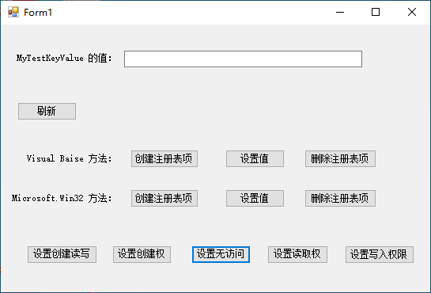

[toc]

### 1. 创建注册表项并设置其值

#### 1.1 创建注册表项

使用 `CreateSubKey` 方法，指定放置注册表项的配置单元以及注册表项的名称。 参数 `Subkey` 不区分大小写。 此示例在 HKEY_CURRENT_USER 下创建注册表项 `MyTestKey`。

```vb
My.Computer.Registry.CurrentUser.CreateSubKey("MyTestKey")
```

#### 1.2 创建注册表项并设置其值

1. 使用 `CreateSubkey` 方法，指定放置注册表项的配置单元以及注册表项的名称。 此示例在 HKEY_CURRENT_USER 下创建注册表项 `MyTestKey`。

   ```vb
   My.Computer.Registry.CurrentUser.CreateSubKey("MyTestKey")
   ```

2. 使用 `SetValue` 方法设置值。 此示例设置字符串值。 “MyTestKeyValue”设置为“This is a test value”。

   ```vb
   My.Computer.Registry.SetValue("HKEY_CURRENT_USER\MyTestKey",
     "MyTestKeyValue", "This is a test value.")
   ```

#### 1.3 示例

此示例在 HKEY_CURRENT_USER 下创建注册表项 `MyTestKey`，然后将字符串值 `MyTestKeyValue` 设置为 `This is a test value`。

```vb
My.Computer.Registry.CurrentUser.CreateSubKey("MyTestKey")
' Change MyTestKeyValue to This is a test value. 
My.Computer.Registry.SetValue("HKEY_CURRENT_USER\MyTestKey",
  "MyTestKeyValue", "This is a test value.")
```

#### 1.4 可靠性编程

即使注册表项受 ACL（访问控制列表）保护，在注册表中以纯文本形式存储机密信息（例如密码）也不安全。

以下情况可能会导致异常：

- 密钥名称是 `Nothing` ([ArgumentNullException](https://docs.microsoft.com/zh-cn/dotnet/api/system.argumentnullexception))。
- 用户没有创建注册表项的权限 ([SecurityException](https://docs.microsoft.com/zh-cn/dotnet/api/system.security.securityexception))。
- 项名称超过 255 个字符的限制 ([ArgumentException](https://docs.microsoft.com/zh-cn/dotnet/api/system.argumentexception))。
- 项已关闭 ([IOException](https://docs.microsoft.com/zh-cn/dotnet/api/system.io.ioexception))。
- 注册表项为只读 ([UnauthorizedAccessException](https://docs.microsoft.com/zh-cn/dotnet/api/system.unauthorizedaccessexception))。

### 2. 从注册表项中读取值

`My.Computer.Registry` 对象的 `GetValue` 方法可以用于读取 Windows 注册表中的值。

如果在下面的示例中，“Software\MyApp”项不存在，则引发异常。 如果在下面的示例中，`ValueName`“Name”不存在，则返回 `Nothing`。

#### 2.1 从注册表项读取值

使用 `GetValue` 方法（指定路径和名称）可从注册表项读取值。 下面的示例从 `HKEY_CURRENT_USER\Software\MyApp` 读取值 `Name` 并将它显示在消息框中。

```vb
Dim readValue = My.Computer.Registry.GetValue(
    "HKEY_CURRENT_USER\Software\MyApp", "Name", Nothing)
MsgBox("The value is " & readValue)
```

#### 2.2 确定值是否存在于注册表项中

使用 `GetValue` 方法可检索值。 下面的代码检查值是否存在并在它不存在时返回消息。

```vb
If My.Computer.Registry.GetValue("HKEY_LOCAL_MACHINE\TestApp",
"TestValue", Nothing) Is Nothing Then
    MsgBox("Value does not exist.")
End If
```

### 3. 删除注册表项

使用 `DeleteSubKey` 方法删除注册表项。 此示例将删除 CurrentUser 配置单元中的软件/TestApp 项。 可在代码中更改为相应的字符串，或使它依赖于用户提供的信息。

```vb
My.Computer.Registry.CurrentUser.DeleteSubKey(
    "Software\TestApp")
```

### 4. 使用 Microsoft.Win32 命名空间读取和写入注册表

虽然在针对注册表进行编程时，`My.Computer.Registry` 应涵盖你的基本需求，不过你还可以使用 .NET 的 [Microsoft.Win32](https://docs.microsoft.com/zh-cn/dotnet/api/microsoft.win32) 命名空间中的 [Registry](https://docs.microsoft.com/zh-cn/dotnet/api/microsoft.win32.registry) 和 [RegistryKey](https://docs.microsoft.com/zh-cn/dotnet/api/microsoft.win32.registrykey) 类。

#### 4.1 注册表类中的项

[Registry](https://docs.microsoft.com/zh-cn/dotnet/api/microsoft.win32.registry) 类提供可以用于访问子项及其值的注册表基项。 这些基项本身是只读的。 下表列出并介绍了 [Registry](https://docs.microsoft.com/zh-cn/dotnet/api/microsoft.win32.registry) 类公开的七个项。

| **Key**                                                      | **说明**                                                     |
| :----------------------------------------------------------- | :----------------------------------------------------------- |
| [ClassesRoot](https://docs.microsoft.com/zh-cn/dotnet/api/microsoft.win32.registry.classesroot) | 定义文档的类型以及与这些类型关联的属性。                     |
| [CurrentConfig](https://docs.microsoft.com/zh-cn/dotnet/api/microsoft.win32.registry.currentconfig) | 包含不是特定于用户的硬件配置信息。                           |
| [CurrentUser](https://docs.microsoft.com/zh-cn/dotnet/api/microsoft.win32.registry.currentuser) | 包含有关当前用户首选项的信息，如环境变量。                   |
| [DynData](https://docs.microsoft.com/zh-cn/dotnet/api/microsoft.win32.registry.dyndata) | 包含动态注册表数据，如虚拟设备驱动程序使用的数据。           |
| [LocalMachine](https://docs.microsoft.com/zh-cn/dotnet/api/microsoft.win32.registry.localmachine) | 包含保存本地计算机的配置数据的五个子项（硬件、SAM、安全性、软件和系统）。 |
| [PerformanceData](https://docs.microsoft.com/zh-cn/dotnet/api/microsoft.win32.registry.performancedata) | 包含软件组件的性能信息。                                     |
| [Users](https://docs.microsoft.com/zh-cn/dotnet/api/microsoft.win32.registry.users) | 包含有关默认用户首选项的信息。                               |

>  重要
>
> 将数据写入当前用户 ([CurrentUser](https://docs.microsoft.com/zh-cn/dotnet/api/microsoft.win32.registry.currentuser)) 比写入本地计算机 ([LocalMachine](https://docs.microsoft.com/zh-cn/dotnet/api/microsoft.win32.registry.localmachine)) 更安全。 当你创建的项以前已由其他进程（可能是恶意的）进行了创建时，会发生通常称为“强占”的情况。 若要防止此情况发生，请使用在项尚未存在时返回 `Nothing` 的方法（如 [GetValue](https://docs.microsoft.com/zh-cn/dotnet/api/microsoft.win32.registrykey.getvalue)）。

#### 4.2 从注册表中读取值

下面的代码演示如何从 HKEY_CURRENT_USER 中读取字符串。

```vb
Dim regVersion As Microsoft.Win32.RegistryKey
Dim keyValue = "Software\\Microsoft\\TestApp\\1.0"
regVersion = Microsoft.Win32.Registry.CurrentUser.OpenSubKey(keyValue, False)
Dim intVersion As Integer = 0
If regVersion IsNot Nothing Then
    intVersion = regVersion.GetValue("Version", 0)
    regVersion.Close()
End If
```

下面的代码读取一个字符串，使它递增，然后将它写入 HKEY_CURRENT_USER。

```vb
Dim regVersion = Microsoft.Win32.Registry.CurrentUser.OpenSubKey(
                  "SOFTWARE\\Microsoft\\TestApp\\1.0", True)
If regVersion Is Nothing Then
    ' Key doesn't exist; create it.
    regVersion = Microsoft.Win32.Registry.CurrentUser.CreateSubKey(
                 "SOFTWARE\\Microsoft\\TestApp\\1.0")
End If

Dim intVersion As Integer = 0
If regVersion IsNot Nothing Then
    intVersion = regVersion.GetValue("Version", 0)
    intVersion = intVersion + 1
    regVersion.SetValue("Version", intVersion)
    regVersion.Close()
End If
```

### 5. 安全性与注册表

即使注册表项受 ACL（访问控制列表）保护，在注册表中以纯文本形式存储机密信息（例如密码）也不安全。

对注册表进行操作时，如果允许对系统资源或受保护的信息进行不适当的访问，则可能会降低安全性。 若要使用这些属性，必须具有来自 [RegistryPermissionAccess](https://docs.microsoft.com/zh-cn/dotnet/api/system.security.permissions.registrypermissionaccess) 枚举（其控制对注册表变量的访问）的读取和写入权限。 通过完全信任运行的任何代码（在默认安全策略下，指安装在用户本地硬盘上的任何代码）都具有访问注册表的必要权限。 有关详细信息，请参阅 [RegistryPermission](https://docs.microsoft.com/zh-cn/dotnet/api/system.security.permissions.registrypermission) 类。

不应将注册表变量存储在某些内存位置，在这些位置，不具有 [RegistryPermission](https://docs.microsoft.com/zh-cn/dotnet/api/system.security.permissions.registrypermission) 的代码可访问这些变量。 同样，授予权限时，授予顺利完成操作所需的最小特权。

通过 [RegistryPermissionAccess](https://docs.microsoft.com/zh-cn/dotnet/api/system.security.permissions.registrypermissionaccess) 枚举定义注册表权限访问值。 下表详细说明了其成员。

| “值”        | 对注册表变量的访问 |
| :---------- | :----------------- |
| `AllAccess` | 创建、读取和写入   |
| `Create`    | 创建               |
| `NoAccess`  | 无访问权限         |
| `Read`      | 读取               |
| `Write`     | Write              |

下面是测试应用界面：



下面是测试应用的代码：

```vb
Imports System.Security.Permissions

Public Class Form1
    Private Sub btnRefresh_Click(sender As Object, e As EventArgs) Handles btnRefresh.Click
        Try
            Dim value = My.Computer.Registry.GetValue("HKEY_CURRENT_USER\MyTestKey", "MyTestKeyValue", Nothing)
            If value IsNot Nothing Then
                tbValue.Text = value
            Else
                tbValue.Text = "未设置"
            End If
        Catch ex As Exception
            Console.WriteLine(ex)
            tbValue.Text = "未设置"
        End Try
    End Sub

    Private Sub btnCreate1_Click(sender As Object, e As EventArgs) Handles btnCreate1.Click
        My.Computer.Registry.CurrentUser.CreateSubKey("MyTestKey")
    End Sub

    Private Sub btnSetValue1_Click(sender As Object, e As EventArgs) Handles btnSetValue1.Click
        My.Computer.Registry.SetValue("HKEY_CURRENT_USER\MyTestKey", "MyTestKeyValue", "This is a test value.")
    End Sub

    Private Sub btnDelete1_Click(sender As Object, e As EventArgs) Handles btnDelete1.Click
        My.Computer.Registry.CurrentUser.DeleteSubKey("MyTestKey")
    End Sub

    Private Sub btnCreate2_Click(sender As Object, e As EventArgs) Handles btnCreate2.Click
        Dim myTestKey = Microsoft.Win32.Registry.CurrentUser.OpenSubKey("MyTestKey", True)
        If myTestKey Is Nothing Then
            ' key doesn't exits; create it.
            Microsoft.Win32.Registry.CurrentUser.CreateSubKey("MyTestKey")
        End If
    End Sub

    Private Sub btnSetValue2_Click(sender As Object, e As EventArgs) Handles btnSetValue2.Click
        Dim myTestKey = Microsoft.Win32.Registry.CurrentUser.OpenSubKey("MyTestKey", True)
        myTestKey.SetValue("MyTestKeyValue", "This is a test value.")
    End Sub

    Private Sub btnDelete2_Click(sender As Object, e As EventArgs) Handles btnDelete2.Click
        Microsoft.Win32.Registry.CurrentUser.DeleteSubKey("MyTestKey", True)
    End Sub

    Private Sub btnCWR_Click(sender As Object, e As EventArgs) Handles btnCWR.Click
        Dim myTestKey = Microsoft.Win32.Registry.CurrentUser.OpenSubKey("MyTestKey", True)
        Dim user = Environment.UserDomainName + "\\" + Environment.UserName
        Console.WriteLine("UserDomainName: " + Environment.UserDomainName + " user: " + Environment.UserName)
        Dim sec = New Security.AccessControl.RegistrySecurity()
        Dim fullRule = New Security.AccessControl.RegistryAccessRule(user,
                                                                 Security.AccessControl.RegistryRights.FullControl,
                                                                 Security.AccessControl.InheritanceFlags.ContainerInherit,
                                                                 Security.AccessControl.PropagationFlags.None,
                                                                 Security.AccessControl.AccessControlType.Allow)
        Dim writeRule = New Security.AccessControl.RegistryAccessRule(user,
                                                                 Security.AccessControl.RegistryRights.WriteKey,
                                                                 Security.AccessControl.InheritanceFlags.ContainerInherit,
                                                                 Security.AccessControl.PropagationFlags.None,
                                                                 Security.AccessControl.AccessControlType.Allow)
        Dim createRule = New Security.AccessControl.RegistryAccessRule(user,
                                                                 Security.AccessControl.RegistryRights.CreateSubKey,
                                                                 Security.AccessControl.InheritanceFlags.ContainerInherit,
                                                                 Security.AccessControl.PropagationFlags.None,
                                                                 Security.AccessControl.AccessControlType.Allow)
        Dim rule = New Security.AccessControl.RegistryAccessRule(user,
                                                                 Security.AccessControl.RegistryRights.ReadKey,
                                                                 Security.AccessControl.InheritanceFlags.ContainerInherit,
                                                                 Security.AccessControl.PropagationFlags.None,
                                                                 Security.AccessControl.AccessControlType.Allow)
        sec.SetAccessRule(rule)
        sec.AddAccessRule(fullRule)
        sec.AddAccessRule(writeRule)
        sec.AddAccessRule(createRule)
        myTestKey.SetAccessControl(sec)
    End Sub

    Private Sub btnC_Click(sender As Object, e As EventArgs) Handles btnC.Click
        Dim myTestKey = Microsoft.Win32.Registry.CurrentUser.OpenSubKey("MyTestKey", True)
        Dim user = Environment.UserDomainName + "\\" + Environment.UserName
        Console.WriteLine("UserDomainName: " + Environment.UserDomainName + " user: " + Environment.UserName)
        Dim sec = New Security.AccessControl.RegistrySecurity()
        Dim createRule = New Security.AccessControl.RegistryAccessRule(user,
                                                                 Security.AccessControl.RegistryRights.CreateSubKey,
                                                                 Security.AccessControl.InheritanceFlags.ContainerInherit,
                                                                 Security.AccessControl.PropagationFlags.None,
                                                                 Security.AccessControl.AccessControlType.Allow)
        sec.SetAccessRule(createRule)
        myTestKey.SetAccessControl(sec)
    End Sub

    Private Sub btnN_Click(sender As Object, e As EventArgs) Handles btnN.Click
        Dim myTestKey = Microsoft.Win32.Registry.CurrentUser.OpenSubKey("MyTestKey", True)
        Dim user = Environment.UserDomainName + "\\" + Environment.UserName
        Console.WriteLine("UserDomainName: " + Environment.UserDomainName + " user: " + Environment.UserName)
        Dim sec = New Security.AccessControl.RegistrySecurity()
        Dim fullRule = New Security.AccessControl.RegistryAccessRule(user,
                                                                 Security.AccessControl.RegistryRights.FullControl,
                                                                 Security.AccessControl.InheritanceFlags.ContainerInherit,
                                                                 Security.AccessControl.PropagationFlags.None,
                                                                 Security.AccessControl.AccessControlType.Deny)
        Dim writeRule = New Security.AccessControl.RegistryAccessRule(user,
                                                                 Security.AccessControl.RegistryRights.WriteKey,
                                                                 Security.AccessControl.InheritanceFlags.ContainerInherit,
                                                                 Security.AccessControl.PropagationFlags.None,
                                                                 Security.AccessControl.AccessControlType.Deny)
        Dim createRule = New Security.AccessControl.RegistryAccessRule(user,
                                                                 Security.AccessControl.RegistryRights.CreateSubKey,
                                                                 Security.AccessControl.InheritanceFlags.ContainerInherit,
                                                                 Security.AccessControl.PropagationFlags.None,
                                                                 Security.AccessControl.AccessControlType.Deny)
        Dim rule = New Security.AccessControl.RegistryAccessRule(user,
                                                                 Security.AccessControl.RegistryRights.ReadKey,
                                                                 Security.AccessControl.InheritanceFlags.ContainerInherit,
                                                                 Security.AccessControl.PropagationFlags.None,
                                                                 Security.AccessControl.AccessControlType.Deny)
        sec.SetAccessRule(rule)
        sec.AddAccessRule(fullRule)
        sec.AddAccessRule(writeRule)
        sec.AddAccessRule(createRule)
        myTestKey.SetAccessControl(sec)


    End Sub

    Private Sub btnR_Click(sender As Object, e As EventArgs) Handles btnR.Click
        Dim myTestKey = Microsoft.Win32.Registry.CurrentUser.OpenSubKey("MyTestKey", True)
        Dim user = Environment.UserDomainName + "\\" + Environment.UserName
        Console.WriteLine("UserDomainName: " + Environment.UserDomainName + " user: " + Environment.UserName)
        Dim sec = New Security.AccessControl.RegistrySecurity()
        Dim rule = New Security.AccessControl.RegistryAccessRule(user,
                                                                 Security.AccessControl.RegistryRights.ReadKey,
                                                                 Security.AccessControl.InheritanceFlags.ContainerInherit,
                                                                 Security.AccessControl.PropagationFlags.None,
                                                                 Security.AccessControl.AccessControlType.Allow)
        sec.SetAccessRule(rule)
        myTestKey.SetAccessControl(sec)
    End Sub

    Private Sub btnW_Click(sender As Object, e As EventArgs) Handles btnW.Click
        Dim myTestKey = Microsoft.Win32.Registry.CurrentUser.OpenSubKey("MyTestKey", True)
        Dim user = Environment.UserDomainName + "\\" + Environment.UserName
        Console.WriteLine("UserDomainName: " + Environment.UserDomainName + " user: " + Environment.UserName)
        Dim sec = New Security.AccessControl.RegistrySecurity()
        Dim writeRule = New Security.AccessControl.RegistryAccessRule(user,
                                                                 Security.AccessControl.RegistryRights.WriteKey,
                                                                 Security.AccessControl.InheritanceFlags.ContainerInherit,
                                                                 Security.AccessControl.PropagationFlags.None,
                                                                 Security.AccessControl.AccessControlType.Allow)
        sec.SetAccessRule(writeRule)
        myTestKey.SetAccessControl(sec)
    End Sub
End Class
```

