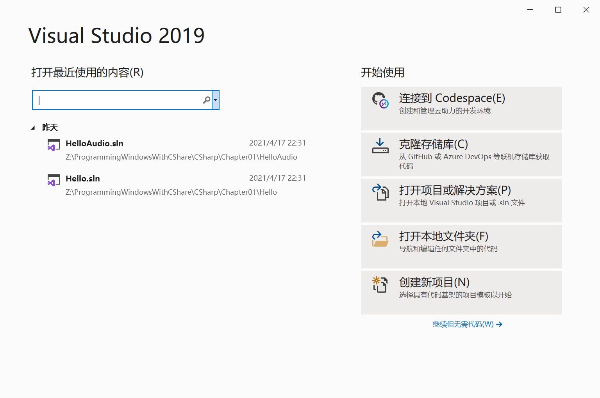
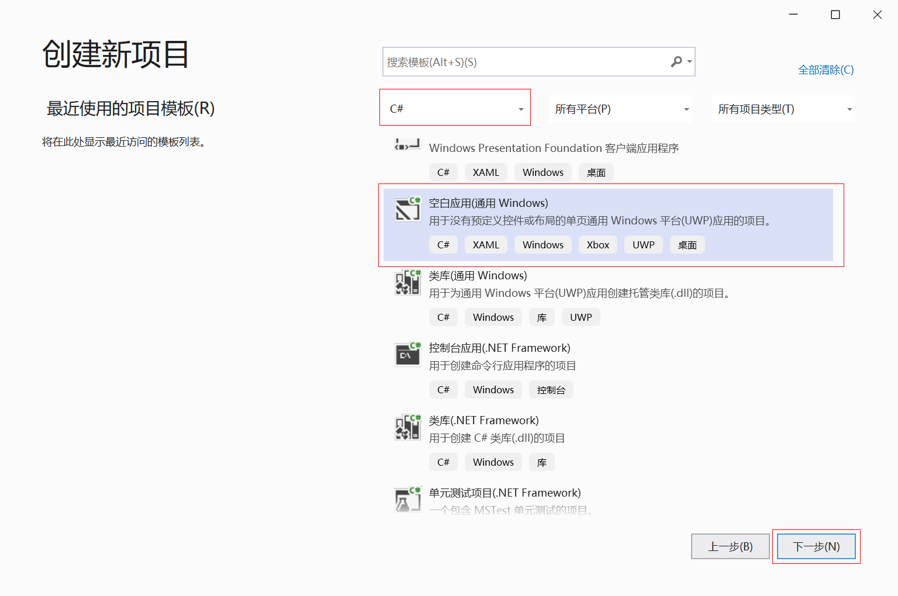
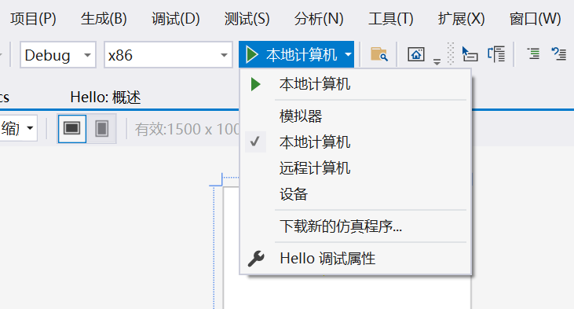

### 1.1 第一个项目

首页的左侧窗格中有个 ”新建项目“ 选项。单击它或从 ”文件“ 菜单中选择 ”新建项目“。



”新建项目“ 对话框打开后，在左侧窗格中选择 ”模板“，并依次选择 ”C# | 空白应用（通用 Windows）”。



为了查看文件的内容，可以双击文件名，也可以右击文件名并选择 “打开” 命令。

以下代码去掉 MainPage.xaml.cs 中的所有注释，仅保留其主体结构：

```c#
using System;
using System.Collections.Generic;
using System.IO;
using System.Linq;
using System.Runtime.InteropServices.WindowsRuntime;
using Windows.Foundation;
using Windows.Foundation.Collections;
using Windows.UI.Xaml;
using Windows.UI.Xaml.Controls;
using Windows.UI.Xaml.Controls.Primitives;
using Windows.UI.Xaml.Data;
using Windows.UI.Xaml.Input;
using Windows.UI.Xaml.Media;
using Windows.UI.Xaml.Navigation;

namespace Hello
{
    public sealed partial class MainPage : Page
    {
        public MainPage()
        {
            this.InitializeComponent();
        }
    }
}
```

按命名空间的前缀，我们可以将这些命名空间分成两大类。

+ **System.\***	包含针对 Windows 8 应用程序的 .NET 类型。
+ **Windows.\*** 包含 Windows Runtime（或称 WinRT）类型。

MainPage 类定义具有一个 `partial` 关键字。这个关键字标明该类的定义可以存在于不同的 C# 源代码文件中，而实际也如此。但直观来看，MainPage 类缺失的定义并非来自某个 C# 代码文件，而由 MainPage.xaml 文件提供。

```xml
<Page
    x:Class="Hello.MainPage"
    xmlns="http://schemas.microsoft.com/winfx/2006/xaml/presentation"
    xmlns:x="http://schemas.microsoft.com/winfx/2006/xaml"
    xmlns:local="using:Hello"
    xmlns:d="http://schemas.microsoft.com/expression/blend/2008"
    xmlns:mc="http://schemas.openxmlformats.org/markup-compatibility/2006"
    mc:Ignorable="d"
    Background="{ThemeResource ApplicationPageBackgroundThemeBrush}">

    <Grid>

    </Grid>
</Page>
```

> 注意：具有 `partial` 这个关键字的类被称为 ”分部类“ （partial class）。有关分部类的更多信息，请阅读 ”C# 编程指南“ 之 ”分部类和方法“，网址：<http://msdn.microsoft.com/zh-cn/library/wa80x488.aspx>。

这个 XAML 文件的根节点是 Page。读者可能已经猜到它来自于 Windows Runtime，但请注意 `x:Class` 特性。

```xml
<Page
    x:Class="Hello.MainPage"
```

`x:Class` 特性只能出现在 XAML 文件的根节点。上述代码我们可以这样理解：在 Hello 命名空间中定义一个名为 MainPage 的类，并使其派生自 Page。

下面两行是其中比较重要的。

```xml
xmlns="http://schemas.microsoft.com/winfx/2006/xaml/presentation"
xmlns:x="http://schemas.microsoft.com/winfx/2006/xaml"
```

数字 2006 暗示了 Windows Presentation Foundation 和 XAML 问世的年份。

第二个命名空间声明将前缀 "x" 与 XAML 本身固有的元素和特性关联。

第三个命名空间也值得一提：

```xml
xmlns:local="using:Hello"
```

这个声明将 XAML 前缀 ”local“ 与该应用程序的 Hello 命名空间关联。开发者在应用程序中自行创建的类便可以在 XAML 中用 local 前缀来引用。

我们下面使用 Windows Runtime 显示一行文本。将 TextBlock 置于单格 Grid 中，然后给它的几个特性赋值，这些特性实际上是 TextBlock 类定义的。

**项目：Hello | 文件：MainPage.xaml（片段）**

```xml
<Grid>
    <TextBlock Text="Hello, Windows 8!"
               FontFamily="Times New Roman"
               FontSize="96"
               FontStyle="Italic"
               Foreground="Yellow"
               HorizontalAlignment="Center"
               VerticalAlignment="Center" />
</Grid>
```

此外，程序也可以在模拟器中调试和运行。我们可以控制模拟器的分辨率、屏幕方向和其他特性。在 Visual Studio 工具栏中，有一个显示为 ”本地计算机“ 的下拉列表，将其改为 ”模拟器“ 即可。



