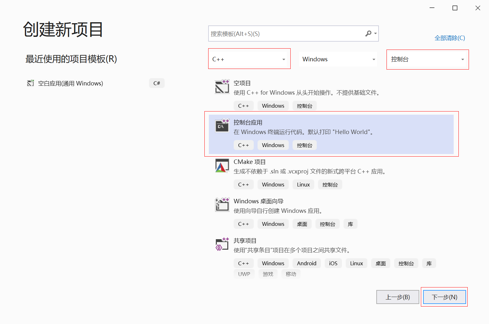

### 1.2 VC++ 的基本使用

#### 1.2.1 第一个控制台应用程序

（1）运行 Visual Studio 2019 ，选择 “创建新项目(N)” ，语言选择 "C++"，在下面选择 "控制台应用" 选项，然后点击下一步。



（2）在 "配置新项目" 对话框中的项目名称中输入工程名 "01FirstApp"，在 "位置" 输入框选择工程的保存目录，然后点击 "创建" 按钮。

（3）现在，向 01FirstApp 工程中添加你自己的文件或代码就行了。程序编写完毕可以按 <kbd>Ctrl</kbd>+<kbd>F7</kbd> 键编译，按 <kbd>F7</kbd> 键编译连接，按 <kbd>Ctrl</kbd>+<kbd>F5</kbd> 组合键运行程序。

#### 1.2.3 API 函数的调用方法

下面是一个调用 API 函数的例子，修改 `01FirstApp` 工程中 main 函数的实现代码如下。

```c
#include <stdio.h>
#include <Windows.h>	// 包含 MessageBox 函数声明的头文件

int main(int argc, char* argv[])
{
  // 调用 API 函数 MessageBox
	int nSelect = MessageBox(NULL, L"Hell, Windows XP", L"Greetings", MB_OKCANCEL);
	if (nSelect == IDOK) 
	{
		printf("用户选择了“确定”按钮\n");
	}
	else {
		printf("用户选择了“取消”按钮\n");
	}
	return 0;
}
```

在自己的程序中调用 API 函数的方法非常简单，具体步骤如下。

（1）包含要调用函数的声明文件。

（2）连接到指定的库文件（即 lib 文件）。Visual Studio 2019 默认已经连接了常用的 lib 文件，所以一般情况下，这一步对我们是透明的。如果需要显式设置的话（如在网络编程时需要添加 WS2_32.lib 库），可以在文件的开头使用 `#pragma comment(lib, "mylib.dll")` 命令。其中 `mylib.lib` 是目标库文件。

（3）在 API 函数前加 `::` 符号，表示这是一个全局的函数，以与 C++ 类的成员函数相区分。

如果想获得某个 API 函数详细信息，只需将光标移向此函数，按 <kbd>F1</kbd> 键即可。也可以打开 MSDN 文档（或 SDK 文档），直接将函数名输入到索引栏来查找函数的用法。