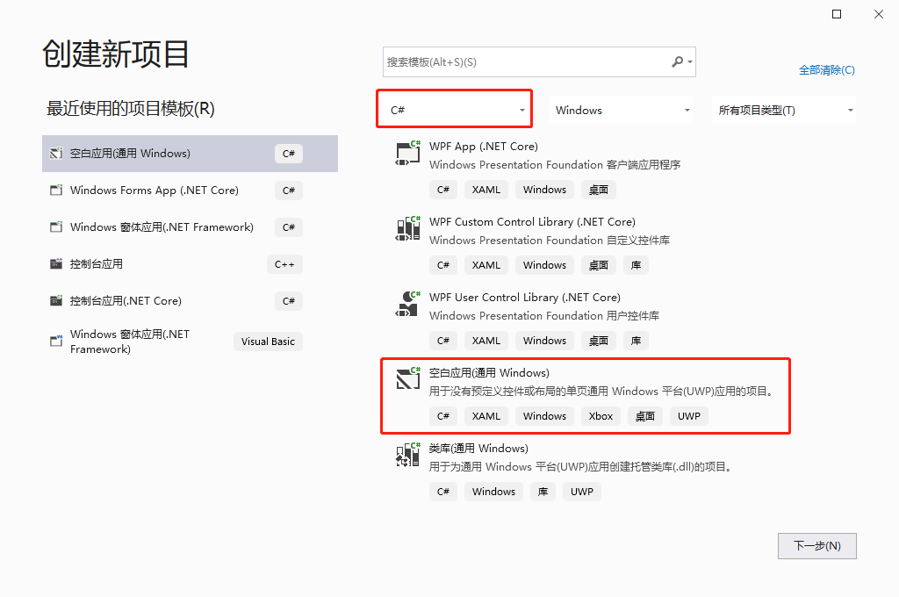

[toc]

### 1. 创建 Hello World 项目

#### 1.1 新建一个 Windows 10 的通用应用程序

打开 Visual Studio 开发工具，选择 `File` 菜单，选择新建一个工程（New Project），在 New Project 中选择 `Templates` -> `Visual C#` -> `Windows` -> `Universal`，在面板中可以选择创建的项目末班，选择一个空白的项目模板 `Blank App(Universal Windows)`，单击 `OK` 按钮完成项目的创建。



#### 1.2 编写程序代码

双击 `解决方案管理器` 中的 `MainPage.xaml` 文件，在中间编辑框中的 `Grid` 控件里面添加一个 `TextBlock` 控件，代码如下：

```xml
<TextBlock Text="你好，Windows 10!" HorizontalAlignment="Center" VerticalAlignment="Center"></TextBlock>
```


除了直接编写代码，也可以通过可视化的编程界面来实现，单击 Visual Studio 左边的工具，把 `TextBlock` 控件拖放到可视化编辑界面，然后选中 `TextBlock` 控件，单击右边的属性窗口，在属性窗口可以对 Text、HorizontalAlignment 和 VerticalAlignment 属性进行设置。


#### 1.3 编译和部署程序

右键解决方案名称（HelloWorldDemo），选择 `Build` 或者 `Rebuild` 选项，表示构建或者重新构建解决方案。可以在工具栏下选择是部署到本地计算机还是模拟器中运行。


#### 1.4 断点调试程序

在任何一个 C# 文件里面，在代码行左侧点击一次就会出现一个红点，这个红点表示是程序的断点。单击工具栏上设备选择下拉框左边的绿色小箭头，程序将会进入到调试状态，当运行断点的时候程序将会被阻塞住，按快捷键 <kbd>F10</kbd> 运行下一步，按快捷键 <kbd>F5</kbd> 将直接跳到下一个断点的位置。


### 2. 解析 Hello World 应用

#### 2.1 MainPage.xaml 文件

```xml
<Page
    x:Class="HelloWorld.MainPage"
    xmlns="http://schemas.microsoft.com/winfx/2006/xaml/presentation"
    xmlns:x="http://schemas.microsoft.com/winfx/2006/xaml"
    xmlns:local="using:HelloWorld"
    xmlns:d="http://schemas.microsoft.com/expression/blend/2008"
    xmlns:mc="http://schemas.openxmlformats.org/markup-compatibility/2006"
    mc:Ignorable="d"
    Background="{ThemeResource ApplicationPageBackgroundThemeBrush}">

    <Grid>
        <TextBlock HorizontalAlignment="Center" Text="你好，Windows 10!" TextWrapping="Wrap" VerticalAlignment="Center"/>
    </Grid>
</Page>
```

在 MainPage.xaml 文件里面可以看到 Page 元素里面也包含相关的属性和命名空间，说明如下：

+ Background="{ThemeResource ApplicationPageBackgroundThemeBrush}"

  Background 表示设置了当前页面的背景，取值为 ThemeResource ApplicationPageBackgroundThemeBrush 则表示当前背景使用的是系统的主题资源背景；它和系统的背景主题一致。也就是说，系统的背景主题修改了，当前页面的背景也会一起改变。所有 Page 元素所指出的属性都可以在这里进行设置（如 FontSize 属性等），在 Page 元素上面设置的属性将会对整个页面的其他元素产生影响。

+ x:Class="HelloWorld.MainPage"

  `x:Class` 表示当前的 XAML 文件关联的后台代码文件是 HelloWorld.MainPage 类，通过这个设置编译器就会自动在项目中找到 HelloWorld.MainPage 类与当前的页面关联起来进行编译。

+ xmlns:local="using:HelloWorld"

  `xmlns:local` 表示当前的页面引入的命名空间标识符，通过该标识符可以在 XAML 页面里面访问所指向的空间的类。

+ xmlns="http://schemas.microsoft.com/winfx/2006/xaml/presentation"

  `xmlns` 代表的是默认的控件，如果在 UI  里面控件没有前缀则代表它属于默认的名字空间。例如，MainPage.xaml 文件里面的 Grid 标签。

+ xmlns:x="http://schemas.microsoft.com/winfx/2006/xaml"

  `xmlns:x` 代表专属的命名空间，例如一个空间里面有一个属性叫 Name，`x:Name` 则代表这个 xaml 的名字空间。

+ xmlns:d="http://schemas.microsoft.com/expression/blend/2008"

  `xmlns:d` 表示呈现一些设计时的数据，而应用真正运行起来时会帮我们忽略掉这些运行时的数据。

+ xmlns:mc="http://schemas.openxmlformats.org/markup-compatibility/2006"

  `xmlns:mc` 表示标记兼容性相关的内容，这里主要配合 `xmlns:d` 使用，它包含 `Ignorable` 属性，可以在运行时忽略掉这些设计时的数据。

+ mc:Ignorable="d"

  `mc:Ignorable="d"` 就是告诉编译器在实际运行时，忽略设计时设置的值。

#### 2.2 MainPage.xaml.cs 文件

```csharp
using System;
using System.Collections.Generic;
using System.IO;
using System.Linq;
using System.Runtime.InteropServices.WindowsRuntime;
using Windows.Foundation;
using Windows.Foundation.Collections;
using Windows.UI.Xaml;
using Windows.UI.Xaml.Controls;
using Windows.UI.Xaml.Controls.Primitives;
using Windows.UI.Xaml.Data;
using Windows.UI.Xaml.Input;
using Windows.UI.Xaml.Media;
using Windows.UI.Xaml.Navigation;

// https://go.microsoft.com/fwlink/?LinkId=402352&clcid=0x804 上介绍了“空白页”项模板

namespace HelloWorld
{
    /// <summary>
    /// 可用于自身或导航至 Frame 内部的空白页。
    /// </summary>
    public sealed partial class MainPage : Page
    {
        public MainPage()
        {
            this.InitializeComponent();
        }
    }
}
```

#### 2.3 App.xaml 文件

```xml
<Application
    x:Class="HelloWorld.App"
    xmlns="http://schemas.microsoft.com/winfx/2006/xaml/presentation"
    xmlns:x="http://schemas.microsoft.com/winfx/2006/xaml"
    xmlns:local="using:HelloWorld">

</Application>
```

在 App.xaml 文件中定义的元素是对整个应用程序是公用的，例如你在 App.xaml 文件中，添加了 `<Application.Resources></Application.Resources>` 元素来定义一些资源文件或者样式，这些资源在整个应用程序的所有页面都可以引用，而 Page 的页面所定义的资源或者控件就只能在当前的页面使用。

#### 2.4 App.xaml.cs 文件

**App.xaml.cs 文件代码**

```xaml
using System;
using System.Collections.Generic;
using System.IO;
using System.Linq;
using System.Runtime.InteropServices.WindowsRuntime;
using Windows.ApplicationModel;
using Windows.ApplicationModel.Activation;
using Windows.Foundation;
using Windows.Foundation.Collections;
using Windows.UI.Xaml;
using Windows.UI.Xaml.Controls;
using Windows.UI.Xaml.Controls.Primitives;
using Windows.UI.Xaml.Data;
using Windows.UI.Xaml.Input;
using Windows.UI.Xaml.Media;
using Windows.UI.Xaml.Navigation;

namespace HelloWorld
{
    /// <summary>
    /// 提供特定于应用程序的行为，以补充默认的应用程序类。
    /// </summary>
    sealed partial class App : Application
    {
        /// <summary>
        /// 初始化单一实例应用程序对象。这是执行的创作代码的第一行，
        /// 已执行，逻辑上等同于 main() 或 WinMain()。
        /// </summary>
        public App()
        {
            this.InitializeComponent();
            this.Suspending += OnSuspending;
        }

        /// <summary>
        /// 在应用程序由最终用户正常启动时进行调用。
        /// 将在启动应用程序以打开特定文件等情况下使用。
        /// </summary>
        /// <param name="e">有关启动请求和过程的详细信息。</param>
        protected override void OnLaunched(LaunchActivatedEventArgs e)
        {
            Frame rootFrame = Window.Current.Content as Frame;

            // 不要在窗口已包含内容时重复应用程序初始化，
            // 只需确保窗口处于活动状态
            if (rootFrame == null)
            {
                // 创建要充当导航上下文的框架，并导航到第一页
                rootFrame = new Frame();

                rootFrame.NavigationFailed += OnNavigationFailed;

                if (e.PreviousExecutionState == ApplicationExecutionState.Terminated)
                {
                    //TODO: 从之前挂起的应用程序加载状态
                }

                // 将框架放在当前窗口中
                Window.Current.Content = rootFrame;
            }

            if (e.PrelaunchActivated == false)
            {
                if (rootFrame.Content == null)
                {
                    // 当导航堆栈尚未还原时，导航到第一页，
                    // 并通过将所需信息作为导航参数传入来配置
                    // 参数
                    rootFrame.Navigate(typeof(MainPage), e.Arguments);
                }
                // 确保当前窗口处于活动状态
                Window.Current.Activate();
            }
        }

        /// <summary>
        /// 导航到特定页失败时调用
        /// </summary>
        ///<param name="sender">导航失败的框架</param>
        ///<param name="e">有关导航失败的详细信息</param>
        void OnNavigationFailed(object sender, NavigationFailedEventArgs e)
        {
            throw new Exception("Failed to load Page " + e.SourcePageType.FullName);
        }

        /// <summary>
        /// 在将要挂起应用程序执行时调用。  在不知道应用程序
        /// 无需知道应用程序会被终止还是会恢复，
        /// 并让内存内容保持不变。
        /// </summary>
        /// <param name="sender">挂起的请求的源。</param>
        /// <param name="e">有关挂起请求的详细信息。</param>
        private void OnSuspending(object sender, SuspendingEventArgs e)
        {
            var deferral = e.SuspendingOperation.GetDeferral();
            //TODO: 保存应用程序状态并停止任何后台活动
            deferral.Complete();
        }
    }
}
```

应用程序在整个生命周期的过程中会有三种主要状态：Running（运行中）、NotRunning（未运行）和 Suspended（挂起）。

（1）应用启动（从其他状态到 Running 状态）

如果某个应用需要从网络请求数据或者需要处理耗时的相关操作，这些操作应在激活以外完成。应用在等待完成这些长时间运行的操作时，可以使用自定义加载 UI 或延长的初始化屏幕。

（2）应用激活（从 NotRunning 状态到 Running 状态）

activated 事件参数包括一个 PreviousExecutionState 属性，该属性告诉你应用在激活之前处于哪种状态。此属性是 ApplicationExecutionState 枚举值之一，如果应用程序被终止有以下的几种取值： ClosedByUser（被用户关闭）、Terminated（已由系统终止，例如因为资源限制）和 NotRunning（意外终止，或者应用自从用户的会话开始以来未运行）。

PreviousExecutionState 还可能有 Running 或 Suspended 值，但是这些情况下，应用以前不是被终止，因此不用担心还原数据。

（3）应用挂起（从 Ruuning 状态到 Suspended 状态）

如果应用已经为 Suspending 事件注册一个事件处理程序，则在要挂起该应用之前调用此事件处理程序。通常，应用应该在收到挂起事件时立即在事件处理程序中保存其状态并释放其独占资源和文件句柄，一般只需 1 秒即可完成。如果应用未在 5 秒内从挂起事件返回，系统会假设应用已停止响应并终止它。

注意，应用不会收到它们被终止的通知，所以保存应用数据的唯一机会是在挂起期间。

（4）应用恢复（从 Suspended 状态到 Running 状态）

如果应用已经为 Rusuming 事件注册一个事件处理程序，则在应用从 Suspended 状态恢复时调用它。可以使用此时间处理程序刷新内容。

#### 2.5 Package.appxmanifest 文件

**Package.appxmanifest 文件代码**

```xml
<?xml version="1.0" encoding="utf-8"?>

<Package
  xmlns="http://schemas.microsoft.com/appx/manifest/foundation/windows10"
  xmlns:mp="http://schemas.microsoft.com/appx/2014/phone/manifest"
  xmlns:uap="http://schemas.microsoft.com/appx/manifest/uap/windows10"
  IgnorableNamespaces="uap mp">

  <Identity
    Name="b5ce231e-c9cb-424f-9db8-4fa822c60031"
    Publisher="CN=Xiaotuan"
    Version="1.0.0.0" />

  <mp:PhoneIdentity PhoneProductId="b5ce231e-c9cb-424f-9db8-4fa822c60031" PhonePublisherId="00000000-0000-0000-0000-000000000000"/>

  <Properties>
    <DisplayName>HelloWorld</DisplayName>
    <PublisherDisplayName>Xiaotuan</PublisherDisplayName>
    <Logo>Assets\StoreLogo.png</Logo>
  </Properties>

  <Dependencies>
    <TargetDeviceFamily Name="Windows.Universal" MinVersion="10.0.0.0" MaxVersionTested="10.0.0.0" />
  </Dependencies>

  <Resources>
    <Resource Language="x-generate"/>
  </Resources>

  <Applications>
    <Application Id="App"
      Executable="$targetnametoken$.exe"
      EntryPoint="HelloWorld.App">
      <uap:VisualElements
        DisplayName="HelloWorld"
        Square150x150Logo="Assets\Square150x150Logo.png"
        Square44x44Logo="Assets\Square44x44Logo.png"
        Description="HelloWorld"
        BackgroundColor="transparent">
        <uap:DefaultTile Wide310x150Logo="Assets\Wide310x150Logo.png"/>
        <uap:SplashScreen Image="Assets\SplashScreen.png" />
      </uap:VisualElements>
    </Application>
  </Applications>

  <Capabilities>
    <Capability Name="internetClient" />
  </Capabilities>
</Package>
```

Package.appxmanifest 文件是 Windows 10 应用程序的清单文件，声明应用的标识、应用的功能以及用来进行部署和更新的信息。可以在清单文件对当前的应用程序进行配置，例如添加磁贴图像和初始屏幕、指示应用支持的方向以及定义应用的功能种类。