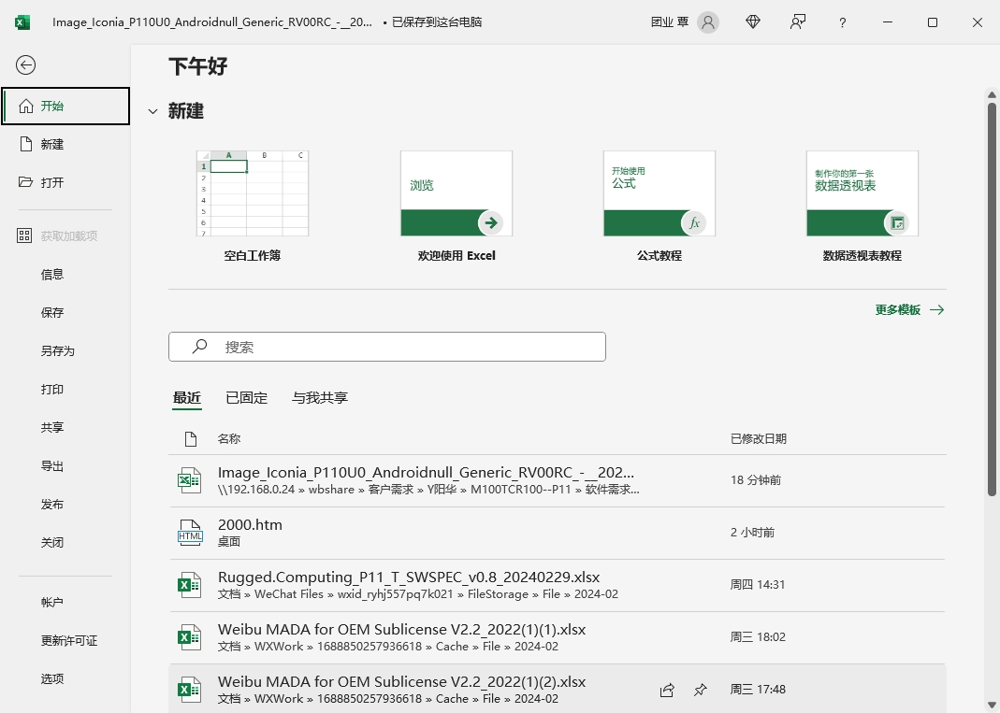

[toc]

### 方法一：设置选项

（1）启动 `Excel` 后，单击菜单 “文件” -> “选项”。

（2）在 “选项” 对话框中单击 “高级” 选项卡，找到 “启动时打开此目录中的所有文件” 文本框，然后手工填入一个文件夹路径。单击 “确定” 后，每次 `Excel` 启动的时候，都会自动打开这个文件夹中的所有文件。

### 方法二：利用 XLSTART 文件夹

在`C:\Users\Administrator\AppData\Roaming\Microsoft\Excel\` 文件夹下创建一个名为 `XLSTART` 的文件夹，然后将要在 `Excel` 启动的时候打开的 `Excel` 文件放到 `XLSTART` 文件夹中即可。

### 方法三：利用启动参数

为 `Excel` 设置启动参数，也可以让 `Excel` 启动的时候自动打开某个文件，这个参数是 `/r 工作簿路径\文件名`。

