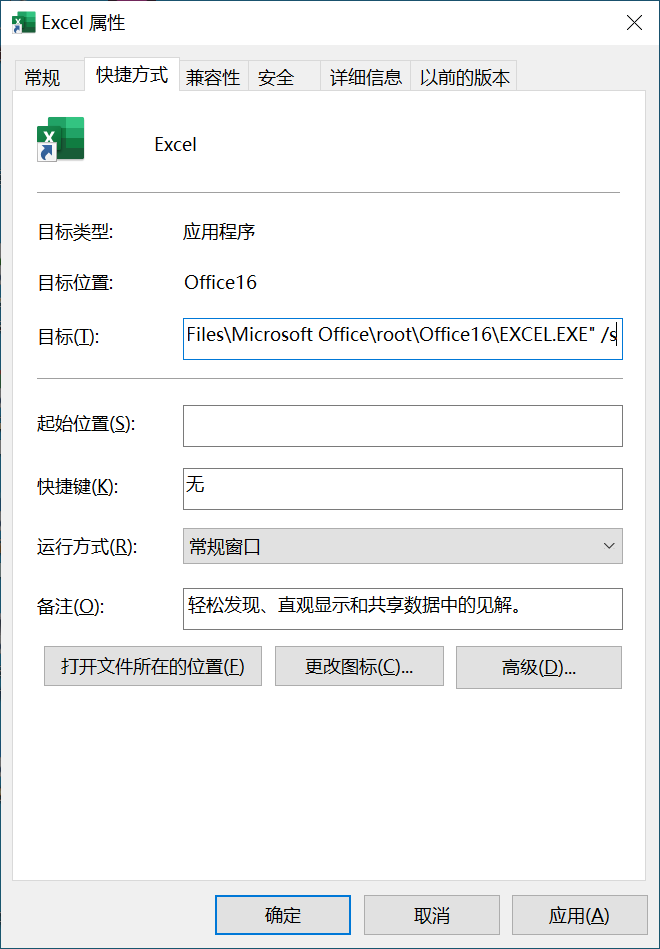

[toc]

### 方法一：修改启动参数

1. 自行创建 Excel 程序快捷方式。

2. 选定创建的快捷方式并单击鼠标右键，在弹出的快捷菜单中单击 "属性" 命令，打开属性对话框，在【快捷方式】选项卡的【目标】文本框的原有内容末尾加上参数 `/s` （注意，新加入的参数与原内容之间需要有一个空格）。

   

3. 单击【确定】按钮，保存设置并关闭对话框。

### 方法二：快捷方式

在键盘上按住 <kbd>Ctrl</kbd> 键启动 Excel 程序，进入安全模式。