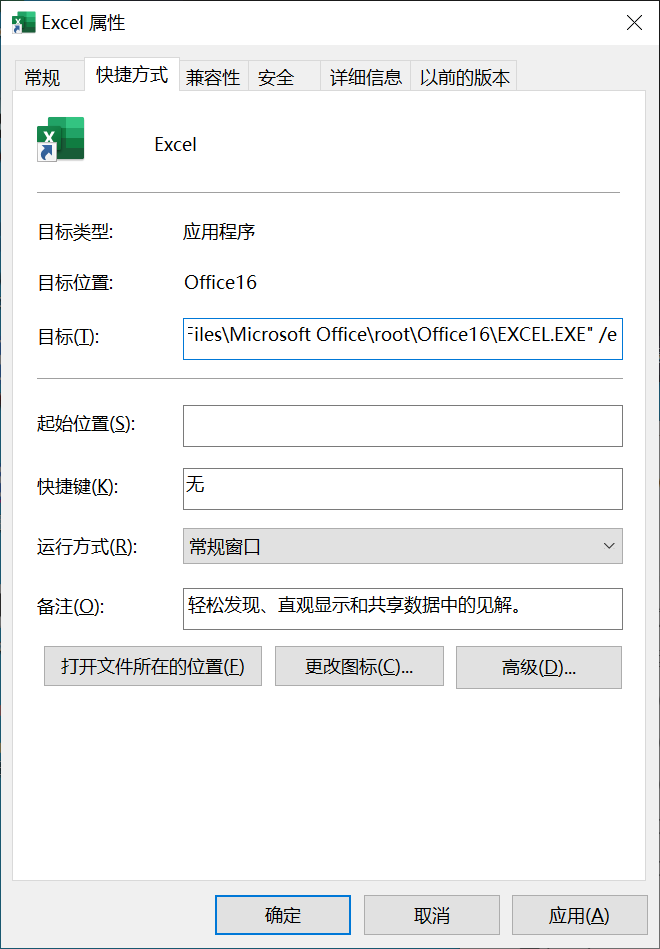
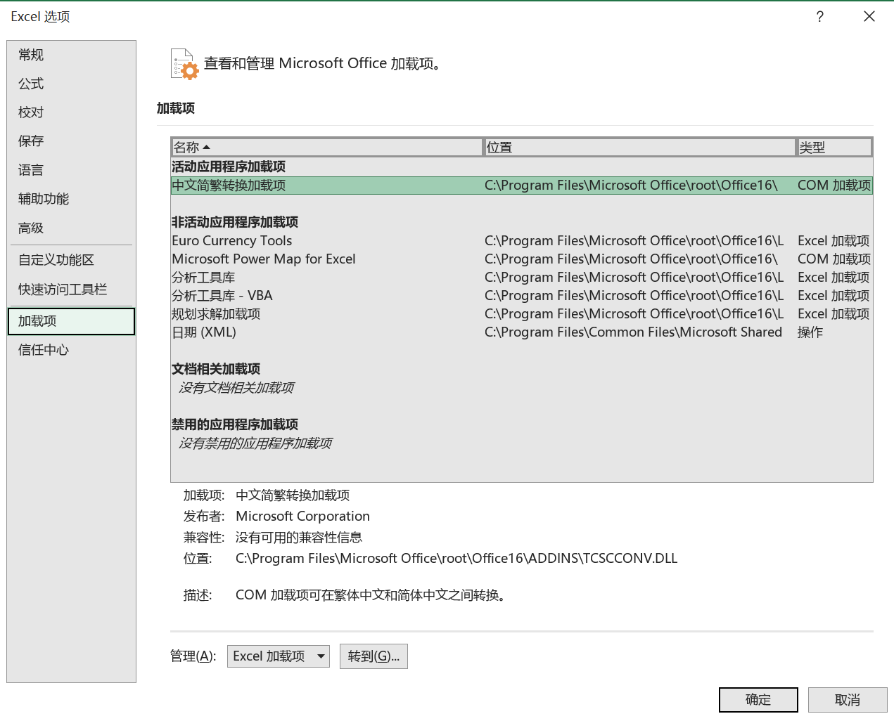

[toc]

### 1. 通过修改启动参数加速 Excel 程序启动速度

1. 在 Excel 快捷方式上单击鼠标右键，在弹出的快捷菜单中单击 "属性" 命令，打开 "EXCEL.EXE 属性" 对话框。

2. 在【快捷方式】选项卡【目标】文本框中原有的内容末尾加上参数 `/e`（注意，新加的参数与原内容之间需要有一个空格）。

   

3. 单击【确定】按钮保存修改的内容。

### 2. 禁用加载项

1. 依次单击【文件】->【选项】，在弹出的【Excel 选项】对话框中选择【加载项】选项卡。在右侧【管理】下拉列表中选择【COM 加载项】，然后单击右侧的【转到】按钮，此时就会弹出【COM 加载项】对话框。

   

2. 在【COM 加载项】对话框的【可用加载项】列表中取消勾选不需要运行的加载项。

   

3. 单击【确定】按钮，关闭对话框，完成设置。