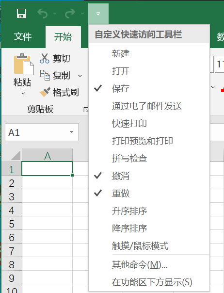
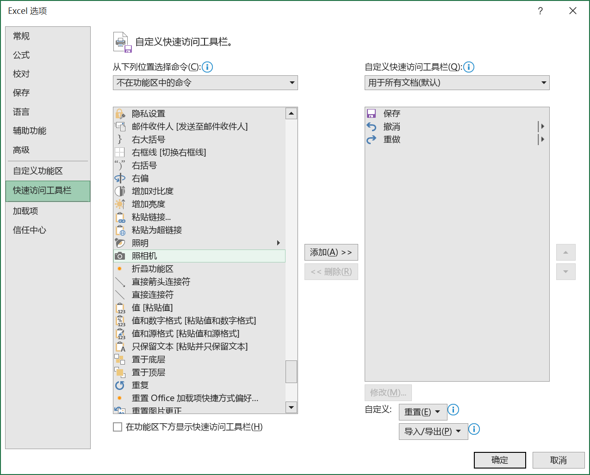

以添加 "照相机" 命令为例，自定义 "快速访问工具栏" 的一般步骤如下：

1. 单击 "快速访问工具栏"右侧的下拉按钮，在弹出的扩展菜单中单击 "其他命令" 选项，弹出【Excel 选项】对话框的【快速访问工具栏】选项卡。

   

2. 在左侧的【从下列位置选择命令】下拉列表中选择【不在功能区中的命令】选项。然后在命令列表中找到 "照相机" 命令并选中，再单击中间的【添加】按钮，此命令就会出现在右侧的命令列表中。

   

3. 单击下方【确定】按钮，完成操作。

4. 删除 "快速访问工具栏" 上的命令按钮，可以参照以上步骤操作。