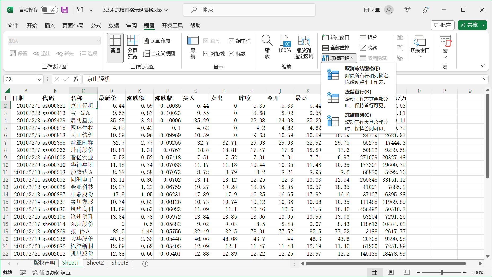

对于比较复杂的大型表格，常常需要在滚动浏览表格时固定显示表头标题行（或者标题列）。使用 "冻结窗格" 命令可以方便地实现这种效果。

操作目的：在如下表格中固定显示列标题（第 1 行）及日期，代码两列区域（A、B列）。

操作方法：需要固定显示的行列为 A、B 列及第 1 行，因此选中 C2 单元格为当前活动单元格。在 Excel 功能区上单击【视图】选项卡上的【冻结窗格】下拉按钮，在其扩展列表中选择【冻结拆分窗格】命令。

> 提示：在设置了冻结窗格的工作表中，按 <kbd>Ctrl</kbd> + <kbd>Home</kbd> 组合键可快速定位到两条冻结线交叉的位置，即最初执行冻结窗格命令时的定位位置所在。

此外，用户还可以在【冻结窗格】的下拉菜单中选择【冻结首行】或【冻结首列】命令，快速冻结表格首行或者冻结首列。

> 如果需要变换冻结位置用户，需要先取消冻结，然后再执行一次冻结窗口操作，但 "冻结首行" 或者 "冻结首列" 不受此限制。

要取消工作表的冻结窗格状态，可以在 Excel 功能区上再次单击【视图】选项卡上的【冻结窗格】下拉菜单，在其扩展菜单中选择【取消冻结窗格】命令，窗口状态即可恢复冻结前的状态。