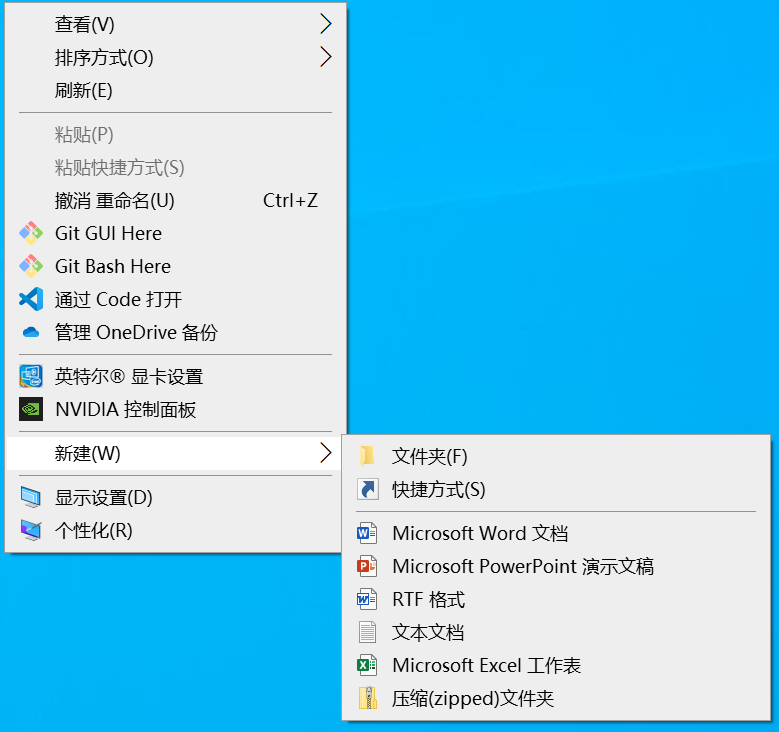

[toc]

### 1. 在 Excel 工作窗口中创建

在现有工作窗口中，有以下两种等效操作可以创建新的工作簿：

（1）依次单击【文件】->【新建】，在右侧选择【空白工作簿】。

（2）在键盘上按 <kbd>Ctrl</kbd> + <kbd>N</kbd> 组合键。

### 2. 在系统中创建工作簿文件

在 Windows 桌面或者文件夹窗口的空白处单击鼠标右键，在弹出的快捷菜单中依次单击【新建】->【Microsoft Excel 工作表】。完成操作后，可在当前位置创建一个新的 Excel 工作簿文件，双击此新建的文件，即可在 Excel 工作窗口中打开此工作簿。

