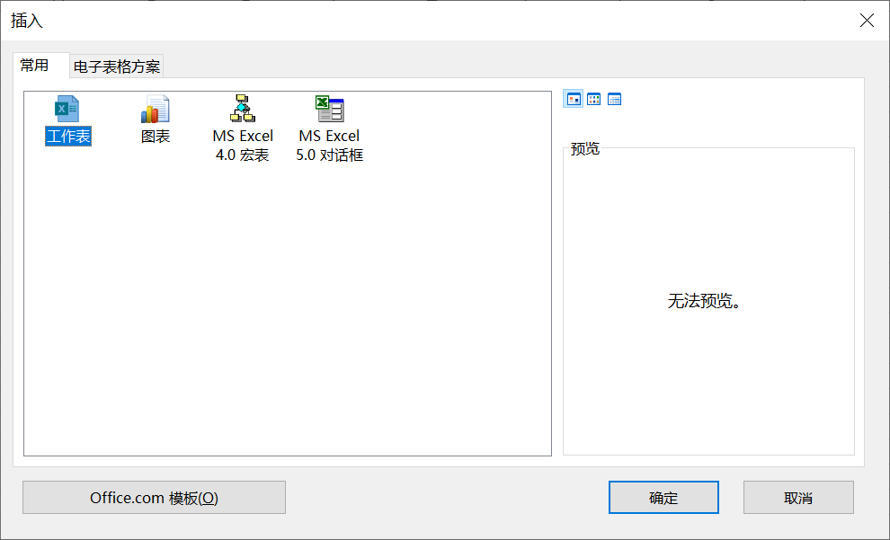

[toc]

### 1. 随着工作簿一同创建

默认情况下，Excel 在创建工作簿时，自动包含了名为 "Sheet1" 的 1 张工作表。用户可以通过设置来改变新建工作簿时锁包含的工作表数目。

依次单击【文件】->【选项】，打开【Excel 选项】对话框，选择【常用】选项卡：

在【包含的工作表数】微调框内，用户可以设置新工作簿默认包含的工作表数目，数值范围为  1 ~ 255，单击【确定】按钮保存设置，并退出【Excel 选项】对话框。

### 2. 从现有的工作簿中创建

以下几种等效方式可以在当前工作簿中创建一个新的工作表：

1. 在 Excel 功能区的【开始】选项卡中单击【插入】下拉按钮，在扩展菜单中单击【插入工作表】命令，会在当前工作表之前插入新工作表。

   

2. 在当前工作表标签上单击鼠标右键，在弹出的快捷菜单上选择【插入】，在弹出的【插入】对话框中选中【工作表】，再单击【确定】按钮。

      

3. 单击工作表标签右侧的【插入工作表】按钮，可以在工作表的末尾快速插入新工作表。

   

4. 在键盘上按 <kbd>Shift</kbd> + <kbd>F11</kbd> 组合键，则会在工作表前插入新工作表。

> 提示：如果用户需要批量增加多张工作表，可以在第一次插入工作表操作完成后按 <kbd>F4</kbd> 键重复操作，也可以在同时选中多张工作表的情况下使用功能区按钮，或使用工作表标签的右键菜单命令插入工作表，此时会一次性创建与选定的工作表数目相同的新工作表。

> 注意：创建新工作表的操作无法通过【撤销】按钮进行撤销操作。

