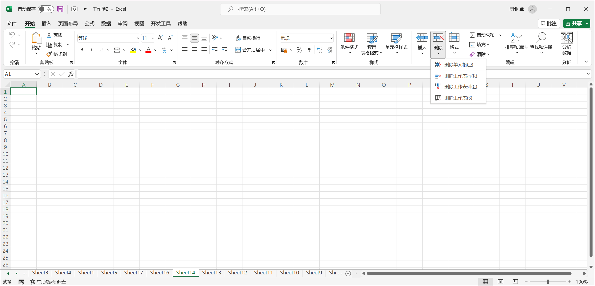
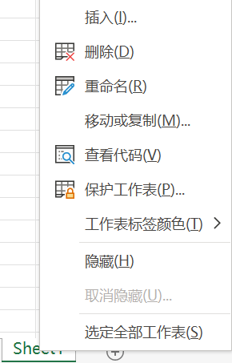

1. 选中要删除的工作表，在 Excel 功能区中单击【开始】选项卡中的【删除】拆分按钮，在其扩展菜单中选择【删除工作表】命令。

   

2. 在工作表标签上单击鼠标右键，在弹出的快捷菜单上选择【删除】命令。

   

> 提示：用户可以在选定多个工作表后同时进行删除操作。

> 注意：删除工作表是 Excel 中无法撤销的操作。如果用户不慎误删除了工作表，将无法恢复。但是在某些情况下，马上关闭当前工作簿，并选择不保存刚才所做的修改，能够有所挽回。工作簿中至少包含一张可视工作簿，所以当工作窗口中只剩下一张工作表时，无法删除此工作表。

