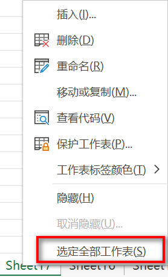

1. 在键盘上按住 <kbd>Ctrl</kbd> 键，同时用鼠标依次单击需要的工作表标签，就可以同时选定多个工作表。

2. 如果用户需要选定的工作表为连续排列的工作表，可以先单击第一个工作表标签，然后按住 <kbd>Shift</kbd> 键，再单击连续工作表中的最后一个工作表标签，即可以同时选定它们。

3. 如果要选定当前工作簿中的所有工作表，组成工作组，可以在工作表标签上单击右键，在弹出的快捷菜单上选择【选定全部工作表】。

   

> 提示：多个工作表被同时选中后，Excel 窗口标题栏上会显示 “组” 字样。被选定的工作表标签都会反白显示。
>
> 
>
> 如果取消工作组的操作模式，用户可以单击工作组以外的工作表标签（如果所有工作表都在工作组内，则单击任意工作表标签即可）。或者是在工作表标签上单击右键，在弹出的快捷菜单上选择【取消组合工作表】。