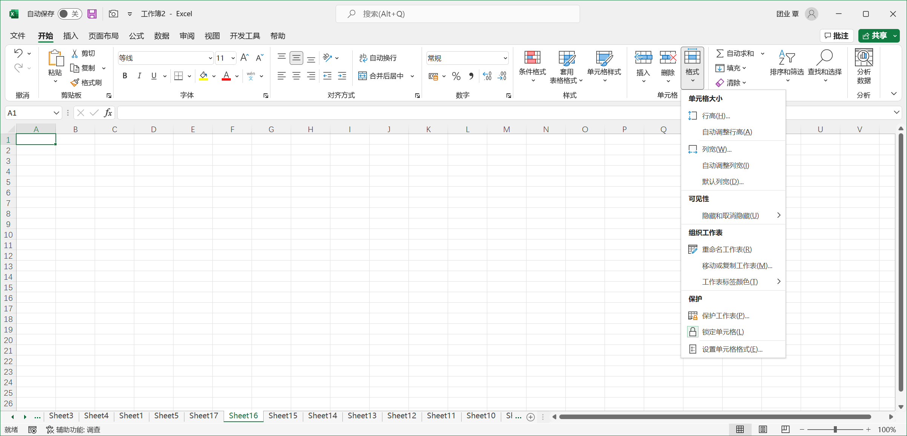

[toc]

### 1. 菜单操作

1. 在工作表标签上单击鼠标右键，在弹出的快捷菜单上选择的【移动和复制(M)...】。

   

2. 选中需要进行移动或者复制的工作表，在 Excel 功能区上单击【开始】选项卡上的【格式】下拉按钮，在扩展菜单中选择【移动和复制工作表(M)...】命令。

   

在【移动或复制工作表】对话框中，用户可以在【工作簿】下拉列表中选择复制/移动的目标工作簿。

【建立副本】复选框是一个操作类型开关，勾选此复选框则为 "复制"方式，取消勾选则为 "移动" 方式。

设置完毕后，单击【确定】按钮退出【移动或复制工作表】对话框，完成工作表复制/移动操作。

### 2. 拖动工作表标签

将光标移至需要移动的工作表标签上，按下鼠标左键，鼠标指针显示出文档的图标，此时拖动鼠标，将此工作表移动至其他位置。例如，拖动 Sheet2 标签 Sheet1 标签上方时，Sheet1 标签前出现黑色三角箭头图标，它标识了工作表的移动插入位置。此时松开鼠标即可把 Sheet2 移至 Sheet1 之前。

如果在按住鼠标左键的同时按住 <kbd>Ctrl</kbd> 键，则执行 "复制" 操作。此时鼠标指针下显示的文档图标上还会出现一个 "+" 号，表示当前操作方式为 "复制"。

如果当前工作窗口中显示了多个工作簿，拖动工作表标签的操作也可以在不同工作簿中进行。

