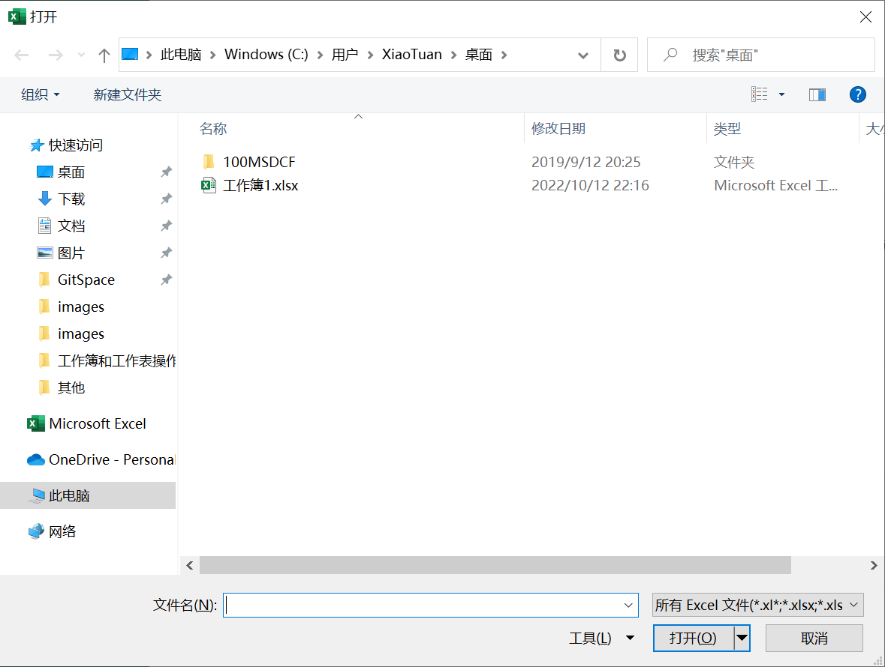
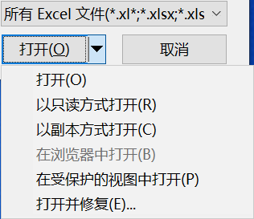
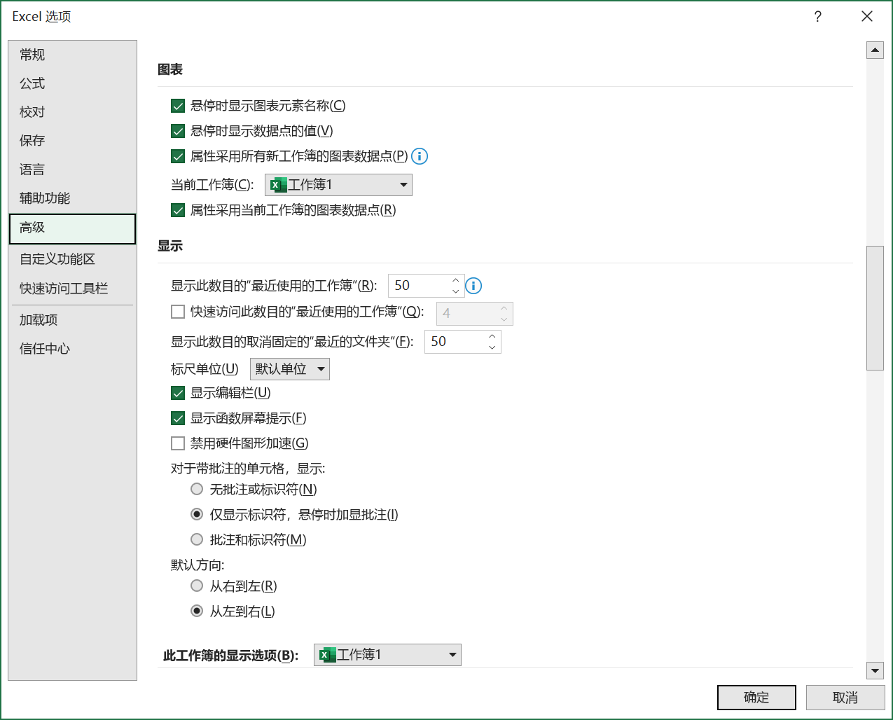

[toc]

### 1. 直接通过文件打开

可以利用 Windows 的资源管理器找到文件，直接双击文件图标即可打开。

### 2. 使用【打开】对话框

有以下几种等效方式可以显示【打开】对话框：

（1）依次点击【文件】->【打开】->【浏览】菜单。

（2）在键盘上按 <kbd>Ctrl</kbd> + <kbd>O</kbd> 组合键。

（3）执行操作后，将显示【打开】对话框。

在目标路径下选中具体文件后，双击文件图标，或者单击【打开】按钮，即可打开文件。如果按住 <kbd>Ctrl</kbd> 键，后用鼠标选中多个文件，再单击【打开】按钮，则可以同时打开多个工作簿。

【打开】下拉按钮的右侧显示有三角箭头，其中也包含了一个下拉菜单。

具体选项含义大致如下：

+ 打开：正常打开方式。
+ 以只读方式打开：以 "只读" 的方式打开目标文件，不能对文件进行覆盖性保存。
+ 以副本方式打开：选择此方法时，Excel 自动创建一个目标文件的副本文件，命名为类似 "副本（1）属于（原文件名）" 的形式，同时打开这个文件。
+ 用浏览器打开：使用 Web 浏览器打开方式。
+ 打开并修复：应用此选项，可以对损坏文件进行修改并重新打开。但修复还原后，并不一定能够和损坏前的文件状态保持一致。

### 3. 通过历史记录

依次单击【文件】->【选项】，打开【Excel 选项】对话框。在左侧选中【高级】选项卡，在右侧的【显示】区域中，调节【显示此数目的“最近使用的工作簿”】的微调按钮，设置需要显示的 “最近使用的文档” 个数，最后单击【确定】按钮，保存设置并关闭【Excel 选项】对话框。

