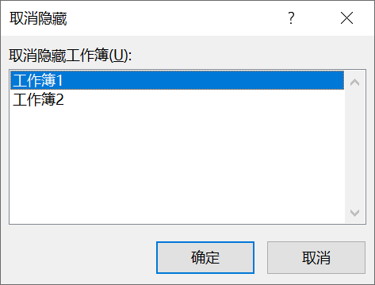

在 Excel 程序中同时打开多个工作簿，Windows 的任务栏上就会显示所有的工作簿标签。在功能区的【视图】选项卡上单击【切换窗口】按钮，即可查看所有工作簿。

如需隐藏其中的某个工作簿，可在激活目标工作簿后，在功能区上单击【视图】选项卡上【窗口】组中的【隐藏】按钮。

如需取消隐藏，可以在功能区单击【视图】选项卡上【窗口】组中的【取消隐藏】按钮对话框中选择需要取消隐藏的工作簿名称，最后单击【确定】按钮完成。

> 提示：取消隐藏工作簿操作，一次只能取消一个隐藏的工作簿，不能对多个隐藏工作簿同时操作。