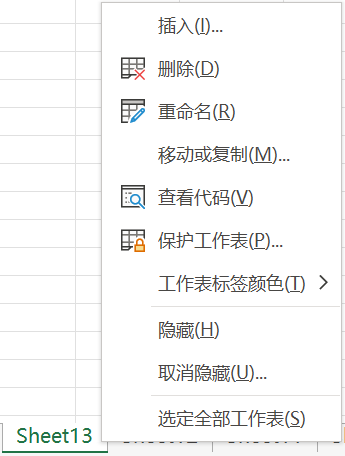

[toc]

### 1. 隐藏工作表

选定工作表后，有以下两种等效方法可以显示隐藏工作表：

+ 在 Excel 功能区中单击【开始】选项卡中的【格式】下拉按钮，在其扩展菜单中依次选择【隐藏和取消隐藏】->【隐藏工作表】。

  

+ 在工作表标签上单击鼠标右键，在弹出的快捷菜单上选择【隐藏】命令。

> 注意：用户不可以隐藏所有的工作表。当隐藏最后一张显示工作表时，会弹出如下对话框。
>
> 

### 2. 取消隐藏工作表

如果要取消工作表的隐藏状态，有以下两种等效方法：

+ 在 Excel 功能区中单击【开始】选项卡中的【格式】下拉按钮，在其扩展菜单中依次单击【隐藏和取消隐藏】->【隐藏工作表】，在弹出的【取消隐藏】对话框中选择需要取消隐藏的工作表，最后单击【确定】按钮确认。

  

+ 在工作表标签上单击鼠标右键，在弹出的快捷菜单上选择【取消隐藏】命令，然后在弹出【取消隐藏】对话框中选择需要取消隐藏的工作表，最后单击【确定】按钮确认操作。

  

> 注意：
>
> + 无法对多张工作表一次性取消隐藏。
> + 如果没有隐藏的工作表，则 "取消隐藏" 命令呈灰色不可用状态。
> + 工作表的隐藏操作不改变工作表的排序顺序。