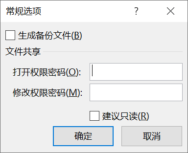

1. 依次单击【文件】->【另存为】，在右侧中单击【浏览】。

   

2. 在【另存为】对话框底部工具栏上依次单击【工具】->【常规选项】，将弹出常规选项对话框。

     

这个对话框中，用户可以为工作簿设置更多的保存选项：

（1）生成备份

自动创建备份文件的过程是这样的：当保存工作簿文件时，Excel 将磁盘上前次保存过的同名文件重命名为 "xxx 的备份"，扩展名改为 `.xlk`，即前文所提到过的备份文件格式。同时，将当前工作窗口中的工作簿保存为与原文件同名的工作簿文件。

备份文件只会在保存时生成，并不会 "自动"生成。用户从备份文件中也只能获取前一次保存时的状态，并不能恢复到更久以前的状态。

（2）打开权限密码

在这个文本框内输入密码，可以为保存的工作簿设置打开文件的密码保护，没有正确的密码输入，就无法用常规方法读取所保存的工作簿文件。密码长度最大支持 15 位，且支持中文字符。

> 提示：如果需要将中文字符作为打开权限密码，用户可以先在记事本或 Word 中输入中文密码，然后复制并粘贴在【打开权限密码】文本框中。

（3）修改权限密码

与上面的密码有所不同，这里设置的密码可以保护工作表不被意外地修改。只有掌握此密码的用户可以在编辑修改工作簿后进行保护，否则只能以 "只读" 方式打开工作簿。

（4）建议只读

勾选此复选框并保存工作簿以后，再次打开工作簿时，会弹出如下对话框，建议用户以 "只读方式" 打开工作簿。

