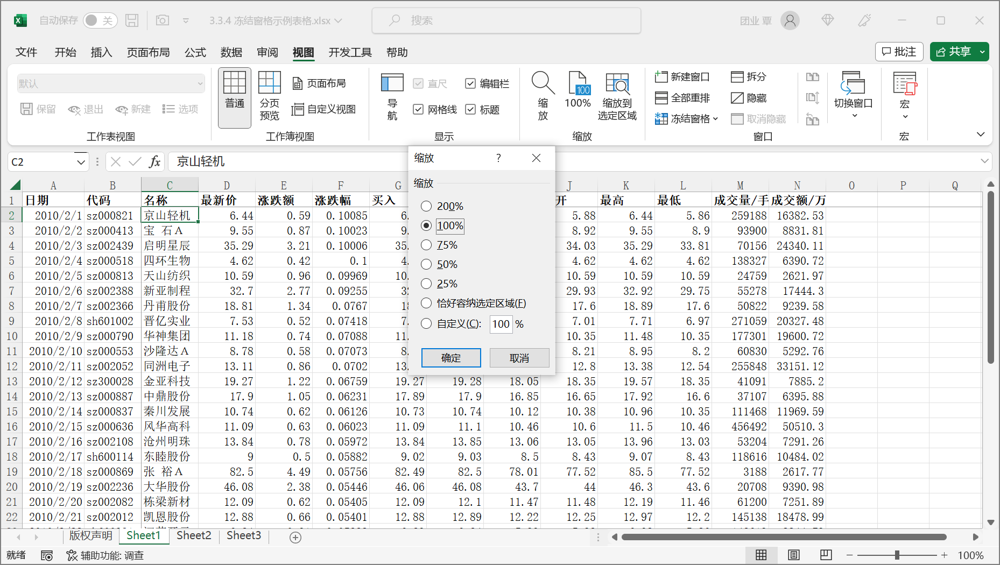

在 Excel 功能区上单击【视图】选项卡上的【缩放】按钮，弹出【显示比例】对话框。

当前默认的缩放比例为 100%，用户可在对话框中选择 "200%"，"75%" 等预先设定的缩放比例，或者是单击【自定义】单选按钮，并在右侧的文本框中输入所需的缩放比例，数值允许范围为 10 ~ 400。如果选择了【恰好容纳选定区域】，则 Excel 会对当前选定的表格区域进行缩放，以使得当前窗口恰好完整地显示所选定的区域。

除了使用菜单栏命令之外，Excel 状态栏上也有【显示比例】滑动按钮，用户可以直接移动滑动条来调节缩放比例。也可以单击滑动条左侧的【缩放级别】按钮，打开【显示比例】对话框进行选择设置。

要快速地将缩放比例恢复到100% 显示状态，可以在 Excel 功能区上单击【视图】选项卡上的【100%】按钮。

> 提示：如果用户使用的鼠标带滚轮，可以在按住 <kbd>Ctrl</kbd> 键的同时滚动滚轮，也可以方便地调整显示比例。