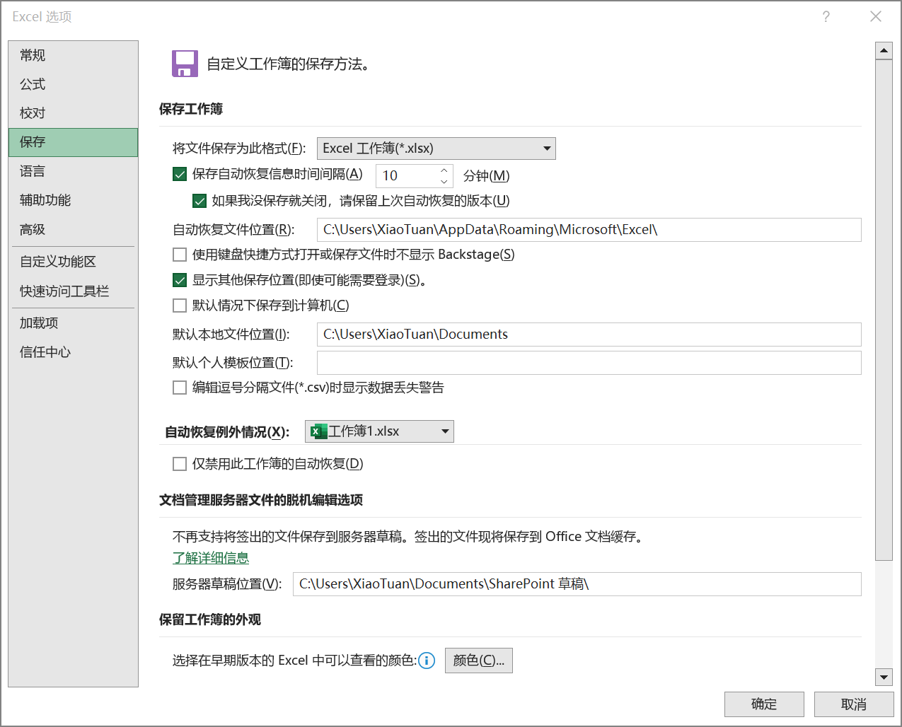

**步骤 1** 单击【文件】-> 【选项】打开【Excel 选项】 对话框，在对话框中单击【保存】选项卡。

**步骤 2** 勾选【保存工作簿】区域中【保存自动恢复信息时间间隔】复选框（默认被勾选），即所谓的 "自动保存"。在右侧的微调框内设置自动保存的间隔时间，默认为 10 分钟，用户可以设置从 1 ~ 120 分钟之间的整数。在下方【自动恢复文件位置】文本框输入需要保存的位置。

**步骤 3** 单击【确认】按钮保存设置，并退出【Excel 选项】对话框。

> 提示：自动保存的间隔时间在实际使用中遵循以下几条规则：
>
> ① 只有工作簿发生新的修改时，计时器才开始启动计时，到达指定的间隔时间后发生保存动作。如果在保存后没有新的修改编辑产生，计时器不会再次激活，也不会有新的备份副本产生。
>
> ② 在一个计时周期过程中，如果进行了手动保存工作，计时器立即清零，直到下一次工作簿发生修改时再次开始激活计时。