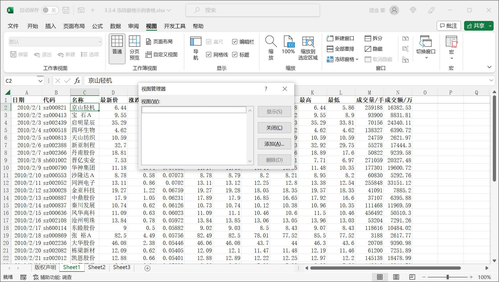

在对工作表进行各种视图显示调整后，用户如果想要保存这些设置内容，并在以后的工作中能够随时使用这些设置后的视图显示，可以通过 "视图管理器" 来实现。

在 Excel 功能区上单击【视图】选项卡上的【自定义视图】按钮，弹出【视图管理器】对话框。要将当前的视图显示保存为一个自定义视图，可在对话框上单击【添加】按钮，在弹出的【添加视图】对话框的【名称】框中填入为创建的视图定义的名称，然后单击【确定】按钮，即可完成创建工作。

视图管理器所能保存的视图设置包括窗口的大小、位置、拆分窗口、冻结窗格、显示比例、打印设置、创建视图时的选定单元格、行列的隐藏、筛选，以及【选项】对话框的诸多设置。需要调用自定义视图的显示时，用户可以再次在 Excel 功能区上单击【视图】选项卡上的【自定义视图】按钮，在弹出的【视图管理器】对话框的列表框中选择相应的视图名称，然后单击【显示】按钮即可。

创建的自定义视图名称均保存在当前工作簿中。用户可以在同一个工作簿中创建多个自定义视图，也可以为不同的工作簿创建不同的自定义视图。但是【视图管理器】对话框中只显示出当前激活的工作簿中所保存的视图名称列表。

要删除已经保存的自定义视图，用户可以选择相应的工作簿，在【视图管理器】对话框的列表框中选择相应的视图名称，最后单击【删除】按钮，完成删除。

> 注意：“视图管理器” 操作与 “列表” 操作不可以同时进行。如果当前工作簿的任何工作表中存在 ”列表“，则 ”视图管理器“ 命令会变成灰色不可用。