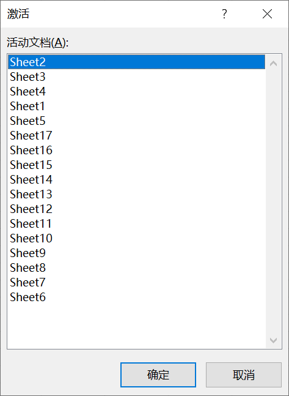

1. 如果工作簿内包含工作表较多，标签栏上不一定能够显示所有工作表标签，则可以通过单击标签栏左侧的工作表导航按钮来滚动显示工作表标签。

   

2. 通过拖动工作窗口上的水平滚动条边框，用户可以改变工作表标签的显示宽度，以方便显示更多工作表标签。

   

3. 如果工作簿中的工作表实在太多，需要滚动很久才能看到目标工作表，用户还可以在工作表导航栏上单击鼠标右键，此时会弹出一个激活对话框，双击其中的项目或者选择其中项目后单击【确定】按钮，就可以激活相应的工作表。

   

4. 另外，常用于切换工作表的快捷键是<kbd>Ctrl</kbd> + <kbd>Page Up</kbd> 组合键和 <kbd>Ctrl</kbd>+ <kbd>Page Down</kbd> 组合键，它们的作用分别是切换到上一张工作表和下一张工作表。