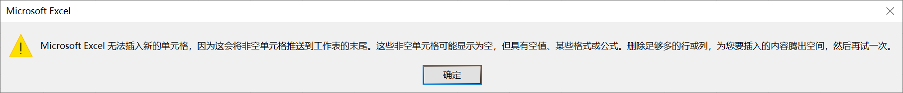

单击行标签选定此行，或者在此行中选定某个单元格，使用以下几种方法可以在所选定行之前插入新行：

（1）在 Excel 功能区上单击【开始】选项卡上的【插入】拆分按钮，在弹出的扩展菜单中选择【插入工作表行】命令。

（2）单击鼠标右键，在弹出的右键快捷菜单中选择【插入】命令。如果当前选定的不是整行，而是行中的某个单元格，则在选择命令后会弹出【插入】对话框。在对话框中选择【整行】单选按钮，然后单击【确定】按钮完成操作。

（3）在键盘上按 <kbd>Ctrl</kbd> + <kbd>Shift</kbd> + <kbd>=</kbd> 组合键。

插入列的方法与此类似，同样也有通过菜单、右键快捷菜单和键盘快捷键等几种操作方法。

如果插入操作之前选定的是连续多行、连续多列或者连续的多个单元格，则执行 "插入" 操作后，会在选定位置之前插入与选定的行、列相同树数目的行或者列。

如果插入操作之前选定的是非连续的多行或者多列，也可以同时执行插入行、列的操作，并且新插入的空白行或者列也是非连续的，数目与选定的行列数目相同。

由于 Excel 之中的行与列数目都有最大限制，行数不超过 1 048 576 行，列数不超过 16 384 列。基于这个原因，如果表格的最后一行或者最后一列不为空，则不能插入新行或者新列的操作。如果在这种情况下选择 "插入" 操作，会弹出如下所示的警告框，提示用户只有清空或者删除最末的行、列后才能在表格中插入新的行或者列。

