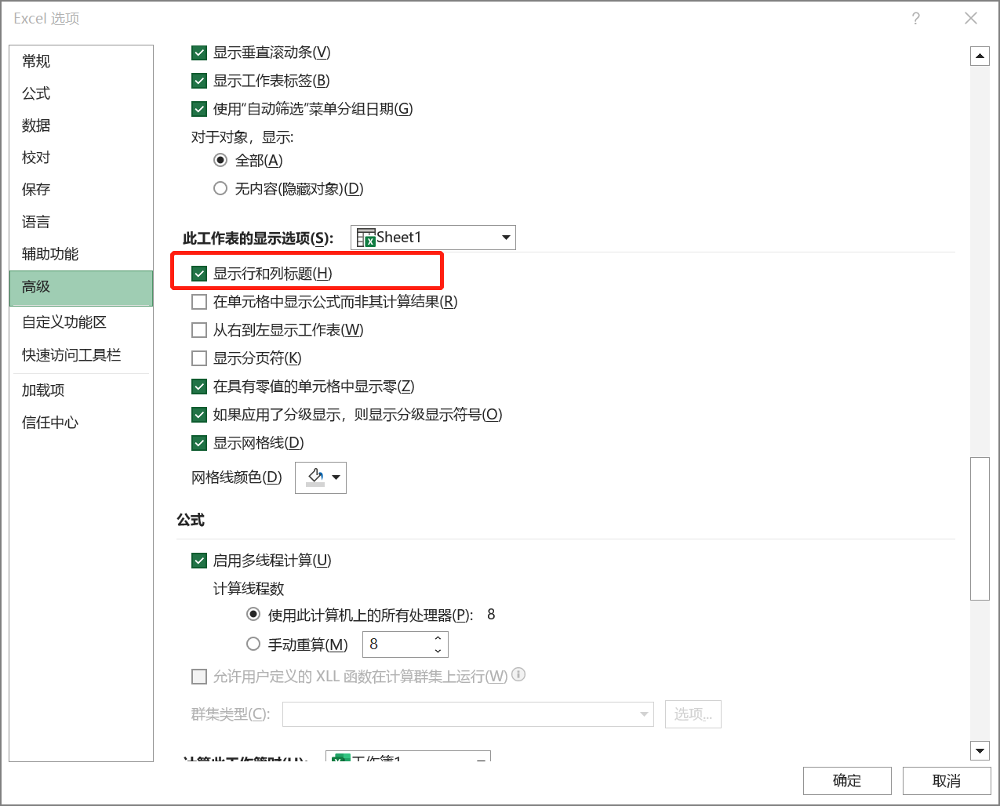
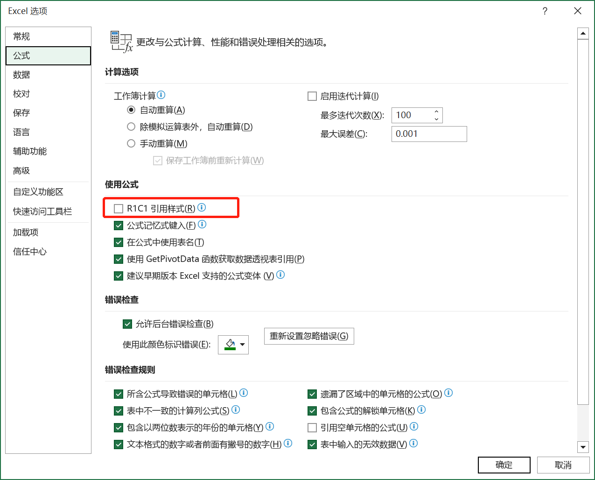

如果 Excel 界面中没有显示行号和列标，用户可以在【Excel 选项】对话框【高级】选项卡中的【此工作表的显示选项】区域的下拉菜单中选择需要显示行号和列标的工作表名称，然后勾选或取消勾选下方的【显示行和列标题】复选框，最后单击【确定】按钮确认操作。

> 提示：如果 Excel 界面中的列标显示为阿拉伯数字而不是英文字母，是因为使用了 "R1C1 引用样式"。若要恢复英文字母样式的列标，可以取消勾选【Excel 选项】对话框【公式】选项卡中的【R1C1】复选框。
>
> 