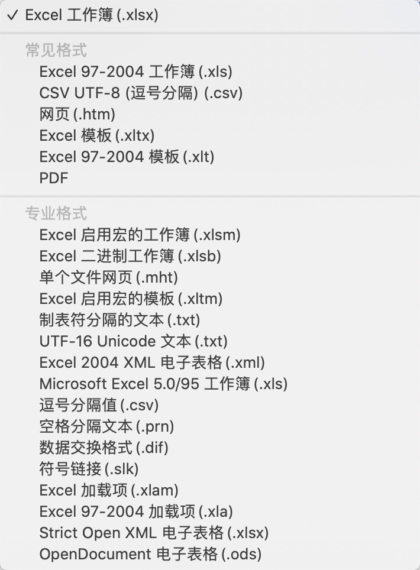
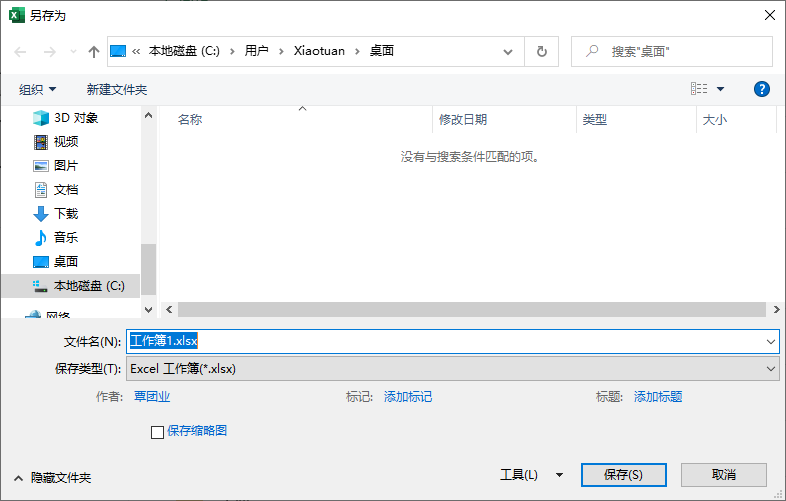
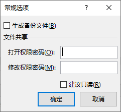
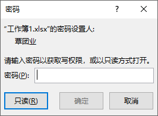
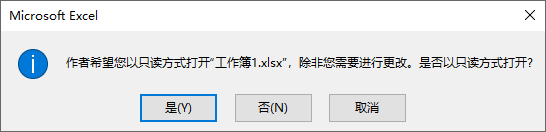
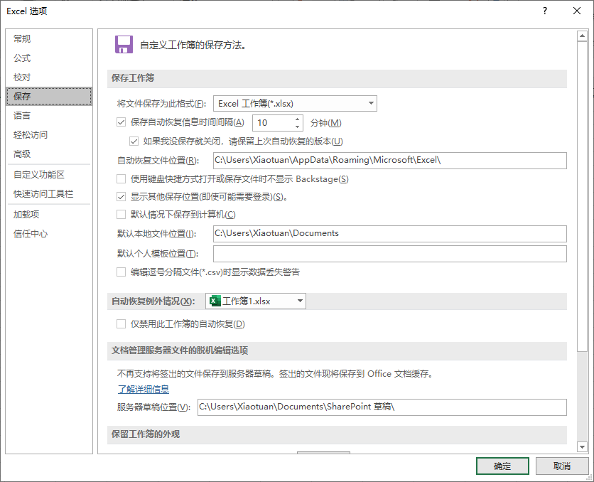
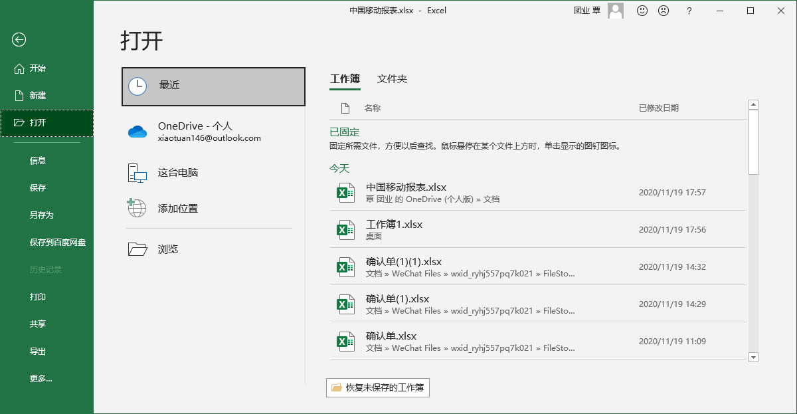
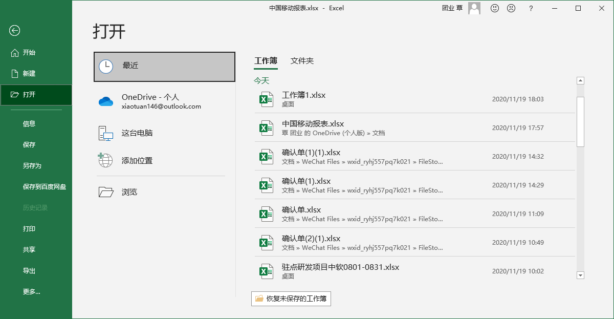
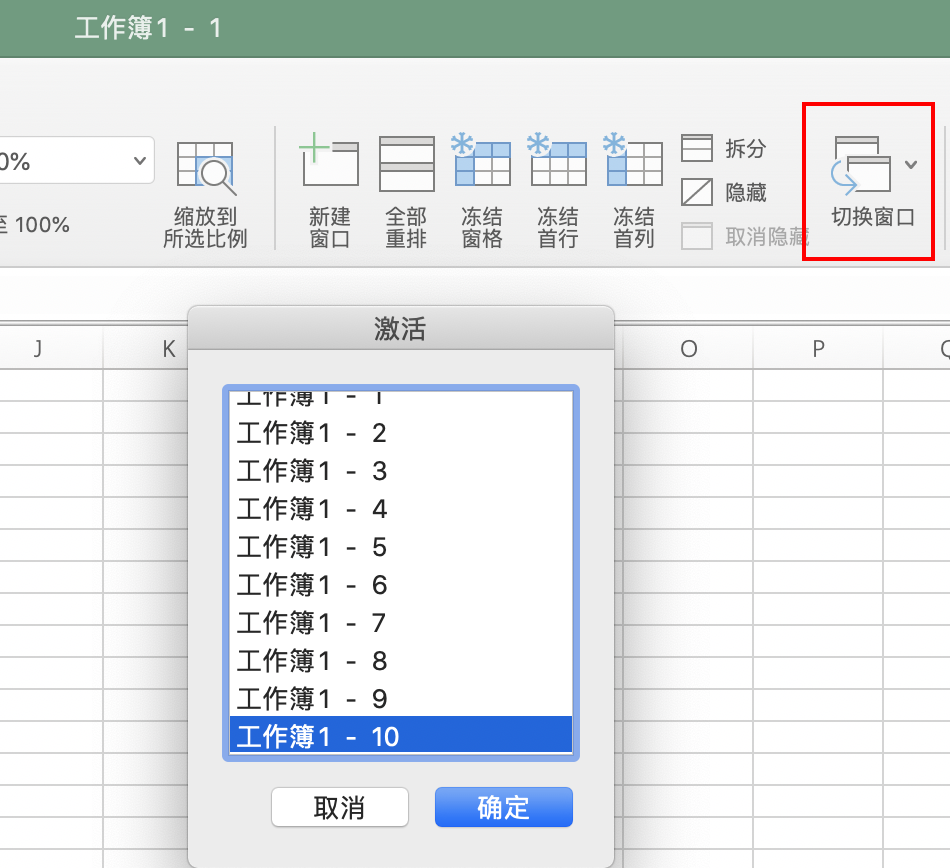

[toc]

### 1. 工作簿类型

工作簿有多种类型。当保存一个新的工作簿时，可以在 【另存为】对话框的【保存类型】下拉菜单中选择所需要保存的 Excel 文件格式，如图 3-1 所示。在 Excel 2007 中，“*.xlsx” 为普通 Excel 工作簿；“.xlsm” 为启用宏的工作簿，当工作簿中包含宏代码时，选择这种类型；"\*.xlsb" 为二进制工作簿；"\*.xls" 为 Excel 97 - 2003 工作簿。

默认情况下，Excel 2007 文件保存的类型为 "Excel 工作簿（*.xlsx）"。如果用户需要和早期的 Excel 版本用户共享电子表格，或者需要经常性制作包含宏代码的工作簿时，可以通过设置 "工作簿默认保存文件格式" 来提高保存操作的效率，操作方法如下：

在功能区上依次单击【Office 按钮】-> 【Excel 选项】，打开【Excel 选项】对话框，选定【保存】选项卡，然后在右侧【保存工作簿】区域中的 【将文件保存为此格式】下拉菜单中选择需要默认保存的文件类型。最后单击【确定】按钮，保存设置并退出【Excel 选项】对话框。

### 2. 创建工作簿

#### 2.1 在 Excel 工作窗口中创建

在现有的工作窗口中，有以下两种等效操作可以创建新的工作簿。

（1）在功能区上依次单击【Office 按钮】->【新建】，打开【新建工作簿】对话框，选择【空工作簿】后单击右侧的【创建】按钮。

（2）在键盘上按 <kbd>Ctrl</kbd>+<kbd>N</kbd> 组合键。

> 提示：用户如果需要启动 Excel 时取消自动创建工作簿，请参阅 《[02-其他特殊启动方式](../第2章 Excel 工作环境/02-其他特殊启动方式.md)》

#### 2.2 在系统中创建工作簿文件

在 Windows 桌面或者文件夹窗口的空白处单击鼠标右键，在弹出的快捷菜单中依次单击【新建】->【Microsoft Office Excel 工作表】。

### 3. 保存工作簿

以下几种等效操作可以保存当前窗口中的工作簿。

（1）在功能区中依次单击 【Office 按钮】->【保存】（或【另存为】）。

（2）单击【快速启动工具栏】上的【保存】按钮。

（3）在键盘上按 <kbd>Ctrl</kbd>+<kbd>S</kbd> 组合键。

（4）在键盘上按 <kbd>Shift</kbd>+<kbd>F12</kbd>组合键。

### 4. 更多保存选项

在【另存为】对话框底部工具栏上依次单击【工具】->【常规选项】，将弹出【常规选项】对话框。

这个对话框中，用户可以为工作簿设置更多的保存选项。

（1）生成备份文件。

自动创建备份文件的过程是这样的：当保存工作簿文件时，Excel 将磁盘上前次保存过的同名文件重命名为 "XXX的备份"，扩展名改为 .xlk，即前文所提到过的备份文件格式。

备份文件只会在保存时生成，并不会 "自动" 生成。用户从备份文件中也只能获取前一次保存时的状态，并不能恢复到更久以前的状态。

（2）打开权限密码

密码长度最大支持 15 位，且支持中文字符。

> 提示：如果需要将中文字符作为打开权限密码，用户可以先在记事本或者 Word 中输入中文字密码，然后复制并粘贴在【打开权限密码】文本框中。

（3）修改权限密码

与上面的密码有所不同，这里设置的密码可以保护工作表不被意外地修改。打开设置过修改权限密码的工作簿时，会弹出对话框，要求用户输入密码或者以只读方式打开文件，如图 3-9 所示。

（4）建议只读

勾选此复选框并保存工作簿以后，再次打开此工作簿时，会弹出如图 3-10 所示的对话框，建议用户以 "只读方式" 打开工作簿。

### 5. 自动保存功能

步骤1：单击【Excel 选项】对话框的【保存】选项卡，如图 3-11 所示。

步骤2：勾选【保存工作簿】区域中【保存自动恢复信息时间间隔】复选框，即所谓的 "自动保存"。在右侧的微调框内设置自动保存的间隔时间，用户可以设置从 1 ~ 120 分钟之间的整数。在下方【自动恢复文件位置】文本框输入需要保存的位置。

步骤3：单击【确认】按钮保存设置，并退出【Excel 选项】对话框。

> 深入了解自动保存的定时机制
>
> ① 只有工作簿发生新的修改时，计时器才开始启动计时，到达指定的间隔时间后发生保存动作。如果在保存后没有新的修改编辑产生，计时器不会再次激活，也不会有新的备份副本产生。
>
> ② 在一个计时周期过程中，如果进行了手动保存工作，计时器立即清零，直到下一次工作簿发生修改时再次开始激活计时。

### 6. 保存工作区

在很多时候，用户在处理某些任务时，会同时打开多个工作簿。下一次继续执行这项任务时，可以使用 "工作区文件" 来实现再次打开前面用到的所有工作簿。

在所有需要的工作簿都被打开后，单击【视图】 选项卡上【窗口】组中的【保存工作区】按钮，出现如图 3-13 所示的【保存工作区】对话框。在对话框内选择保存路径及保存文件名，单击【保存】按钮，即可完成对当前工作区的信息保存，保存的文件扩展名为 .xlw。

> 警告：最新版本已经去掉该功能了。

### 7. 打开现有工作簿

#### 7.1 直接通过文件打开

如果用户知道工作簿文件保存的确切位置，可以利用 Windows 的资源管理器找到文件，直接双击文件图标即可打开。

#### 7.2 使用【打开】对话框

如果用户已经启动了 Excel 程序，可以通过执行【打开】命令打开指定的工作簿。有以下几种等效方式可以显示【打开】对话框。

（1）在功能区中依次单击【Office 按钮】->【打开】。

（2） 在键盘上按 <kbd>Ctrl</kbd> + <kbd>O</kbd> 组合键。

（3）执行操作后，将显示如图 3-14 所示的【打开】对话框。

在目标路径下选中具体文件后，双击文件图标，或者单击【打开】按钮，即可打开文件。如果按住 <kbd>Ctrl</kbd> 键，后用鼠标选中多个文件，再单击【打开】按钮，则可以同时打开多个工作簿。

【打开】下拉按钮的右侧显示有三角箭头，其中包含了一个下拉菜单（注意：最新版本已经没有该选项了）。

这些打开选项的含义大致如下。

（1）打开：正常打开方式。

（2）以只读方式打开：以 "只读" 的方式打开目标文件，不能对文件进行覆盖性保存。

（3）以副本方式打开：选择此方法时，Excel 自动创建一个目标文件的副本文件，命名为类似 "副本（1）属于（原文件名）" 的形式，同时打开这个文件。这样，用户可以在副本文件上进行编辑修改，而不会对原文件造成任何影响。

（4）用浏览器打开：使用 Web 浏览器打开文件。

（5）打开并修复：应用此选项，可以对损坏文件进行修改并重新打开。

#### 7.3 通过历史记录

在功能区中依次单击【Office 按钮】->【Excel 选项】，打开【Excel 选项】对话框。在左侧选中【高级】选项卡，在右侧的【显示】区域中，调节【显示此数目的 "最近使用的文档"】的微调按钮，设置需要显示的 "最近使用的文档" 个数，最后单击【确定】按钮，保存设置并关闭【Excel 选项】对话框，如图 3-17 所示。

### 8. 显示和隐藏工作簿（最新版本已经没有该功能）

在功能区的【视图】选项卡上单击【切换窗口】按钮，即可查看所有工作簿列表，如图 3-18 所示。

如需隐藏其中的某个工作簿，可在激活目标工作簿后，在功能区上单击【视图】选项卡上【窗口】组中的【隐藏】按钮，如图 3-20 所示。

如需取消隐藏，恢复显示工作簿，操作方法如下。

在功能区中单击【视图】选项卡上【窗口】组中的【取消隐藏】按钮，在弹出的【取消隐藏】对话框中选择需要取消隐藏的工作簿名称，最后单击【确定】按钮完成，如图 3-22 所示。

> 提示：取消隐藏工作簿操作，一次只能取消一个隐藏的工作簿，不能对多个隐藏工作簿同时操作。

### 9. 版本和格式转换

#### 9.1 直接转换

步骤1：打开需要转换的文档文件。

步骤2：在打开的文档文件上单击【Office 按钮】，单击弹出的左侧窗格中的【转换】按钮。

步骤3：在弹出的提示对话框中单击【确定】按钮，即可完成格式转换。

#### 9.2 "另存为" 方法

用户可以使用 "另存为" 的方法，将 Excel 早期版本转换为 Excel 2007 版本。

<b>表 3-1              转换早期版本工作簿文件格式的两种方式对比</b>

| 比较项目           | "转换" 方式            | "另存为" 方式                                                |
| ------------------ | ---------------------- | ------------------------------------------------------------ |
| 早期版本工作簿文件 | 删除早期版本工作簿文件 | 不删除早期版本工作簿文件                                     |
| 工作模式           | 立即以正常模式工作     | 保存原版本的兼容模式，需要关闭早期版本文件并打开转换新版本的文件后才可以以正常模式工作 |
| 新建工作表文件格式 | Excel 工作簿（.xlsx）  | 可以选择多种文件格式                                         |

### 10. 关闭工作簿和 Excel 程序

以下几种等效操作可以关闭当前工作簿。

（1）在功能区上依次单击【Office 按钮】->【关闭】。

（2）在键盘上按 <kbd>Ctrl</kbd> + <kbd>W</kbd> 组合键。

（3）单击工作簿窗口上的【关闭窗口】按钮。

以上方法虽然关闭了当前工作簿，但是并没有退出 Excel 程序，以下几种等效方法可以关闭 Excel 程序。

（1）在功能区上依次单击【Office 按钮】->【退出】。

（2）在键盘上按 <kbd>Alt</kbd> + <kbd>F4</kbd> 组合键。

（3）单击 Excel 工作窗口按钮中的【关闭】按钮。

（4）双击当前 Excel 工作窗口标题左端的 Excel 程序图标。