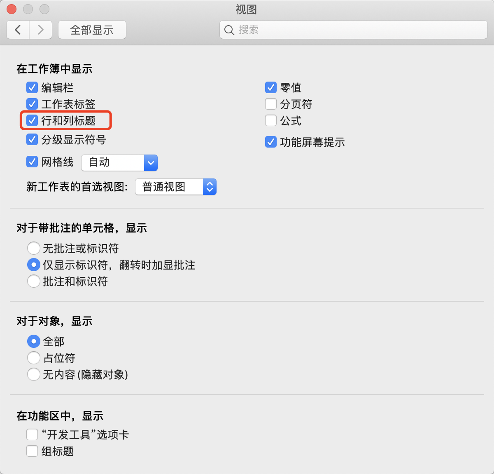
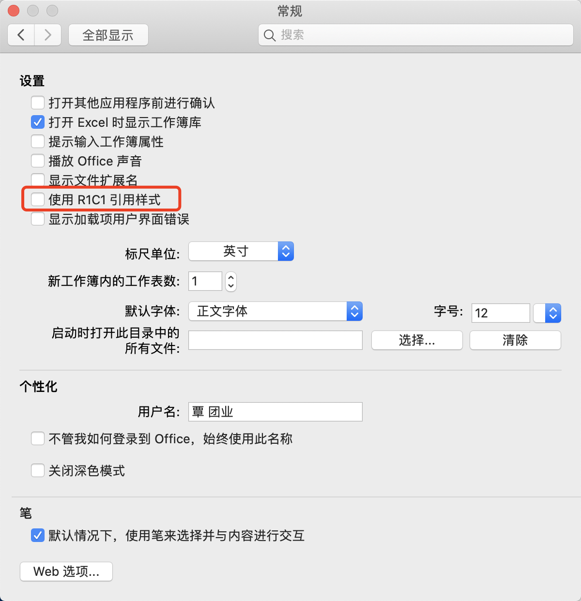
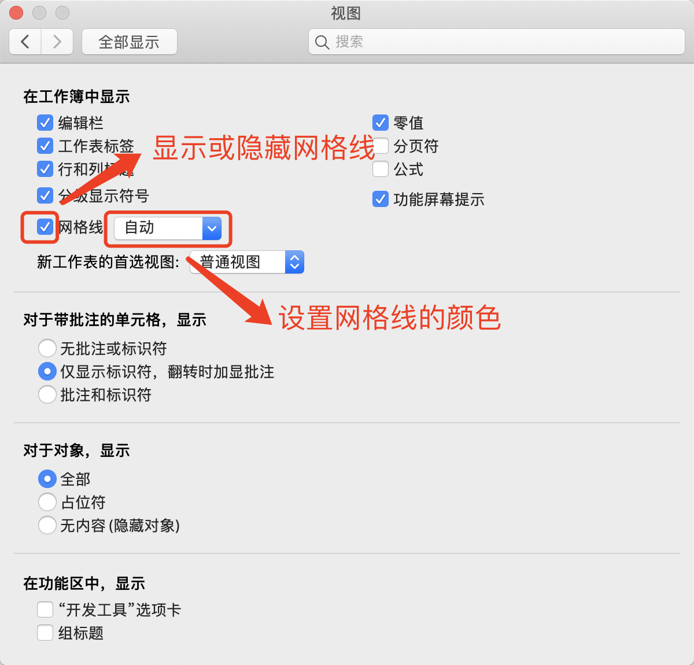

[toc]

### 1. 认识行与列

如果 Excel 界面中没有显示行号和列号，用户可以在【Excel 选项】对话框【高级】选项卡中的【此工作表的显示选项】区域的下拉菜单中选择需要显示行号和列标的工作表名称，然后勾选下方的【显示行和列标题】复选框，然后单击【确定】按钮确认操作。

如果 Excel 界面中的列标题显示为阿拉伯数字而不是英文字母，是因为使用了 ”R1C1 引用样式”。若要恢复英文字母样式的列标，可以取消勾选【Excel 选项】对话框【公式】选项卡中的【R1C1】复选项。

通过设置，用户可以关闭网格的显示或更改网格线的颜色。在【Excel 选项】对话框的【高级】选项卡中取消勾选【显示网格线】复选框，可以关闭网格线的显示。

> 注意：网格线的选项设置只对设置的目标工作表有效。

### 2. 行与列的范围

在一张空白工作表中，选中任意单元格，在键盘上按 <kbd>Ctrl</kbd>+<kbd>方向键↓</kbd> 组合键，就可以迅速定位到选定单元格所在列向下连续非空的最后一行（若整列为空或者选择单元格所在列下方均为空，则定位到当前列的 1048 576 行），按 <kbd>Ctrl</kbd>+<kbd>方向键→</kbd> 组合键，则可以迅速定位到选定单元格所在行向右连续非空的最后一列（若整行为空或者选择单元格所在行下方均为空，则定位到当前列的 XFD 列）；按 <kbd>Ctrl </kbd> + <kbd>Home</kbd> 组合键，可以到达表格定义的左上角单元格，按 <kbd>Ctrl</kbd> + <kbd>End</kbd> 组合键，可以到达表格定义的右下角单元格。

> 注意：当工作表设置冻结窗格时，按  <kbd>Ctrl </kbd> + <kbd>Home</kbd> 组合键到达的位置为设置冻结窗格所在的单元格位置。

### 3. A1 引用样式与 R1C1 引用样式

以数字为行号，以字母为列标的标记方式被称为 “A1 引用样式”，这是 Excel 默认使用的引用样式。

在 Excel 的名称框中输入字母 + 数字组合，即表示单元格地址，可以快速定位到该地址。

> 注意：A1 引用样式必须是列标在前、行号在后的形式，也就是字母在前、数字在后的形式。

“R1C1 引用样式” 是以字母 R + 行号数字 + 字母 C + 列号数字来标记单元格位置，其中字母 R 就是行（Row）的缩写，字母 C 是列（Column）的缩写。例如，“R12C23” 表示位于第 12 行第 23 列的单元格。

> 注意：“R1C1 引用样式” 必须是行号在前、列号在后的形式，这与 A1 引用样式完全相反。

