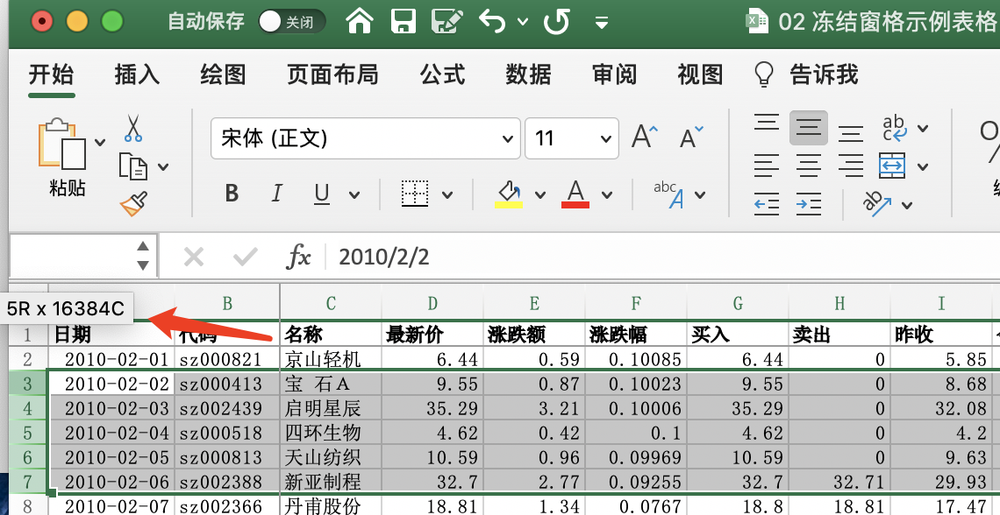
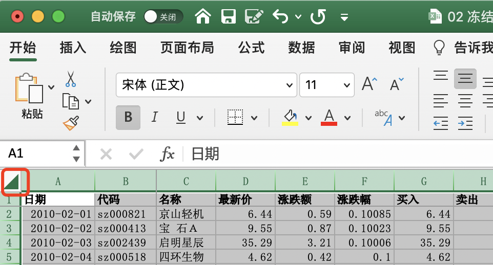

[toc]

### 1. 选择行和列

#### 1.1 选定单行或者单列

用鼠标单击某个行号标签或者列标标签，即可选中相应的整行或者整列。

用鼠标选中单元格后，按 <kbd>Shift</kbd> + <kbd>空格键</kbd> 组合键，即可选定单元格所在的行；按 <kbd>Ctrl</kbd> + <kbd>空格键</kbd> 组合键，即可选定单元格所在的列。

#### 1.2 选定相邻连续的多行或者多列

用鼠标单击某行的标签后，按住左键不放，向上或者向下拖动，即可选中与此行相邻的连续多行。选中多列的方法与此类似。拖动鼠标时，行或者列标签旁会出现一个带数字和字母内容的提示框，显示当前选中的区域中有多少行或者多少列。

用户选定某行后按 <kbd>Ctrl</kbd> + <kbd>Shift</kbd> + <kbd>↓</kbd> 组合键，如果选定行中活动单元格以下的行都不存在非空单元格，则将同时选定该行到工作表中的最后可见行。同理，选定某列后按 <kbd>Ctrl</kbd> + <kbd>Shift</kbd> + <kbd>→</kbd> 组合键，如果选定列中活动单元格右侧的列中不存在非空单元格，则将同时选定该列到工作表中的最后可见列。使用相反的方向键，则可以选中相反方向的所有行或者列。

> 提示：单击行列标签交叉处的 “全选” 按钮，可以同时选中工作表中的所有行和所有列。
>
> 

#### 1.3 选定不相邻的多行或者多列

选中单行后，按住 <kbd>Ctrl</kbd> 键不放，继续使用鼠标单击多个行标签，直至选择完所有需要选择的行，然后松开 <kbd>Ctrl</kbd> 键，即可选择不相邻的多行。要选定不相邻的多列，方法与此类似。

### 2. 设置行高和列高

#### 2.1 精确设置行高和列高

