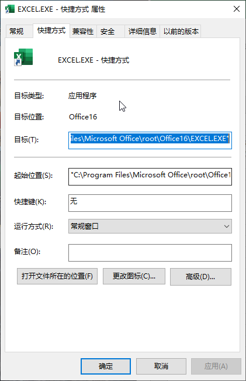

> 注意：
> 只能修改由用户创建的 “Exce l程序快捷方式” 的属性， 不能修改由 Office 安装程序创建的 “ Excel程序快捷方式” 的属性。

右键单击 “Excel程序快捷方式”， 在弹出的菜单中单击 “属性” 项， 然后在弹出的对话框中找到 “目标” 文本框中。 在此文本框中加入一些启动参数， 就可以实现不同的 Excel 启动效果。 下面以一些具体的例子来说明。

1. 隐藏启动屏幕

在 “目标” 文本框中的内容末尾加上参数 " /e" （注意，新加入的参数与原内容之间需要有一个空格）。

2. 强制 `Excel` 以安全模式运行

在 “目标” 文本框中的内容末尾加上参数 " /s" （注意，新加入的参数与原内容之间需要有一个空格）。

> 提示： 如果对启动参数感兴趣，可以查看 `Excel` 的帮助系统以了解详细的启动参数列表。
