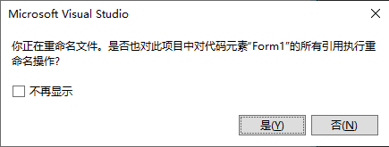
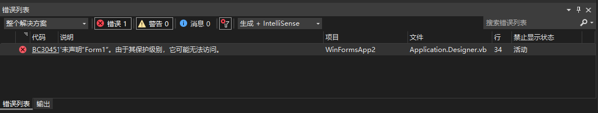
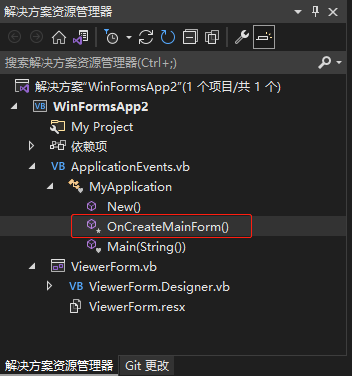

[toc]

### 1. 问题描述

对启动 Form 窗口文件名称进行重命名，在重命名后弹出的窗口（如下图所示）中选择 "是" 按钮，程序无法编译运行。



### 2. 报错信息



### 3. 解决办法

#### 3.1 方法一

1. 打开 `ApplicationEvents.vb` 文件中 `MyApplication` 类的 `onCreateMainForm()` 方法

   

2. 将 `onCreateMainForm()` 方法中 `Me.MainForm` 的值设置成重命名后的启动窗口名称。

   ```vb
   Protected Overrides Sub OnCreateMainForm()
       Me.MainForm = ViewerForm
   End Sub
   ```

#### 3.2 方法二

在重命名弹出的窗口中选择 "否" 按钮即可。