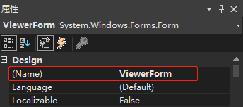

[toc]

### 1. 问题描述

1. 通过窗体属性窗口修改窗体的 `(Name)` 属性值为 ViewerForm。

   

2. 通过右击解决方案资源管理器中窗体文件名，在弹出的菜单中选择 "重命名" 菜单，将窗体文件名修改为 ViewerForm。

   

3. 窗体设计器无法显示

### 2. 报错信息


### 3. 解决办法

使用文本编辑器打开报错窗体的 vb 文件，将其类名修改成窗体 `(Name)` 属性一致即可。例如将 ViewerForm.vb 文件的如下代码：

```vb
Public Class Form

End Class
```

修改成:

```vb
Public Class ViewerForm

End Class
```

