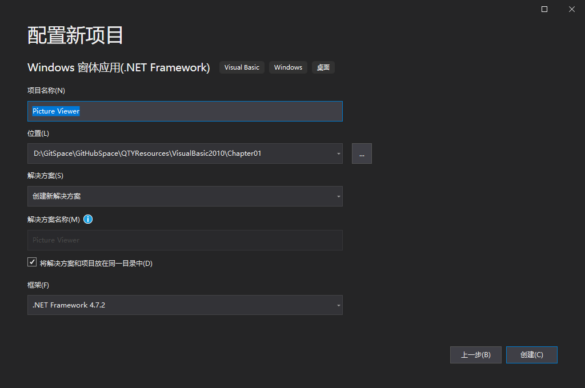

通过下列步骤新建一个 Windows 窗体应用程序。

1. 选择菜单 `文件 -> 新建项目` ，选择 `Visual Basic` 语言，在下面列表中选择 "Windows窗口应用（.NET Framework)"，然后单击 "下一步" 按钮。

   

2. "配置新项目" 对话框的地步是一个 "项目名称" 的文本框，用于指定要创建的项目名称。在该文本框中输入 "Picture Viewer".

   

3. 单击 "创建" 按钮创建项目。（设备标识）

   

>  如果图中所示的窗口没有显示出来，请使用 "视图" 菜单显示它。