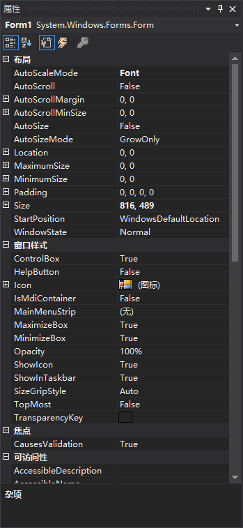
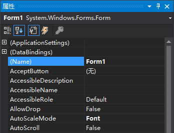
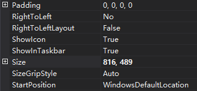
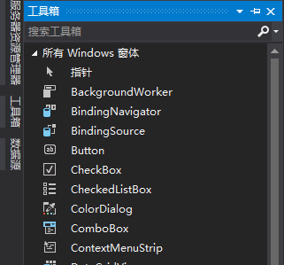

单击默认窗体的任意地方，看 "属性" 窗口中是否显示了它的属性。在 "属性" 窗口的下拉列表中将包含窗体的名称：Form1 System.Windows.Forms.Form，其中 Form1 是对象的名称， System.Windows.Forms.Form 是对象的类型。

**1. 对象的命名**

对于任何新对象，首先应设置的属性是 Name （名称）。如果没有显示 "属性" 窗口，按 <kbd>F4</kbd> 键显示它。滚动到属性列表顶部，找到 (Name) 属性。如果 Name 属性没有列在最前面，表明 "属性" 窗口设置为按分类而不是按字母顺序显示属性。可单击属性网格上方的 "字母顺序" 按钮，使属性按字母顺序显示。

> 注意：建议将 "属性" 窗口设置为按字母顺序显示。注意，Name 属性总是在列表的开头，表示为（Name）。之所以用括号，是因为括号使属性处于列表的开头，因为按字母顺序排列时，符号在字母前面。

如果需要修改窗体名称，不仅要重命名窗体，还要重命名窗体文件。按如下步骤修改名称和文件名。

1. 单击 Name 属性，将 Form1 改为 ViewerForm。注意，这并没有改变窗体的文件名，文件名显示在 "解决方案资源管理器" 窗口中。
2. 右击 "解决方案资源管理器" 窗口中的 Form1.vb。
3. 在弹出的菜单中选择 "重命名"。
4. 将 Form1.vb 改为 ViewerForm.vb。

**2. 设置窗体的 Text 属性**

通过以下步骤修改标题文本：

1. 单击窗体，使其属性显示在 "属性" 窗口中。
2. 使用 "属性" 窗口中的滚动条找到 Text 属性。
3. 将文本改为 Picture Viewer，再按回车键或单击其他属性，窗口标题栏中的文本将发生变化。

**3. 保存项目**

单击工具栏中的 "全部保存" 按钮，保存所做的工作。

**4. 为窗体添加图标**

要为窗体指定图标，执行以下步骤：

1. 在 "属性" 窗口中，单击 Icon 属性以选中它。
2. 单击 Icon 属性后，该属性右边将出现一个带三个点的小按钮，单击该按钮。
3. 使用弹出的 "打开" 对话框找到文件 PictureViewer.ico或其他图标文件。找到图标后双击它，或单击选中它再单击 "打开" 按钮。

**5. 改变窗体的大小**

Width 和 Height 的值都显示在 Size 属性下：Width 在逗号的左边，Height 在右边。可修改 Size 属性中的数字来修改 Width 和 Height 属性。

将 Width 属性改为 400、Height 属性改为 325.

> 注意：也可通过拖曳窗体的边框来改变它的大小。

**5. 在窗体中添加控件**

单击 "工具箱" 选项卡显示 "工具箱" 窗口以显示最常用的控件；如果有必要，单击 "公共控件"。

