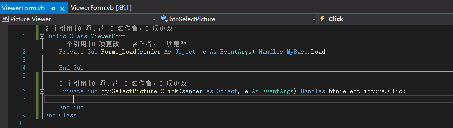

**1. 让用户浏览文件**

Button 控件的默认事件是 Click 事件，这是因为单击用户对象按钮执行的最常见操作。现在，双击 Select Picture 按钮，在代码窗口中访问它的 Click 事件。



以撇号打头的语句表示这是注释：编译器不会处理这样的语句，因此可以在撇号后输入任意文本。输入如下文本，然后按回车键：

```basic
Public Class ViewerForm
	.....

    Private Sub btnSelectPicture_Click(sender As Object, e As EventArgs) Handles btnSelectPicture.Click
        ' Show the open file dialog box.
        If ofdSelectPicture.ShowDialog = DialogResult.OK Then
            ' Load the picture into the picture box.
            picShowPicture.Image = Image.FromFile(ofdSelectPicture.FileName)
            ' Show the name of the file in the form's caption.
            Me.Text = "Picture Viewer(" & ofdSelectPicture.FileName & ")"
        End If
    End Sub
End Class
```

> 提示：无需按 <kbd>Tab</kbd> 键或使用空格来缩进代码。

**2. 使用代码终止程序**

在窗体设计器中，双击 Quit 按钮来访问其 Click 事件。在 Quit 按钮的 Click 事件处理程序中输入下列代码：

```basic
Public Class ViewerForm
    ......

    Private Sub btnQuit_Click(sender As Object, e As EventArgs) Handles btnQuit.Click
        ' Close the window and exit the application
        Me.Close()
    End Sub
End Class

```

> 注意：Me.Close() 语句关闭当前窗体。当程序中最后一个加载的窗体被关闭后，应用程序将完全终止。